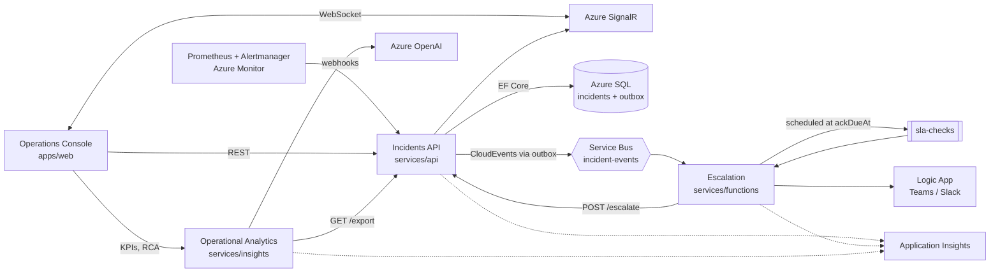
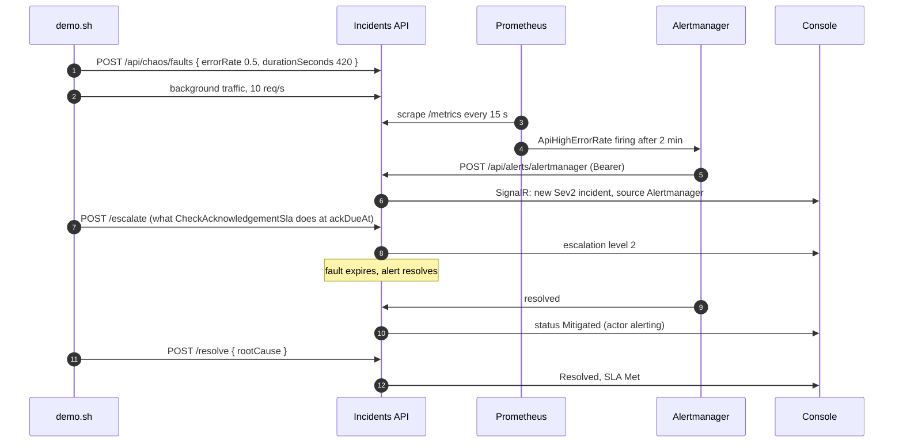

# Incident Ops

Incident management and KTLO operations platform. It turns alerts into deduplicated incidents, tracks them against severity-based SLAs, escalates unacknowledged incidents through an on-call rotation without polling, pushes changes to the operations console in real time, and turns incident history into KTLO metrics and AI-drafted root cause analyses.

This repository holds every module: three services, the console, the infrastructure, the documentation site, the [contract](contracts/contracts.md) they implement, and a Docker Compose stack that runs everything locally with Prometheus and Alertmanager.

## Contents

1. [Live](#live)
2. [Repository layout](#repository-layout)
3. [Bounded contexts](#bounded-contexts)
4. [Architecture](#architecture)
5. [Requirement → evidence](#requirement--evidence)
6. [Quick start](#quick-start)
7. [Local demo: alert to resolution](#local-demo-alert-to-resolution)
8. [Continuous integration and delivery](#continuous-integration-and-delivery)
9. [How this was built](#how-this-was-built)
10. [License](#license)

## Live

| What | Where |
|---|---|
| Documentation site | https://marcelo-roman.github.io/incident-ops/ |
| Operations console, Incidents API, Insights API | run locally with the [quick start](#quick-start); the Azure deployment is defined in [infra](infra) and runs from `main` |

The API is seeded with seven services, a six-engineer on-call rotation and six months of deterministic incident history, so every view has data on first load.

## Repository layout

```
.
├── services/
│   ├── api/             Incident Management: .NET 8 Minimal APIs, EF Core, SignalR, Service Bus outbox
│   ├── functions/       Escalation: Azure Functions (.NET 8 isolated), Service Bus, Logic App
│   └── insights/        Operational Analytics: Python, FastAPI, Pandas, NumPy, scikit-learn, Azure OpenAI
├── apps/
│   └── web/             Operations Console: React, TypeScript, Vite, TanStack Query, SignalR client
├── infra/               Bicep, setup scripts, Azure DevOps pipeline samples
├── docs/                MkDocs site: architecture, operations, engineering standards, ADRs
├── contracts/           contracts.md: domain, SLA policy, HTTP API, events, topology, conventions
├── local/               Prometheus rules and tests, Alertmanager, Service Bus emulator topology
├── scripts/             demo.sh (alert-to-resolution walkthrough), check-links.py
├── .github/             workflows per module, reusable deploy workflow, CODEOWNERS
├── docker-compose.yml   full local stack, builds the services from source
└── .env.example         local-only settings
```

Each module has its own README with architecture, configuration, tests and delivery: [api](services/api/README.md), [functions](services/functions/README.md), [insights](services/insights/README.md), [web](apps/web/README.md), [infra](infra/README.md), [docs](docs/README.md).

## Bounded contexts

| Context | Module | Owns | Relationship |
|---|---|---|---|
| Incident Management | [`services/api`](services/api) | the `Incident` aggregate, lifecycle, SLA clock, on-call rotation, alert ingestion; the only writer of incident state | upstream supplier; publishes CloudEvents and the HTTP API as the published language |
| Escalation | [`services/functions`](services/functions) | `AcknowledgementWatch` aggregate, paging decisions | downstream customer; anti-corruption layer over events and HTTP; escalates only through `POST /escalate` |
| Operational Analytics | [`services/insights`](services/insights) | `IncidentRecord` history, KPIs, recurring clusters, anomalies, RCA drafts | downstream customer; anti-corruption layer over the export endpoint; read-only |
| Operations Console | [`apps/web`](apps/web) | operator workflows and views | downstream customer of the API and Insights; conforms to the contract shapes |

Context map with diagram: [docs/docs/architecture/context-map.md](docs/docs/architecture/context-map.md).

## Architecture



Diagrams for each flow (C4 context and containers, lifecycle state machine, SLA escalation loop, alert ingestion, SignalR, delivery pipeline, Azure topology) are on the [documentation site](https://marcelo-roman.github.io/incident-ops/architecture/) and in [docs/docs/architecture](docs/docs/architecture).

## Requirement → evidence

| Requirement | Evidence in this repository |
|---|---|
| C#, .NET 8, Minimal APIs | endpoint groups per feature in [services/api/src/IncidentOps.Api](services/api/src/IncidentOps.Api) (for example [IncidentCommandEndpoints.cs](services/api/src/IncidentOps.Api/Incidents/IncidentCommandEndpoints.cs)); [ADR 0001](docs/docs/adr/0001-minimal-apis-over-controllers.md) |
| EF Core | write model, value-object mappings and migrations in [Persistence](services/api/src/IncidentOps.Infrastructure/Persistence); separate no-tracking read model in [Persistence/ReadModel](services/api/src/IncidentOps.Infrastructure/Persistence/ReadModel) |
| SignalR | [IncidentsHub.cs](services/api/src/IncidentOps.Api/RealTime/IncidentsHub.cs), client in [apps/web/src/features/realtime](apps/web/src/features/realtime); [ADR 0003](docs/docs/adr/0003-azure-signalr-service.md) |
| DDD, clean architecture | aggregates and value objects in [IncidentOps.Domain](services/api/src/IncidentOps.Domain) ([Incident.cs](services/api/src/IncidentOps.Domain/Incidents/Incident.cs), [SlaClock.cs](services/api/src/IncidentOps.Domain/Sla/SlaClock.cs)); Escalation model in [IncidentOps.Escalation.Domain](services/functions/src/IncidentOps.Escalation.Domain); anti-corruption layers in [functions](services/functions/src/IncidentOps.Escalation.Infrastructure/AntiCorruption) and [insights](services/insights/src/incident_insights/infrastructure/incidents/acl.py); architecture tests in [IncidentOps.Architecture.Tests](services/api/tests/IncidentOps.Architecture.Tests) and import-linter contracts in [pyproject.toml](services/insights/pyproject.toml); [context map](docs/docs/architecture/context-map.md), [code structure](docs/docs/architecture/code-structure.md), [ADR 0008](docs/docs/adr/0008-tactical-ddd-rich-aggregates-and-value-objects.md) |
| Event-driven with Service Bus, transactional outbox | domain events turned into outbox rows in [UnitOfWork.cs](services/api/src/IncidentOps.Infrastructure/Persistence/UnitOfWork.cs), dispatched by [OutboxDispatcher.cs](services/api/src/IncidentOps.Infrastructure/Outbox/OutboxDispatcher.cs) as CloudEvents ([CloudEventMessageFactory.cs](services/api/src/IncidentOps.Infrastructure/Messaging/CloudEventMessageFactory.cs)); topology in [servicebus.bicep](infra/bicep/modules/servicebus.bicep) and [local/servicebus/Config.json](local/servicebus/Config.json); [ADR 0002](docs/docs/adr/0002-service-bus-scheduled-messages-for-sla-timers.md), [ADR 0006](docs/docs/adr/0006-cloudevents-envelope.md), [ADR 0009](docs/docs/adr/0009-transactional-outbox-for-integration-events.md) |
| Azure Functions, Logic Apps | triggers in [services/functions/src/IncidentOps.Functions/Triggers](services/functions/src/IncidentOps.Functions/Triggers); Logic App definition in [notify-oncall.json](infra/bicep/workflows/notify-oncall.json) deployed by [logicapp.bicep](infra/bicep/modules/logicapp.bicep) |
| Application Insights, observability | OpenTelemetry in [ObservabilityRegistration.cs](services/api/src/IncidentOps.Api/Observability/ObservabilityRegistration.cs), [functions Telemetry](services/functions/src/IncidentOps.Functions/Telemetry); availability test and alert rules in [alerting.bicep](infra/bicep/modules/alerting.bicep); Prometheus [rules](local/prometheus/rules/incident-ops-api.yml) with [unit tests](local/prometheus/tests/incident-ops-api.test.yml); [observability](docs/docs/architecture/observability.md), [runbooks with KQL](docs/docs/operations/runbooks/index.md) |
| Python, FastAPI, Pandas, NumPy, scikit-learn | [KpiCalculator](services/insights/src/incident_insights/domain/kpis/kpi_calculator.py) (Pandas), [VolumeAnomalyDetector](services/insights/src/incident_insights/domain/anomalies/volume_anomaly_detector.py) (NumPy), [RecurringIssueDetector](services/insights/src/incident_insights/domain/recurring/recurring_issue_detector.py) (scikit-learn), FastAPI [app](services/insights/src/incident_insights/interface/api/app.py); [ADR 0007](docs/docs/adr/0007-python-for-analytics-service.md) |
| Azure OpenAI | [azure_openai_drafter.py](services/insights/src/incident_insights/infrastructure/rca/azure_openai_drafter.py) (Entra ID token, structured output); account and deployment in [openai.bicep](infra/bicep/modules/openai.bicep) |
| React, TypeScript | feature modules in [apps/web/src/features](apps/web/src/features), boundaries enforced in [eslint.config.js](apps/web/eslint.config.js) |
| Bicep infrastructure as code | [infra/bicep](infra/bicep), linter at error level in [bicepconfig.json](infra/bicepconfig.json); [ADR 0005](docs/docs/adr/0005-bicep-for-infrastructure.md) |
| CI/CD in YAML: GitHub Actions | path-filtered [workflows](.github/workflows), OIDC to Azure, reusable [deploy-container-app.yml](.github/workflows/deploy-container-app.yml) with smoke test and rollback; [ADR 0010](docs/docs/adr/0010-monorepo-with-path-filtered-pipelines-and-codeowners.md) |
| CI/CD in YAML: Azure DevOps | samples in [infra/azure-devops](infra/azure-devops) with templates, setup in [ado-bootstrap.md](infra/scripts/ado-bootstrap.md); [ADO hygiene](docs/docs/engineering/ado-hygiene.md) |
| Incident management, SLAs, KTLO | lifecycle and SLA rules in [IncidentOps.Domain](services/api/src/IncidentOps.Domain), escalation loop in [services/functions](services/functions); [severity and SLA](docs/docs/operations/severity-and-sla.md), [support model](docs/docs/operations/support-model.md), [incident response](docs/docs/operations/incident-response.md), [postmortem example](docs/docs/operations/postmortems/2026-09-17-payments-gateway-timeouts.md), [KTLO metrics](docs/docs/operations/ktlo-metrics.md), [KTLO vs roadmap](docs/docs/leadership/ktlo-vs-roadmap.md) |
| Engineering standards, DoR, DoD, quality gates | [definition of ready](docs/docs/engineering/definition-of-ready.md), [definition of done](docs/docs/engineering/definition-of-done.md), [quality gates](docs/docs/engineering/quality-gates.md), [testing strategy](docs/docs/engineering/testing-strategy.md), [code review](docs/docs/engineering/code-review-guidelines.md), [branching](docs/docs/engineering/branching-and-git-workflow.md), [CODEOWNERS](.github/CODEOWNERS), [conventions](contracts/contracts.md#conventions) |
| AI-assisted development | [AI-assisted development](docs/docs/engineering/ai-assisted-development.md), [How this was built](#how-this-was-built) |

## Quick start

Requirements: Docker with Compose v2, about 6 GB of free memory, and `curl` + `jq` for the demo.

```bash
cp .env.example .env && docker compose up --build
```

`--build` builds the API, Insights and the console from `services/api`, `services/insights` and `apps/web`. Without it, `docker compose up` pulls the published images `ghcr.io/marcelo-roman/incident-ops-{api,insights,web}` (tag from `IMAGE_TAG`).

| Service | URL |
|---|---|
| Console | http://localhost:8080 |
| API Swagger | http://localhost:5080/swagger |
| Insights docs | http://localhost:8000/docs |
| Prometheus | http://localhost:9090 |
| Alertmanager | http://localhost:9093 |
| Service Bus emulator | `localhost:5672` (AMQP) |
| SQL Server | `localhost:1433` |

| File | Purpose |
|---|---|
| [docker-compose.yml](docker-compose.yml) | SQL Server, Service Bus emulator, API (chaos enabled), Insights, console, Prometheus, Alertmanager, notification sink; Azurite under the `functions` profile |
| [local/servicebus/Config.json](local/servicebus/Config.json) | emulator topology: topic, subscriptions with SQL filters, `sla-checks` queue |
| [local/prometheus/prometheus.yml](local/prometheus/prometheus.yml) | scrapes the API's `/metrics` every 15 s |
| [local/prometheus/rules/incident-ops-api.yml](local/prometheus/rules/incident-ops-api.yml) | `ApiDown`, `ApiHighErrorRate`, `ApiHighLatencyP95`, `SlaBreachesOpen` |
| [local/alertmanager/alertmanager.yml](local/alertmanager/alertmanager.yml) | webhook to `/api/alerts/alertmanager` with Bearer key, grouping by `alertname` + `service`, `ApiDown` inhibition, 1 h repeat |
| [.env.example](.env.example) | local-only values; `.env` is ignored by git |

Host ports are configurable through `WEB_PORT`, `API_PORT` and `INSIGHTS_PORT`. `SLA_TIME_SCALE=60` shrinks every SLA window sixty times so escalation can be watched in seconds. Without `AZURE_OPENAI_*` in `.env`, RCA drafts come from the deterministic fallback drafter and are labeled as such in `generatedBy`.

**Functions run on the host.** Start Azurite with `docker compose --profile functions up -d azurite`, then run [services/functions](services/functions/README.md#running-locally) with Azure Functions Core Tools, pointing `ServiceBusConnection` at the emulator and `IncidentsApi__BaseUrl` at `http://localhost:5080`. Pages land in the `notification-sink` echo service (`docker compose logs -f notification-sink`). Without the functions, unacknowledged incidents do not escalate on their own.

## Local demo: alert to resolution

[scripts/demo.sh](scripts/demo.sh) walks the whole loop against the local stack:



Open the console at http://localhost:8080, then:

```bash
./scripts/demo.sh
```

Takes about 15 minutes with the default 420 s fault: the alert needs its `for` duration to fire, and after the fault expires the 5-minute rate window has to drain before Alertmanager sends the resolved notification on its next `group_interval`. Set `WAIT_FOR_AUTO_MITIGATION=false` to skip the wait and resolve right after escalating. The escalation step calls the API directly because a Sev2 acknowledgement window is 30 minutes; with the functions running, the same escalation happens on its own at `ackDueAt` (seconds when `SLA_TIME_SCALE=60`).

## Continuous integration and delivery

Trunk-based: `main` changes only through squash-merged pull requests, and pull requests run build, lint and tests. One workflow per module, each filtered to its own paths, so a change runs only the checks it can affect. Deploy jobs run only on pushes to `main`, behind the `production` environment (which accepts `main` only) and the `DEPLOY_ENABLED` repository variable, authenticate to Azure with OpenID Connect (no stored Azure secret), and container apps ship through the local reusable [deploy-container-app.yml](.github/workflows/deploy-container-app.yml) (new revision, smoke test, rollback). Azure DevOps equivalents live in [infra/azure-devops](infra/azure-devops) as samples.

| Workflow | Runs on changes to | Gates | Delivers |
|---|---|---|---|
| [api.yml](.github/workflows/api.yml) | `services/api/**`, `contracts/**` (pull requests), the workflow, the reusable deploy | `dotnet format --verify-no-changes`, build (warnings as errors, analyzers), 204 tests incl. Testcontainers SQL Server and architecture tests, 80% line coverage gate | image to GHCR, `ca-incident-ops-api` |
| [functions.yml](.github/workflows/functions.yml) | `services/functions/**`, `contracts/**` (pull requests), the workflow | format, build, 186 tests incl. anti-corruption and architecture tests, 80% line and branch coverage | zip to `func-incident-ops` |
| [insights.yml](.github/workflows/insights.yml) | `services/insights/**`, `contracts/**` (pull requests), the workflow, the reusable deploy | ruff, ruff format, mypy strict, import-linter (7 contracts), 178 tests with 85% coverage floor, image build | image to GHCR, `ca-incident-ops-insights` |
| [web.yml](.github/workflows/web.yml) | `apps/web/**`, `contracts/**` (pull requests), the workflow | ESLint (incl. architecture boundaries), Prettier, `tsc`, 161 Vitest tests with coverage thresholds, build, image build | image to GHCR, Static Web App |
| [infra.yml](.github/workflows/infra.yml) | `infra/**`, the workflow | Bicep build, build-params and lint (all rules at error), Logic App JSON, ShellCheck, Azure DevOps YAML parse, validate and what-if | Bicep deployment to `rg-incident-ops` |
| [docs.yml](.github/workflows/docs.yml) | `docs/**`, the workflow | `mkdocs build --strict` | GitHub Pages |
| [platform.yml](.github/workflows/platform.yml) | `docker-compose.yml`, `.env.example`, `local/**`, `scripts/**`, any `*.md`, `.github/**` | `docker compose config`, `promtool check config`, `promtool test rules`, `amtool check-config`, Service Bus JSON, Markdown link check, ShellCheck, actionlint | |

[CODEOWNERS](.github/CODEOWNERS) assigns an owner per top-level path, and changes to `contracts/` require that owner's review. Gates in detail: [quality gates](docs/docs/engineering/quality-gates.md); branch rules: [branching and git workflow](docs/docs/engineering/branching-and-git-workflow.md).

## How this was built

AI-assisted development was a deliberate part of the method, with explicit guardrails. Claude Code acted as a pair programmer:

1. **Contract first, written by the author.** [contracts/contracts.md](contracts/contracts.md) (domain, SLA policy, API, events, alert ingestion, topology, runtime configuration, delivery, conventions) was designed before any code. It is the boundary between modules and between human decisions and delegated work.
2. **Parallel implementation against the contract.** Each module was implemented by a separate agent session working only from the contract and the conventions. Agents could not change the contract; gaps went back to the author.
3. **Author review.** Every change was reviewed by the author with the same [review guidelines](docs/docs/engineering/code-review-guidelines.md) as human code. Architecture, bounded contexts, ADRs, SLA policy and escalation semantics were decided by the author.
4. **CI as the arbiter.** Build, lint, tests, architecture tests and coverage gates run in GitHub Actions on every pull request. Generated code that does not pass does not merge.
5. **No secrets to the model.** Agents saw `.env.example` placeholders only. Delivery uses OIDC federation, so there are no Azure credentials to leak.
6. **AI inside the product, with a human in the loop.** Insights drafts RCAs with Azure OpenAI from an incident and its timeline. The draft is input for the postmortem owner, never published as is.

What was not delegated, and why: [AI-assisted development](docs/docs/engineering/ai-assisted-development.md).

## License

[MIT](LICENSE)
