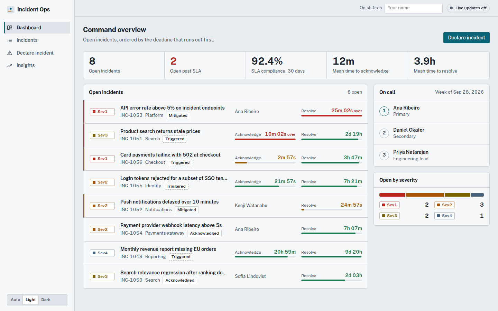
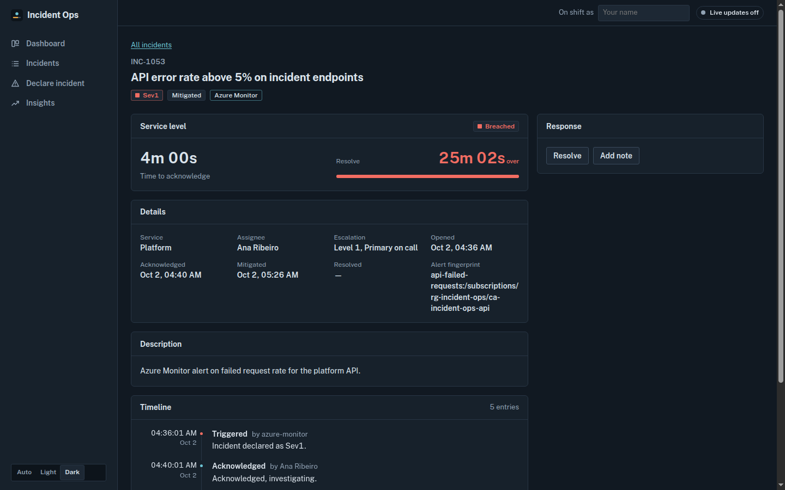
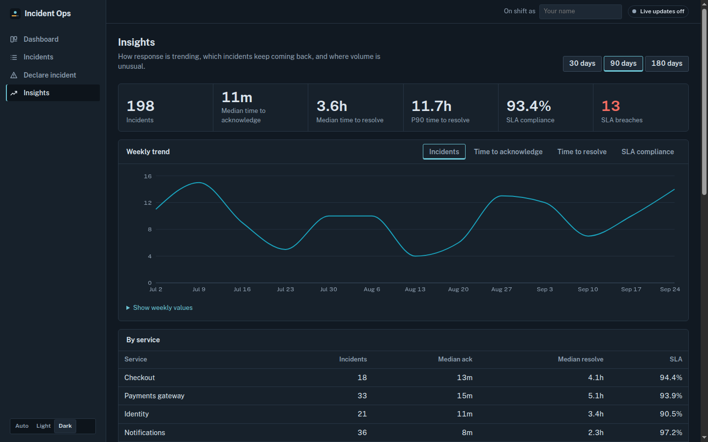

# Incident Ops Web

Operations console for the Incident Ops platform: live SLA clocks, the on-call escalation chain, incident response actions and KTLO analytics, in one screen an incident commander can keep open all shift.

## Contents

1. [What it is](#what-it-is)
2. [Screenshots](#screenshots)
3. [Architecture](#architecture)
4. [Running locally](#running-locally)
5. [Configuration](#configuration)
6. [Scripts](#scripts)
7. [Testing](#testing)
8. [Container image](#container-image)
9. [Deployment](#deployment)
10. [Contract notes](#contract-notes)
11. [License](#license)

## What it is

A React single-page application and the Operations Console bounded context: it implements the HTTP API, the SignalR hub and the Insights API defined in the [contract](../../contracts/contracts.md) and holds no incident state of its own.

| Page             | What it does                                                                                                                                                                                                                                                                             |
| ---------------- | ---------------------------------------------------------------------------------------------------------------------------------------------------------------------------------------------------------------------------------------------------------------------------------------- |
| Dashboard        | Service metrics from `/api/metrics/summary`, open incidents ordered by the deadline that runs out first with live acknowledge and resolve countdowns (on track, at risk, breached), the current on-call chain (primary, secondary, engineering lead) and the open incidents by severity. |
| Incidents        | Every incident, newest first, filtered by status, severity, service and alert source. Filters live in the URL so a view can be shared.                                                                                                                                                   |
| Incident detail  | SLA clocks, record details, alert fingerprint, timeline (alert entries rendered apart from human ones) and the response actions allowed from the current status: acknowledge, mitigate, resolve with root cause, add note. Resolved incidents offer an AI-drafted RCA.                   |
| Declare incident | Validated form; each severity option shows its SLA targets. Opens the new incident on success.                                                                                                                                                                                           |
| Insights         | KPI tiles, weekly trend chart (incidents, time to acknowledge, time to resolve, SLA compliance) with a table view, KPIs by service, the ten largest recurring incident clusters (expandable to all), volume anomalies and RCA drafts for recently resolved incidents.                    |

The console probes `GET /health/ready` on load and every five minutes. A network error, a timeout or a 502, 503 or 504 replaces the page with a full-width notice that the demo environment is paused and started on request for evaluations; while paused it probes every 30 seconds and shows the page again once the API answers.

Live updates arrive over SignalR (`/hubs/incidents`). `IncidentChanged` patches the cached incident in place and marks lists and metrics stale; `TimelineAppended` appends to the cached timeline without duplicates. The connection reconnects with capped exponential backoff and jitter, and the header shows its state. Dark and light themes follow the system preference unless the operator picks one.

## Screenshots

| Dashboard (light)                                  | Incident detail (dark)                                 |
| -------------------------------------------------- | ------------------------------------------------------ |
|  |  |



The screenshots were captured in mock mode (`pnpm dev:mock`).

## Architecture

```
src/
  app/                    composition root: providers, router, layout shell, theme, global styles
  features/
    incidents/            incidents, services, SLA clocks, status transitions, response actions
      api/                typed client, query keys, cache operations, query and mutation hooks
      domain/             pure modules: types, SLA policy and clocks, transitions, schemas, labels
      hooks/              view logic: filters in the URL, SLA clocks, action panel, forms
      components/         rendering only
      pages/              routed screens
      index.ts            public API
      testing.ts          test factories for other features
    declare-incident/     declaration form, schema and SLA targets per severity
    environment/          API availability probe and the paused-environment notice
    oncall/               current rotation and escalation levels
    dashboard/            metrics summary and the command overview
    insights/             KPIs, trend, recurring clusters, anomalies
    rca/                  AI-drafted root cause analysis
    realtime/             SignalR connection, supervision, status, cache wiring
  shared/
    config/               build-time defaults and runtime config.json loading
    http/                 fetch client and RFC 7807 problem handling
    ui/                   primitives: panel, button, fields, KPI strip, async states
    format/ time/ lib/    formatting, shared clock, small utilities
    operator/             the operator name used as the actor on actions
    test/                 render helpers
  mocks/                  MSW handlers and an in-memory store that enforces the contract
  test/                   Vitest setup
```

Rules, enforced by `eslint-plugin-boundaries` in `eslint.config.js`:

- A feature imports another feature only through its `index.ts` (or `testing.ts` from tests). Deep imports fail lint.
- `shared` never imports `app` or `features`. `app` composes features through their public APIs.
- `mocks` and the test setup are reachable from tests and from the entry point only.

Inside a feature the layers have one job each:

- `domain` is pure TypeScript with no React and no I/O: SLA clocks (`sla.ts`), status transitions (`transitions.ts`), validation schemas, presentation labels. Domain code is held to a 95% line coverage threshold.
- `api` is the only place that talks to the network. Components never call the client; they use the hooks exported next to it.
- `hooks` hold view logic and state; `components` render what hooks and domain functions return.

Server state lives in TanStack Query. Metrics keys sit under the incidents key namespace, so any incident change invalidates the numbers derived from it. The SLA countdowns tick from a single shared clock (`useSyncExternalStore`), so a hundred timers on screen cost one interval.

## Running locally

Requirements: Node 22 and pnpm 11 (`corepack enable` picks the version pinned in `package.json`).

```bash
pnpm install
pnpm dev:mock
```

`dev:mock` sets `VITE_USE_MOCKS=true`: Mock Service Worker answers every API and Insights call from an in-memory store seeded with incidents in every status and SLA state, applies the same transition rules as the API (invalid transitions return `409` problem details) and drafts RCAs: even-numbered incidents come back as Azure OpenAI drafts and odd-numbered ones as rule-based fallback drafts, so both labels can be seen. Live updates are off in this mode and the header says so.

To run against a backend, point the build-time defaults at it and start the dev server:

```bash
cp .env.example .env.local
pnpm dev
```

The [root compose file](../../docker-compose.yml) runs the API, Insights and this console together: `cp .env.example .env && docker compose up --build` from the repository root, then open <http://localhost:8080> (`WEB_PORT`).

## Configuration

Endpoints resolve in this order: `/config.json` served next to the app, then the `VITE_*` values the bundle was built with, then the production endpoints.

| Setting           | Build time (`VITE_*`)    | Runtime (`config.json`) | Container (env)     | Default                                          |
| ----------------- | ------------------------ | ----------------------- | ------------------- | ------------------------------------------------ |
| API base URL      | `VITE_API_BASE_URL`      | `apiBaseUrl`            | `API_BASE_URL`      | `https://incidents-api.marceloroman.com.br`      |
| Insights base URL | `VITE_INSIGHTS_BASE_URL` | `insightsBaseUrl`       | `INSIGHTS_BASE_URL` | `https://incidents-insights.marceloroman.com.br` |
| Mock mode         | `VITE_USE_MOCKS`         |                         |                     | `false`                                          |

The build emits a `config.json` carrying its `VITE_*` values, and the dev server serves the same document. The container replaces it at start-up, so one image runs in every environment. A missing or invalid `config.json` falls back to the build-time values.

## Scripts

| Script                              | What it does                                                            |
| ----------------------------------- | ----------------------------------------------------------------------- |
| `pnpm dev`                          | Vite dev server on port 5173                                            |
| `pnpm dev:mock`                     | Dev server with MSW mocks                                               |
| `pnpm build`                        | Type-check and production build into `dist/`                            |
| `pnpm preview`                      | Serve the production build                                              |
| `pnpm lint`                         | ESLint (typescript-eslint strict, react-hooks, architecture boundaries) |
| `pnpm lint:fix`                     | ESLint with fixes applied                                               |
| `pnpm format` / `pnpm format:check` | Prettier write / check                                                  |
| `pnpm typecheck`                    | TypeScript project references, strict mode                              |
| `pnpm test`                         | Vitest, once                                                            |
| `pnpm test:coverage`                | Vitest with coverage thresholds                                         |
| `pnpm test:watch`                   | Vitest in watch mode                                                    |
| `pnpm test:e2e`                     | Playwright smoke test against the mock dev server                       |

## Testing

- Unit tests for every domain module: SLA clocks and their edge cases (exactly 25% remaining, escalated acknowledge windows, resolve deadline passing while the acknowledge window is fresh), transitions, schemas, formatting, runtime config, reconnect backoff and the connection supervisor.
- Component tests per feature with Testing Library against MSW: dashboard, incident list filters, incident actions (validation, success, `409` conflict), declaration, insights, on-call, RCA drafts, realtime cache wiring and the app shell (navigation, keyboard theme switching).
- Coverage thresholds in `vite.config.ts`: 70% overall, 95% lines on `features/*/domain`, 90% on shared config, HTTP and formatting. CI runs `pnpm test:coverage`.
- `e2e/smoke.spec.ts` declares and acknowledges an incident in a real browser against the mock server. It is not part of CI; run it with `pnpm exec playwright install chromium` followed by `pnpm test:e2e`.

## Container image

`Dockerfile` builds the bundle with Node 22 and serves it from `nginx-unprivileged` as user 101 on port 8080.

```bash
docker build -t incident-ops-web .
docker run --rm -p 8080:8080 \
  -e API_BASE_URL=http://localhost:5080 \
  -e INSIGHTS_BASE_URL=http://localhost:8000 \
  incident-ops-web
```

At start-up `docker/40-render-runtime-config.sh` validates both URLs, writes `config.json` and renders the security headers, including a Content-Security-Policy whose `connect-src` allows exactly those origins (and their WebSocket form for SignalR). Unknown paths fall back to `index.html`, hashed assets are cached for a year, and `/healthz` backs the `HEALTHCHECK`.

## Deployment

Delivery runs on GitHub Actions. [`.github/workflows/web.yml`](../../.github/workflows/web.yml) runs when `apps/web/**` or the workflow changes (and on pull requests that change `contracts/**`):

| Job      | When                     | What it does                                                                                                                 |
| -------- | ------------------------ | ---------------------------------------------------------------------------------------------------------------------------- |
| `verify` | pull requests and pushes | install with `--frozen-lockfile`, lint, format check, typecheck, tests with coverage, build, upload `dist`                   |
| `image`  | pull requests and pushes | build the container image; on push, publish `ghcr.io/marcelo-roman/incident-ops-web` tagged with the commit SHA and `latest` |
| `deploy` | pushes to `main`         | upload `dist` to Azure Static Web Apps with `Azure/static-web-apps-deploy@v1`, behind the `production` environment           |

The deploy job reads the `SWA_DEPLOYMENT_TOKEN` secret. Repository variables `VITE_API_BASE_URL` and `VITE_INSIGHTS_BASE_URL` override the production endpoints baked into the build.

`public/staticwebapp.config.json` configures the Static Web App: SPA navigation fallback (assets and `config.json` excluded), immutable caching for hashed assets and security headers (CSP, HSTS, `X-Content-Type-Options`, `X-Frame-Options`, `Referrer-Policy`, `Permissions-Policy`).

[`infra/azure-devops/web.yml`](../../infra/azure-devops/web.yml) is the Azure DevOps equivalent of the same pipeline (build stage, then a deployment job using `AzureStaticWebApp@0` with `SWA_DEPLOYMENT_TOKEN` from the `vg-incident-ops` variable group). It ships as a sample and is not wired to an Azure DevOps project.

## Contract notes

Where the contract names a payload without fixing its shape, the console uses these readings:

| Payload                                             | Shape used                                                                                                                                                                                                                                                                                                           |
| --------------------------------------------------- | -------------------------------------------------------------------------------------------------------------------------------------------------------------------------------------------------------------------------------------------------------------------------------------------------------------------- |
| `GET /api/kpis`, `/api/recurring`, `/api/anomalies` | The response models of the [Insights API](../../services/insights) (camelCase): `overall`, `byService`, `weekly` with medians and p90; clusters with `label`, `terms`, `services[{serviceId, count}]`, `sampleTitles`; anomalies with `count`, `baselineMean`, `zScore`. Percentages are 0 to 100.                   |
| `POST /api/rca/draft`                               | The `RcaDraftResponse` of the Insights API: `summary`, `impact`, `timeline[{at, event}]`, `contributingFactors[]`, `actionItems[{title, owner, priority}]`, `generatedBy`, `generatedAt`. `generatedBy` is `azure-openai:<deployment>` or `deterministic-fallback`, and each draft is labelled with its real source. |
| `GET /api/metrics/summary`                          | `openBySeverity` as a map keyed by severity; `slaCompliance30d` as a 0 to 100 percentage.                                                                                                                                                                                                                            |
| `GET /api/oncall/current`                           | `primary`, `secondary` and `lead` as display names.                                                                                                                                                                                                                                                                  |
| Source filter                                       | `GET /api/incidents` has no `source` parameter, so the console filters by source on the client.                                                                                                                                                                                                                      |

## License

[MIT](../../LICENSE)
