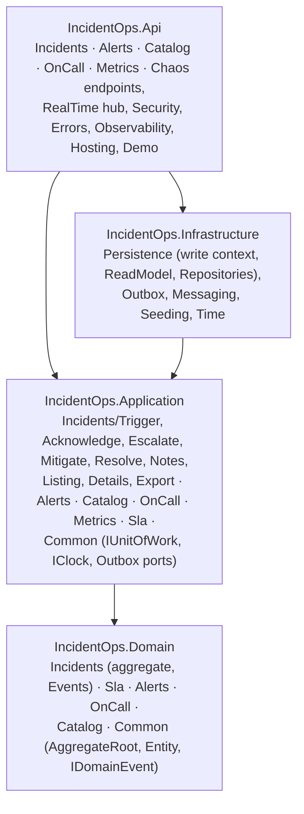
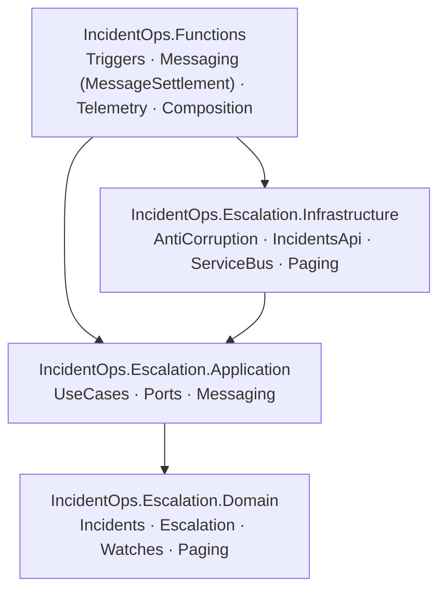
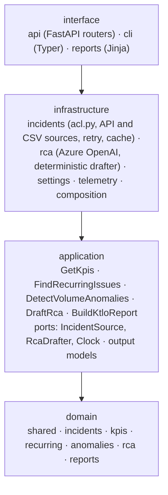
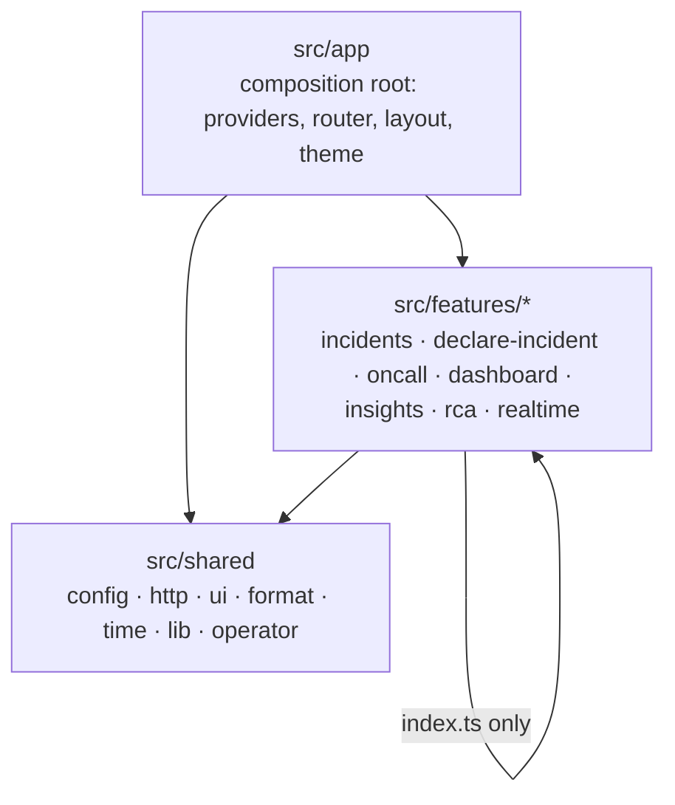

# Code structure

Every module follows the same idea: business rules in the center with no framework dependencies, use cases around them, adapters at the edge, and the dependency direction enforced by a test or a lint rule, not by convention alone. Each module is one bounded context ([context map](context-map.md)); folders are organized by feature inside each layer.

| Module | Context | Layers | Organized by | Enforced by |
| --- | --- | --- | --- | --- |
| `services/api` | Incident Management | Domain → Application → Infrastructure, Api | feature (`Incidents`, `Alerts`, `Catalog`, `OnCall`, `Metrics`, `Sla`) | project references + 23 architecture tests (NetArchTest and reflection) |
| `services/functions` | Escalation | Domain → Application → Infrastructure, Functions host | concept (`Incidents`, `Escalation`, `Watches`, `Paging`) | project references + NetArchTest and reflection tests |
| `services/insights` | Operational Analytics | domain → application → infrastructure → interface | feature (`kpis`, `recurring`, `anomalies`, `rca`, `reports`) | 7 import-linter contracts |
| `apps/web` | Operations Console | `app` → `features/*` → `shared` | feature (`incidents`, `declare-incident`, `oncall`, `dashboard`, `insights`, `rca`, `realtime`) | `eslint-plugin-boundaries` |

## Incident Management (`services/api`)

### Tactical model

| Aggregate | Root | Owns | Behavior |
| --- | --- | --- | --- |
| Incident | `Incident` (`IncidentId`) | `TimelineEntry` entities, `SlaClock` | `Trigger`, `TriggerFromAlert`, `Acknowledge`, `Escalate`, `Mitigate`, `Resolve`, `AddNote`, `RecordAlert`, `SlaStateAt`, `CompliesWithSla` |
| Service | `Service` (`ServiceId`) | | catalog entry; incidents reference it by `ServiceId` only |
| On-call rotation | `OnCallRotation` | `Engineer` entities | `ShiftAt(instant)` returns primary, secondary and lead |

- Value objects validate on creation and are immutable: `IncidentId`, `IncidentNumber`, `IncidentTitle`, `Description`, `ServiceId`, `Actor`, `Note`, `RootCause`, `EscalationLevel` (1 to 3, `Next()` stops at 3), `AlertFingerprint`, `SlaClock`.
- `SlaClock` holds the acknowledge window, the resolve deadline and `acknowledgementBreached`; the incident delegates SLA state and compliance to it.
- Each behavior raises one domain event bound to the timeline entry it appended: `IncidentTriggered`, `IncidentAcknowledged`, `IncidentEscalated`, `IncidentMitigated`, `IncidentResolved`, `IncidentNoteAdded`, `AlertRecorded`.
- Repository interfaces (`IIncidentRepository`, `IServiceRepository`, `IOnCallRotationRepository`) live in the domain and exist only for aggregate roots.

### Commands, queries and events

- **Commands** go through aggregates: one folder per use case with a command record and one sealed handler (`Incidents/Escalate/EscalateIncident.cs`, `EscalateIncidentHandler.cs`). The handler loads the aggregate, calls one behavior and commits through `IUnitOfWork`.
- **Queries** read projections (CQRS-lite): list, details, export and metrics read `IncidentRecord` and `TimelineEntryRecord` from a separate no-tracking EF Core context mapped to the same tables, without materializing aggregates. SLA state on the read side is still computed by the domain `SlaClock`.
- **Transactional outbox**: the unit of work turns domain events into outbox rows in the same `SaveChanges` as the aggregate changes. `OutboxDispatcher` (woken on commit, polling as a fallback) notifies SignalR and publishes CloudEvents to Service Bus, retries with capped exponential backoff and dead-letters after a maximum number of attempts. The CloudEvent `id` and the Service Bus `MessageId` equal the outbox message id. Decision: [ADR 0009](../adr/0009-transactional-outbox-for-integration-events.md).
- **Translation**: `IncidentEventTranslator` maps domain events to integration events and real-time notifications; endpoints never see domain events.

### Architecture tests

`tests/IncidentOps.Architecture.Tests`:

| Test | Rule |
| --- | --- |
| `Domain_depends_on_no_other_layer_or_framework`, `Domain_references_only_the_base_class_library` | the domain references nothing outside the BCL |
| `Application_depends_only_on_domain` | application references no infrastructure, API or framework |
| `Infrastructure_does_not_depend_on_the_api` | adapters do not reach the host |
| `Api_features_depend_on_the_application_layer_only` | each endpoint feature folder uses application types only |
| `Use_cases_reach_persistence_only_through_ports` | handlers use repositories, `IUnitOfWork` and query ports |
| `Application_has_one_sealed_handler_per_use_case` | one sealed, single-method handler per use case |
| `Infrastructure_implementations_are_internal_or_sealed` | adapters are not extension points |
| `Domain_exceptions_share_a_base_type` | domain errors map to problem details in one place |
| `Entities_have_no_public_setters`, `Value_objects_are_immutable` | state changes only through behavior |
| `Aggregates_derive_from_the_aggregate_root`, `Timeline_entries_are_entities_owned_by_the_incident_aggregate` | aggregate boundaries |
| `Repositories_are_domain_ports_for_aggregate_roots` | no repository for a non-root |
| `Domain_events_are_immutable_records` | events cannot change after they are raised |

## Escalation (`services/functions`)

- `AcknowledgementWatch` is the aggregate, identified by incident and level (`WatchKey`). `Open` decides whether a window needs watching, `Schedule` produces the `ScheduledCheck`, `Evaluate` compares the watch with the incident's current state and returns an `EscalationDecision`.
- Value objects: `EscalationLevel`, `AcknowledgementDeadline`, `EscalationReason`, `OnCallTarget`, `IncidentId`, `IncidentNumber`, `ServiceId`, `Severity` (knows whether it `PagesOnCall`). `PagingDecision.Decide` holds who is paged for which severity.
- Use cases `ScheduleAcknowledgementCheck`, `CheckAcknowledgementSla` and `PageOnCall` translate input through a port, call one domain behavior and act on the outcome through ports (`IIncidentReader`, `IIncidentEscalator`, `IOnCallDirectory`, `ISlaCheckScheduler`, `IPager`).
- The anti-corruption layer (`Infrastructure/AntiCorruption`) maps CloudEvents, SLA check messages and upstream statuses into the Escalation model and turns any contract or invariant violation into `MalformedMessageException`, which the host dead-letters.
- Triggers are one thin class per function: bind, map to `InboundMessage`, call the use case, settle the message.

Architecture tests (`tests/IncidentOps.Functions.Tests/Architecture`):

| Test | Rule |
| --- | --- |
| `DomainDependsOnNothingOutsideItself` | the domain has no dependencies |
| `ApplicationDependsOnDomainAndAbstractionsOnly`, `UseCasesDependOnDomainAndPortsOnly`, `PortsAreTheOnlyApplicationInterfaces` | use cases see the model and their ports only |
| `TriggersDependOnTheApplicationOnly` | triggers never touch the domain or infrastructure |
| `InfrastructureDoesNotReachIntoTheHost` | adapters do not depend on the Functions host |
| `UpstreamDtosStayInsideTheAntiCorruptionLayer` | Incident Management types do not leak |
| `ConcreteTypesAreSealed`, `DomainTypesHaveOnlyReadonlyState`, `DomainTypesExposeNoSetters` | immutable, closed domain and adapters |

## Operational Analytics (`services/insights`)

- The domain is plain Python: frozen dataclasses and enums, no Pydantic, no I/O. `IncidentRecord` is an immutable entity that answers its own questions (`time_to_acknowledge()`, `sla_outcome(as_of)`, `chronology()`); `IncidentHistory` is a first-class collection; `ReportingWindow`, `Percentage`, `DurationStats`, `SlaPolicy`, `Cluster`, `RcaDraft` are value objects with invariants.
- Domain services (`KpiCalculator`, `RecurringIssueDetector`, `VolumeAnomalyDetector`, `RcaDraftComposer`, `KtloReportComposer`) take and return domain types; pandas, NumPy and scikit-learn appear only inside them.
- Use cases only orchestrate: load the history through `IncidentSource`, call a domain service, return a camelCase output model.
- The anti-corruption layer `infrastructure/incidents/acl.py` is the only code that knows the API field names.

import-linter contracts in `pyproject.toml`, run by `uv run lint-imports`:

| Contract | Type | Rule |
| --- | --- | --- |
| Layers | `layers` | `interface` → `infrastructure` → `application` → `domain`, never upwards |
| No I/O frameworks inside | `forbidden` | `domain` and `application` do not import `azure`, `fastapi`, `httpx`, `jinja2`, `openai`, `opentelemetry`, `pydantic_settings`, `starlette`, `typer`, `uvicorn` |
| Plain domain | `forbidden` | `domain` does not import `pydantic` |
| Computation stays in services | `forbidden` | entities, collections and value-object modules do not import `pandas`, `sklearn`, `scipy`, `threadpoolctl` |
| Routers use use cases | `forbidden` | `interface.api.routers` does not import `infrastructure` |
| Interface sees outputs | `forbidden` | `interface` does not import the domain model |
| Independent features | `independence` | `domain.kpis`, `domain.recurring`, `domain.anomalies`, `domain.rca` do not import each other |

## Operations Console (`apps/web`)

Inside a feature: `domain` (pure TypeScript: SLA clocks, transitions, schemas, labels), `api` (the only network code: typed client, query keys, hooks), `hooks` (view logic), `components` (rendering), `pages` (routed screens), `index.ts` (public API).

| Rule (`boundaries/dependencies`, default `disallow`) | Why |
| --- | --- |
| a feature imports another feature only through its `index.ts` (`testing.ts` from tests) | features stay replaceable; deep imports fail lint |
| `shared` never imports `app` or `features` | shared code has no knowledge of screens |
| `app` composes features through their public APIs | one composition point |
| `mocks` and the test setup are reachable from tests and the entry point only | MSW never ships in production paths |

Plus `typescript-eslint` strict type-checked rules, `max-lines-per-function: 80`, `no-else-return`, `no-nested-ternary` and the `react-hooks` rules.

## Infrastructure (`infra`)

| Folder | Content |
| --- | --- |
| `bicep/main.bicep`, `main.bicepparam`, `naming.bicep` | composition of all resources for `rg-incident-ops`, naming function |
| `bicep/modules/` | one module per resource: containerapp, containerapps-environment, functions, servicebus, signalr, sql, openai, monitoring, alerting, logicapp, staticwebapp, roleassignments, budget |
| `bicep/workflows/` | Logic App workflow definition |
| `azure-devops/` | Azure DevOps samples: `api.yml`, `functions.yml`, `insights.yml`, `web.yml`, `infra.yml`, and `templates/` (Bicep validate, what-if, container app deploy) |
| `scripts/` | OIDC bootstrap, Cloudflare DNS, image resolution, SQL grants for the API identity, Azure DevOps setup guide |

The GitHub Actions workflows that deploy every module live at the repository root in `.github/workflows/` ([deployment](deployment.md#delivery-pipeline)).

## Conventions across modules

From the [contract](https://github.com/marcelo-roman/incident-ops/blob/main/contracts/contracts.md#conventions): English names, no code comments, early return, one responsibility per type, short functions, domain rules only in the domain layer, configuration via environment variables. How these are tested: [testing strategy](../engineering/testing-strategy.md). Why the model is shaped this way: [ADR 0008](../adr/0008-tactical-ddd-rich-aggregates-and-value-objects.md).
