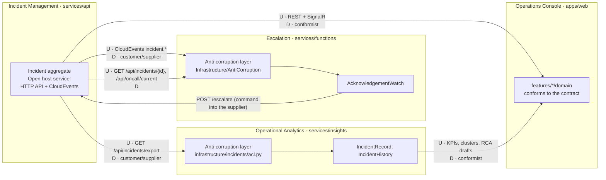

# Context map

Incident Ops is split into four bounded contexts. Each one is a module in the repository, has its own model and its own vocabulary, and talks to the others only through the published contract: the HTTP API and the CloudEvents defined in [contracts.md](https://github.com/marcelo-roman/incident-ops/blob/main/contracts/contracts.md).

## Bounded contexts

| Context | Module | Owns | Core model |
|---|---|---|---|
| Incident Management | [`services/api`](https://github.com/marcelo-roman/incident-ops/tree/main/services/api) | incidents and their timeline, SLA clock, escalation level, alert deduplication, service catalog, on-call rotation; system of record | `Incident` aggregate with `TimelineEntry` and `SlaClock`, `Service`, `OnCallRotation` |
| Escalation | [`services/functions`](https://github.com/marcelo-roman/incident-ops/tree/main/services/functions) | acknowledgement watches, escalation decisions, paging decisions | `AcknowledgementWatch` aggregate, `EscalationDecision`, `PagingDecision` |
| Operational Analytics | [`services/insights`](https://github.com/marcelo-roman/incident-ops/tree/main/services/insights) | KTLO measures, recurring issue clusters, volume anomalies, RCA drafts; never changes an incident | `IncidentRecord`, `IncidentHistory`, `KpiCalculator`, `RecurringIssueDetector`, `VolumeAnomalyDetector`, `RcaDraft` |
| Operations Console | [`apps/web`](https://github.com/marcelo-roman/incident-ops/tree/main/apps/web) | the operator's view: SLA countdowns, allowed actions, filters, live updates | `features/*/domain` modules: SLA clocks, status transitions, validation schemas |

## Map

`U` marks the upstream side of a relationship and `D` the downstream side.

## Relationships

### Incident Management → Escalation

| Aspect | Value |
|---|---|
| Pattern | customer/supplier over a published language; anti-corruption layer on the downstream side |
| Upstream | Incident Management publishes `incident.triggered` and `incident.escalated` (CloudEvents 1.0) on `incident-events` and serves `GET /api/incidents/{id}` and `GET /api/oncall/current` |
| Downstream | Escalation translates the envelope and payload in `Infrastructure/AntiCorruption` into `IncidentProfile`, `IncidentState`, `EscalationLevel` and `AcknowledgementDeadline`; upstream DTOs never reach the domain |
| Back channel | Escalation asks the supplier to act with `POST /api/incidents/{id}/escalate`; the decision to change the incident stays in Incident Management |
| Failure handling | a payload that breaks the contract or an Escalation invariant becomes `MalformedMessageException` and is dead-lettered |

### Incident Management → Operational Analytics

| Aspect | Value |
|---|---|
| Pattern | customer/supplier over a published language; anti-corruption layer on the downstream side |
| Upstream | `GET /api/incidents/export?from=&to=` (flat incidents, no timeline) and `GET /api/incidents/{id}` for RCA drafts |
| Downstream | `infrastructure/incidents/acl.py` is the only code that knows the API field names (`serviceId`, `ackDueAt`, ...); it builds `IncidentRecord` value types, and the CSV source goes through the same translation |
| Shared rule | SLA compliance follows the contract definition; Analytics recomputes it on `IncidentRecord` instead of importing code from the API |

### Incident Management → Operations Console

| Aspect | Value |
|---|---|
| Pattern | conformist over the published language |
| Upstream | REST endpoints and the `/hubs/incidents` SignalR hub (`IncidentChanged`, `TimelineAppended`) |
| Downstream | the console adopts the contract shapes as its types (`features/incidents/domain`), and mirrors the transition rules and SLA thresholds only to decide what to show and which actions to offer; the API stays the authority and answers `409` to an invalid action |

### Operational Analytics → Operations Console

| Aspect | Value |
|---|---|
| Pattern | conformist |
| Upstream | `GET /api/kpis`, `/api/recurring`, `/api/anomalies`, `POST /api/rca/draft` (camelCase response models of the Insights application layer) |
| Downstream | `features/insights` and `features/rca` render those shapes; each RCA draft is labelled with its `generatedBy` value |

## Language per context

The same real-world incident is a different thing in each context, and each context names only what it needs.

| Term | Incident Management | Escalation | Operational Analytics | Operations Console |
|---|---|---|---|---|
| Incident | `Incident` aggregate, the only writable copy | `IncidentProfile` (identity, severity, service) and `IncidentState` (status, level) read from events and the API | `IncidentRecord`, an immutable fact with derived measures | contract `Incident` shape, cached in TanStack Query |
| Deadline | `SlaClock` with acknowledge window and resolve deadline | `AcknowledgementDeadline` for one level | `SlaTargets` and `SlaOutcome` judged after the fact | countdown on screen |
| Escalation | behavior `Escalate`, raises `IncidentEscalated` | `EscalationDecision`: `Escalate`, `AlreadyAcknowledged`, `Superseded`, `FinalLevelReached` | escalated past level 1 counts toward on-call load | escalation chain display |
| Timeline | `TimelineEntry` entities owned by the aggregate | not modelled | `chronology()` used for RCA drafts | timeline component |

## Rules that keep the map honest

- Only Incident Management changes an incident. Other contexts ask through the API.
- A change to the published language starts in [contracts.md](https://github.com/marcelo-roman/incident-ops/blob/main/contracts/contracts.md), reviewed through [CODEOWNERS](https://github.com/marcelo-roman/incident-ops/blob/main/.github/CODEOWNERS); pull requests that touch `contracts/` run the workflows of all four contexts.
- Anti-corruption layers are checked by architecture tests: the Escalation domain does not see upstream DTOs, and import-linter keeps the Analytics domain free of HTTP and serialization frameworks ([code structure](code-structure.md)).
- Decisions behind this split: [ADR 0006](../adr/0006-cloudevents-envelope.md) (published language), [ADR 0008](../adr/0008-tactical-ddd-rich-aggregates-and-value-objects.md) (tactical model), [ADR 0009](../adr/0009-transactional-outbox-for-integration-events.md) (event delivery).
