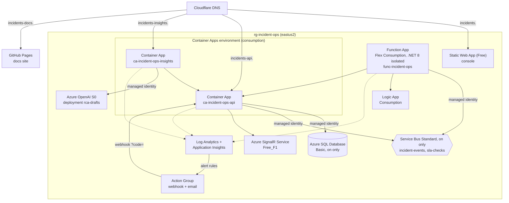
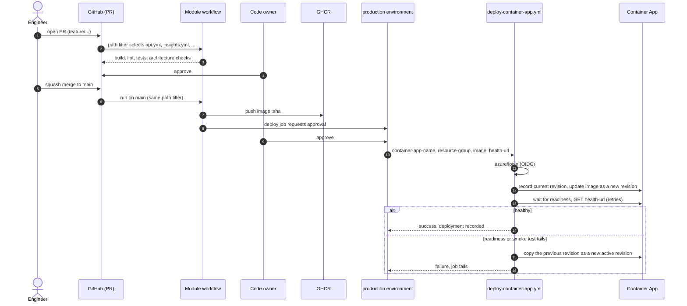

# Deployment

Azure resources, how traffic reaches them, how code gets there, and how it is secured.

## Azure topology

Region `eastus2`, resource group `rg-incident-ops`. All resources are defined in Bicep in [`infra/bicep`](https://github.com/marcelo-roman/incident-ops/tree/main/infra/bicep) ([ADR 0005](../adr/0005-bicep-for-infrastructure.md)).

| Host | Target |
| --- | --- |
| `incidents.marceloroman.com.br` | Static Web App |
| `incidents-api.marceloroman.com.br` | Container App `ca-incident-ops-api` |
| `incidents-insights.marceloroman.com.br` | Container App `ca-incident-ops-insights` |
| `incidents-docs.marceloroman.com.br` | GitHub Pages of `marcelo-roman/incident-ops`, built from `docs/` |

Hosting rationale: [ADR 0004](../adr/0004-container-apps-for-hosting.md).

## Power states

The environment is started on request and powered down every day at 05:00 UTC by [`power.yml`](https://github.com/marcelo-roman/incident-ops/blob/main/.github/workflows/power.yml), which runs [`infra/scripts/power.sh`](https://github.com/marcelo-roman/incident-ops/blob/main/infra/scripts/power.sh). The documentation site on GitHub Pages is always on.

| | On | Off |
| --- | --- | --- |
| Service Bus namespace | present | deleted |
| Azure SQL database | Basic, 5 DTU, re-created empty and seeded by the API on first start | deleted |
| API container app | one warm replica | scaled to zero |
| Availability test and alert rules | enabled | disabled |
| Console | live | full-width notice that the demo environment is paused |

Infrastructure deploys from `infra.yml` keep the current state. The repository variable `KEEP_ON_UNTIL` (UTC date) skips the nightly power down through that date. Costs per state and the operator steps are in the [infrastructure README](https://github.com/marcelo-roman/incident-ops/blob/main/infra/README.md#power-states).

## Runtime configuration

Every module reads configuration from environment variables injected by Bicep (production) or Docker Compose (local). Names are fixed by the [contract](https://github.com/marcelo-roman/incident-ops/blob/main/contracts/contracts.md#runtime-configuration); a module that needs a new setting proposes a contract change first.

| Module | Variables | Production value | Local value |
| --- | --- | --- | --- |
| API | `ConnectionStrings__IncidentOps` | Azure SQL, `Authentication=Active Directory Managed Identity` | SQL Server container, SQL login |
| API | `ServiceBus__FullyQualifiedNamespace`, `ServiceBus__TopicName` | namespace host, `incident-events` | — |
| API | `ServiceBus__ConnectionString` | not set | emulator connection string |
| API | `Azure__SignalR__ConnectionString` | `Endpoint=https://<signalr>;AuthType=azure.msi;Version=1.0;` | not set (in-process hub) |
| API | `Security__EscalationApiKey` | Container Apps secret `escalation-api-key` | `.env` |
| API | `Auth__SigningKey`, `Auth__DemoPassword` | Container Apps secrets `auth-signing-key`, `demo-password` | `.env` |
| API | `Auth__DemoUsername` | `demo` unless the `DEMO_USERNAME` variable is set | `.env` |
| API | `Cors__AllowedOrigins__0`, `Cors__AllowedOrigins__1` | console origins | `http://localhost:8080` |
| API, Insights | `APPLICATIONINSIGHTS_CONNECTION_STRING`, `OTEL_SERVICE_NAME` | shared component; `incident-ops-api` / `incident-ops-insights` | empty (telemetry off) |
| Insights | `INCIDENTS_API_BASE_URL` | API URL | `http://api:8080` |
| Insights | `INCIDENTS_API_KEY`, `AUTH_SIGNING_KEY` | Container Apps secrets `escalation-api-key`, `auth-signing-key` | `.env` |
| Insights | `AZURE_OPENAI_ENDPOINT`, `AZURE_OPENAI_DEPLOYMENT` | account endpoint, `rca-drafts` | optional |
| Insights | `CORS_ALLOWED_ORIGINS` | comma-separated console origins | `http://localhost:8080` |
| Functions | `AzureWebJobsStorage__accountName` | identity-based host storage | `AzureWebJobsStorage` = Azurite |
| Functions | `ServiceBusConnection__fullyQualifiedNamespace` | identity-based trigger connection | `ServiceBusConnection` = emulator connection string |
| Functions | `IncidentEventsTopic`, `SlaSchedulerSubscription`, `NotifierSubscription`, `SlaChecksQueue` | entity names for `%binding%` expressions | same names |
| Functions | `IncidentsApi__BaseUrl`, `IncidentsApi__ApiKey` | API URL, secure app setting | `http://localhost:5080`, `.env` |
| Functions | `Notifications__LogicAppUrl`, `Web__BaseUrl` | Logic App callback URL, console URL | stub URL, `http://localhost:8080` |

Identity-based settings (`__fullyQualifiedNamespace`, `__accountName`, `AuthType=azure.msi`) mean production holds no connection string for Service Bus, Storage or SignalR. The shared secrets are the API key (a GitHub secret injected at deploy time as a Container Apps secret, a Function app setting and the Action Group webhook `code`), the token signing key (a Container Apps secret of the API and of Insights) and the demo password (a Container Apps secret of the API). Key Vault references for the Function app settings are the next hardening step.

## Delivery pipeline

GitHub Actions is the delivery system. The repository holds one workflow per module in [`.github/workflows/`](https://github.com/marcelo-roman/incident-ops/tree/main/.github/workflows), each filtered by path, so a pull request runs only the workflows of the modules it changes. Deploy jobs run only on `main` behind the GitHub environment `production` with required reviewers. Azure login is OpenID Connect (`azure/login@v2`) with federated credentials for `repo:marcelo-roman/incident-ops`, so no Azure secret is stored.

| Module | Workflow | Path filter | Deploy step |
| --- | --- | --- | --- |
| API | `api.yml` | `services/api/**` | image to GHCR, then the local reusable workflow `./.github/workflows/deploy-container-app.yml` |
| Insights | `insights.yml` | `services/insights/**` | image to GHCR, then `./.github/workflows/deploy-container-app.yml` |
| Functions | `functions.yml` | `services/functions/**` | `Azure/functions-action@v1` to `func-incident-ops` (Flex Consumption) |
| Web | `web.yml` | `apps/web/**` | `Azure/static-web-apps-deploy@v1` with `SWA_DEPLOYMENT_TOKEN` |
| Docs | `docs.yml` | `docs/**` | `mkdocs build --strict` on PR; GitHub Pages deploy on `main` |
| Infra | `infra.yml` | `infra/**` | Bicep build and lint, validate and `what-if` in the job summary; deploy on `main` behind `production`, keeping the current power state |
| Power | `power.yml` | none: `workflow_dispatch` and a daily `schedule` on `main` | `infra/scripts/power.sh up` or `down` |
| Platform | `platform.yml` | `docker-compose.yml`, `.env.example`, `local/**`, `scripts/**`, `**/*.md`, `.github/**` | no deploy: compose config, alert rule tests, link check, ShellCheck, actionlint |

Every workflow also triggers on changes to its own file; the four application workflows also run on pull requests that change `contracts/**`. Steps run with `defaults.run.working-directory` set to the module.

[`infra/azure-devops/`](https://github.com/marcelo-roman/incident-ops/tree/main/infra/azure-devops) holds one Azure DevOps pipeline per deployable with the same stages and `trigger.paths.include` filters. They are samples and are not wired to a project; the mapping is in [quality gates](../engineering/quality-gates.md#github-actions-and-azure-devops-equivalents).

## Security

- Managed identities with RBAC for SQL (Entra authentication), Service Bus (`Azure Service Bus Data Sender/Receiver`), SignalR and Azure OpenAI. No connection strings in production for these.
- Nothing but health checks is anonymous. People sign in to the console with a shared demo account and receive a signed access token; services use the API key. The model is described in [Security](security.md) and decided in [ADR 0011](../adr/0011-demo-authentication-with-signed-jwt-and-service-api-keys.md).
- `POST /escalate` and the alert webhooks accept only the API key (`X-Api-Key`, `Authorization: Bearer`, or `?code=` for Azure Monitor, which cannot send custom headers). The key is a Container Apps secret for the API and Insights and a secure app setting for the Function App, all set from one GitHub secret at deploy time.
- No secrets in the repository; `.env.example` carries local-only values. GitHub secrets hold the API key, the token signing key, the demo password, the notification webhook, the Cloudflare token and the Static Web App token.
- Container images run as non-root and declare health checks; image scanning is not automated yet ([quality gates](../engineering/quality-gates.md#not-automated-yet)).
- `POST /api/chaos/faults` exists only when `Chaos:Enabled=true` (set only in the local compose stack), requires the API key, and injects faults only on `/api/incidents`, `/api/services`, `/api/oncall` and `/api/metrics`; alert ingestion, `/metrics`, health and the hub are never affected.
