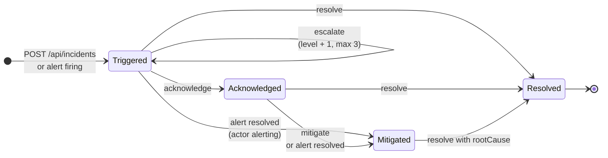
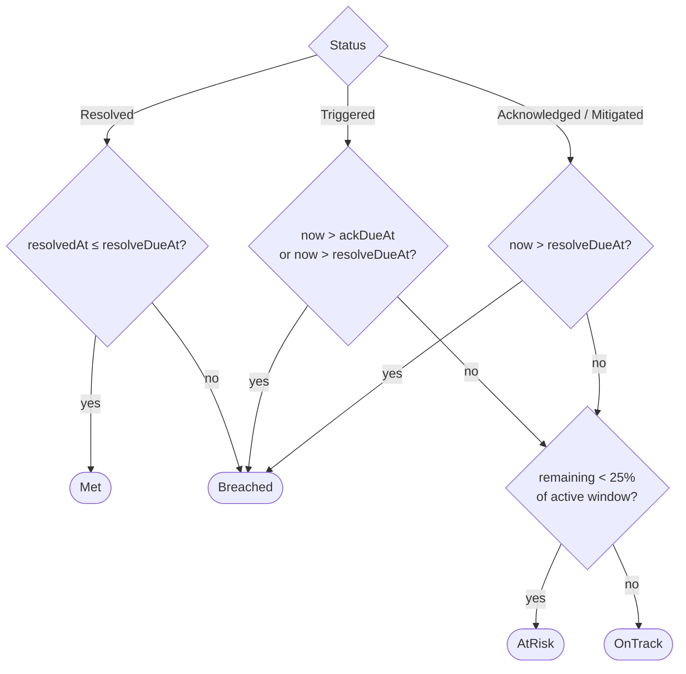
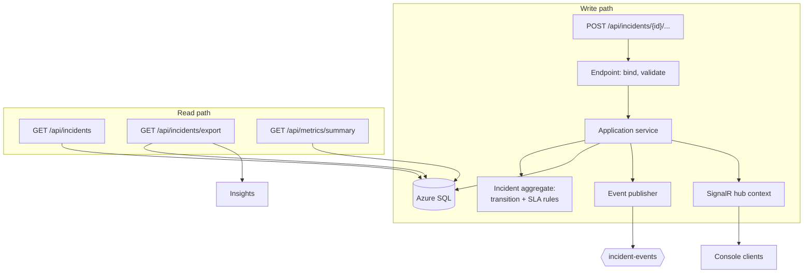
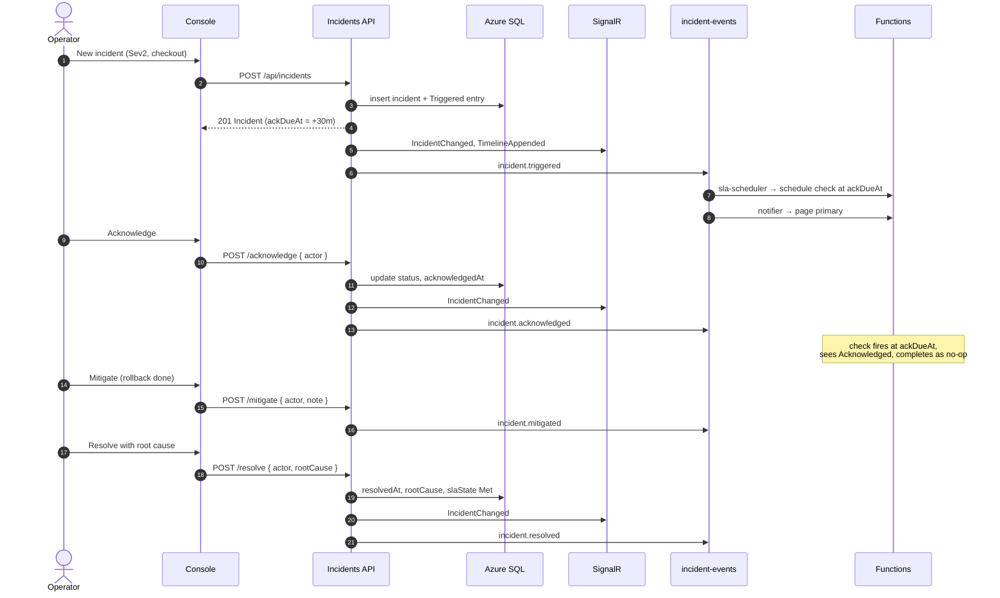

# Incident lifecycle

How an incident moves through its states, what each transition writes, and which events and messages it produces.

## State machine



Any other transition returns `409 Conflict` with problem details. The rules live in the domain's `Incident` aggregate; endpoints only bind input and map results.

| Transition | Who | Writes | Event | Timeline kind |
|---|---|---|---|---|
| create | operator, Alertmanager, Azure Monitor | incident, `ackDueAt`, `resolveDueAt`, level 1 | `incident.triggered` | `Triggered` |
| escalate | `CheckAcknowledgementSla` (API key) | level + 1, new `ackDueAt` | `incident.escalated` | `Escalated` |
| acknowledge | operator | `acknowledgedAt`, `assignee` | `incident.acknowledged` | `Acknowledged` |
| mitigate | operator, or alert resolved | `mitigatedAt` | `incident.mitigated` | `Mitigated` |
| resolve | operator only | `resolvedAt`, `rootCause` | `incident.resolved` | `Resolved` |
| note | operator | — | none | `Note` |
| alert repeat / resolve | alert source | — | none (or `incident.mitigated`) | `Alert` |

## SLA state

`slaState` is computed by the domain from the deadlines, the status and the current time whenever an incident is returned, so it never goes stale between writes.



The active window is the acknowledgement window while `Triggered`, the resolve window afterwards. Windows per severity: [severity and SLA](../operations/severity-and-sla.md).

## Write path and read path



The API commits the state change first, then publishes the CloudEvent and the SignalR messages. If publishing fails after commit, the request still succeeds and the failure is logged with the incident id and alerted; the next state change republishes the full incident. A transactional outbox is the next step if publish failures appear in practice.

## End-to-end sequence

From creation to resolution, for a Sev2 acknowledged in time.



## Event envelope

CloudEvents 1.0 structured mode, full incident in `data`, `eventType` and `severity` duplicated as Service Bus application properties for subscription filters. Rationale: [ADR 0006](../adr/0006-cloudevents-envelope.md).

```json
{
  "specversion": "1.0",
  "id": "5b1c0b0e-1f43-4c55-9a52-8f2d0e7a1c11",
  "type": "incident.escalated",
  "source": "incident-ops-api",
  "time": "2026-10-02T14:15:03Z",
  "subject": "8a6e2f4c-7d1b-4b8e-9a3f-2c5d6e7f8a9b",
  "datacontenttype": "application/json",
  "data": { "number": 1042, "severity": "Sev1", "status": "Triggered", "escalationLevel": 2, "ackDueAt": "2026-10-02T14:30:03Z" }
}
```
