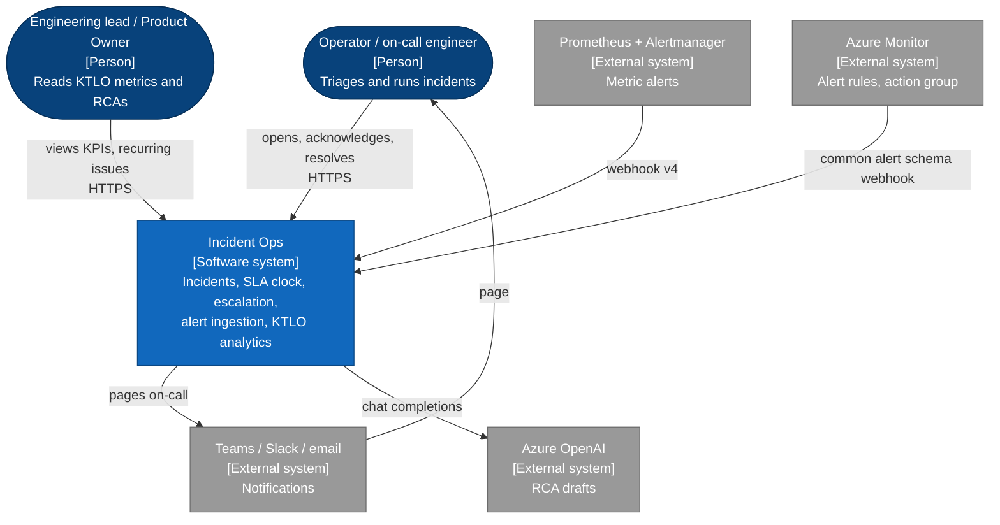
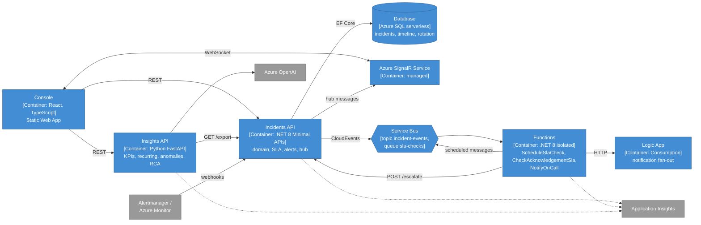

# Architecture overview

Incident Ops is the system an operations team uses to open, acknowledge, mitigate and resolve incidents against a severity-based SLA, to turn alerts into incidents, to get paged when nobody acknowledges, and to measure KTLO load from the history. Every interface is defined in the [contract](https://github.com/marcelo-roman/incident-ops/blob/main/contracts/contracts.md); these pages explain how the pieces fit and why.

| Page | Covers |
|---|---|
| This page | goals, system context, containers, failure modes, capacity |
| [Context map](context-map.md) | bounded contexts and how they relate |
| [Incident lifecycle](incident-lifecycle.md) | status state machine, write/read paths, event flow per transition |
| [SLA timers and escalation](sla-escalation.md) | scheduled-message timer loop, idempotency guard, on-call rotation |
| [Real-time updates](real-time.md) | SignalR hub, negotiation, reconnect |
| [Deployment](deployment.md) | Azure topology, DNS, security, delivery pipeline |
| [Observability](observability.md) | Application Insights vs Prometheus, correlation, KQL and PromQL |
| [Code structure](code-structure.md) | layers, aggregates and boundaries per module, and how they are enforced |
| [Alerting](../operations/alerting.md) | alert → incident → SLA → escalation → notification |

## Design goals

In priority order:

1. Escalation must fire even when the API is idle and must never double-escalate.
2. An alert becomes exactly one incident, however many times it repeats.
3. The console reflects changes from other operators within 2 seconds.
4. Each module is deployable on its own, against a published contract.
5. Runs on consumption SKUs: near-zero cost when idle.

## System context

C4 level 1: who uses the system and what it talks to.

## Containers

C4 level 2: deployable units and how they communicate.

| Container | Responsibility | Runtime | State |
|---|---|---|---|
| Console (`apps/web`) | incident list, detail, timeline, on-call, KPIs | Static Web App | none |
| Incidents API (`services/api`) | system of record; transitions; SLA deadlines and `slaState`; alert ingestion and dedupe; events; SignalR hub; `/metrics` | Container App | Azure SQL |
| Functions (`services/functions`) | SLA timers, escalation on missed acknowledgement, paging | Function App, Flex Consumption | Service Bus |
| Logic App | fan-out to Teams/Slack webhook and email | Logic App, Consumption | none |
| Insights (`services/insights`) | MTTA/MTTR/SLA KPIs, recurring clusters, volume anomalies, RCA drafts | Container App | none, reads the export endpoint |
| Infrastructure (`infra`) | Bicep, Azure DevOps samples; deployed by `.github/workflows/infra.yml` | GitHub Actions | Azure is the state |

Boundaries follow ownership of data: only the API writes incidents. Each container is one bounded context; the [context map](context-map.md) shows how they relate. Functions and alert sources change incident state exclusively through API endpoints, so transition rules exist in one place, the domain layer.

## Analytics and AI

Insights pulls `GET /api/incidents/export?from=&to=` and computes with Pandas. It holds no database: the dataset is a few thousand rows, and recomputing per request with a short in-memory cache is cheaper than keeping a second store consistent. Recurring issues use TF-IDF over title and description, latent semantic analysis and k-means with the cluster count chosen by silhouette; anomalies flag weeks whose volume per service is at least 3 standard deviations above the previous 8 weeks (rolling z-score). RCA drafts send the incident and its timeline to the Azure OpenAI deployment `rca-drafts` (GPT-5 family, `gpt-5.4-mini` by default, model parameterized in Bicep) and return a structured draft for a human to edit. Rationale: [ADR 0007](../adr/0007-python-for-analytics-service.md). Metric definitions: [KTLO metrics](../operations/ktlo-metrics.md).

## Failure modes

| Failure | Effect | Mitigation |
|---|---|---|
| Service Bus unavailable | Events wait in the transactional outbox; timers and pages start late | API keeps serving; the outbox dispatcher retries with capped backoff and delivers when Service Bus recovers. Runbook: [escalation not firing](../operations/runbooks/sla-breach-escalation-not-firing.md) |
| Function throws on check | Message retried, then dead-lettered after 10 deliveries | Dead-letter alert. Runbook: [dead letters](../operations/runbooks/service-bus-dead-letters.md) |
| API unavailable when check fires | Escalation call fails, message retried | Retries cover a ~10 minute outage; beyond that dead letters are replayed |
| Duplicate or late check message | None | Level-matching guard makes the check idempotent |
| Alert webhook repeated or retried | None | Fingerprint dedupe appends a timeline entry instead of a new incident |
| API down while alerts fire | Alert sources retry; incidents created late | Alertmanager retries the webhook; `ApiDown` itself routes to on-call outside the API path ([alerting](../operations/alerting.md#when-the-api-is-the-thing-that-is-down)) |
| SignalR unavailable | Console stops live-updating | Client refetches every 30 s |
| Azure OpenAI throttled or down | RCA draft unavailable | Insights returns `502` problem details instead of a mislabelled fallback draft; KPIs unaffected |
| SQL serverless resumed from pause | First request after idle takes several seconds | Availability test keeps it warm in business hours |

## Capacity and cost

Sized for a team of 6 to 40 engineers and up to a few hundred incidents a month. All compute is consumption-billed and scales to zero, except Service Bus Standard (fixed base charge) and Log Analytics ingestion. Ingestion is the cost to watch: sampling stays off for exceptions and Service Bus dependencies, and is set to 25% for successful `GET` requests.
