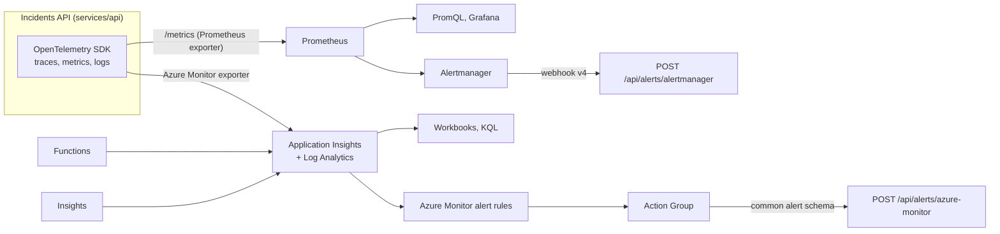

# Observability

Two telemetry paths with different jobs. Application Insights is the system of investigation: traces, logs, exceptions, dependencies, correlated across modules. Prometheus is the system of alerting on the API's metrics in the local stack and in any Kubernetes or self-hosted deployment; in Azure, Azure Monitor alert rules over Application Insights do the same job.

## What goes where

| Signal | Application Insights | Prometheus |
| --- | --- | --- |
| HTTP requests (rate, errors, latency) | `requests` table, every module | `http_server_request_duration_seconds` histogram, API `/metrics` |
| Dependencies (SQL, Service Bus, HTTP) | `dependencies` table | — |
| Exceptions with stack traces | `exceptions` table | — |
| Structured logs | `traces` table with `incidentId`, `eventType`, `decision` | — |
| Distributed traces | end-to-end transaction view via `operation_Id` | — |
| Domain metrics (meter `IncidentOps.Api`) | `customMetrics` | `incidentops_incidents_open{severity}`, `incidentops_sla_breached_open`, `incidentops_sla_compliance_30d`, `incidentops_incident_events_total{kind,severity,source}` |
| Availability | standard test on `/health/live`, 15 min, 1 location, while the environment is on | `up{job="incident-ops-api"}` |
| Alerting | Azure Monitor alert rules → Action Group | rules → Alertmanager |
| Retention | 90 days (Log Analytics) | 15 days (local Prometheus default) |

Both are fed by OpenTelemetry in the API: the Azure Monitor exporter and the Prometheus exporter run side by side on the same instruments, so a request counted in one is counted in the other.



## Correlation

- W3C trace context on HTTP (`traceparent`), propagated by the OpenTelemetry instrumentation.
- On Service Bus, the publisher sets `Diagnostic-Id`/`traceparent` as an application property; the Functions trigger continues the trace, so one `operation_Id` covers console click → API → topic → function → `POST /escalate` → API.
- Every log line inside an incident operation carries `incidentId` and `incidentNumber` as scope properties (`customDimensions` in Application Insights).

## KQL examples

End-to-end trace for one incident:

```kusto
let incidentId = "<incident id>";
let ops = union traces, requests
    | where timestamp > ago(2d)
    | where tostring(customDimensions.incidentId) == incidentId
    | distinct operation_Id;
union requests, dependencies, traces, exceptions
| where operation_Id in (ops)
| project timestamp, cloud_RoleName, itemType, name, message, success, duration
| order by timestamp asc
```

p95 latency per route, last 24 hours:

```kusto
requests
| where timestamp > ago(24h) and cloud_RoleName == "incident-ops-api"
| summarize p95 = percentile(duration, 95), count() by name
| order by p95 desc
```

Event publish failures:

```kusto
dependencies
| where timestamp > ago(24h)
| where cloud_RoleName == "incident-ops-api" and type has "Service Bus" and success == false
| summarize failures = count() by bin(timestamp, 15m), resultCode
```

More queries in the [runbooks](../operations/runbooks/index.md) and [SLOs](../operations/slo.md).

## PromQL examples

Error ratio over 5 minutes (basis of `ApiHighErrorRate`):

```promql
sum(rate(http_server_request_duration_seconds_count{job="incident-ops-api", http_response_status_code=~"5.."}[5m]))
/
sum(rate(http_server_request_duration_seconds_count{job="incident-ops-api"}[5m]))
```

p95 latency per route (basis of `ApiHighLatencyP95`):

```promql
histogram_quantile(0.95,
  sum by (le, http_route) (rate(http_server_request_duration_seconds_bucket{job="incident-ops-api"}[5m])))
```

Open incidents by severity and breached SLAs (basis of `SlaBreachesOpen`):

```promql
sum by (severity) (incidentops_incidents_open)
incidentops_sla_breached_open
```

Request rate by status class:

```promql
sum by (http_response_status_code) (rate(http_server_request_duration_seconds_count{job="incident-ops-api"}[1m]))
```

Rules built on these: [alerting](../operations/alerting.md#prometheus-rules).

## Sampling and cost

- Application Insights: adaptive sampling off for exceptions, dependencies to Service Bus and all non-2xx requests; successful `GET` requests sampled at 25%. KQL counts over sampled data use `sum(itemCount)` instead of `count()` when precision matters.
- Prometheus: scrape interval 15 s; no high-cardinality labels (no incident id, no user) on metrics.
