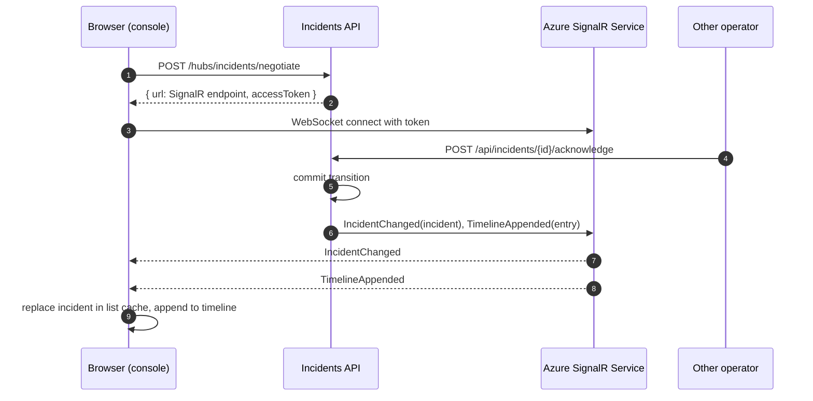
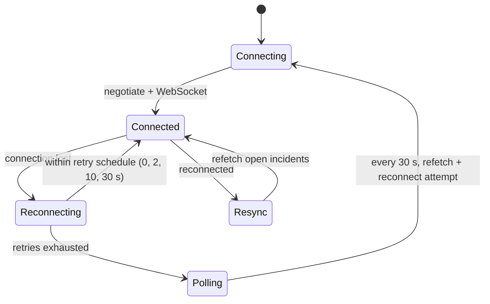

# Real-time updates

Operators see acknowledgements, escalations, alert repeats and notes from others within 2 seconds, without refreshing. Rationale: [ADR 0003](../adr/0003-azure-signalr-service.md).

## Hub contract

Path `/hubs/incidents`. Server-to-client only; all writes go through REST so validation and rate limiting live in one place.

| Method | Argument | Sent when |
| --- | --- | --- |
| `IncidentChanged` | `Incident` | any field changes: create, transition, escalation, assignee |
| `TimelineAppended` | `TimelineEntry` | a timeline entry is written: transitions, notes, alerts |

Production runs Azure SignalR Service in default mode; locally the hub is in-process. The API code is the same: `AddAzureSignalR()` is applied only when the connection setting exists.

## Connection and broadcast

The API holds no client connections; the service does. API replicas can scale to zero or restart without dropping operators.

## Reconnect and consistency

Messages missed while disconnected are not replayed. The client treats REST as the source of truth and refetches the open list after every reconnect, so the hub only needs to be fast, not reliable. Each `IncidentChanged` carries the full incident, which makes applying it idempotent and order-tolerant by comparing timestamps.

## Limits

| Item | Free_F1 | Standard_S1 (per unit) |
| --- | --- | --- |
| Concurrent connections | 20 | 1 000 |
| Messages per day | 20 000 | 1 000 000 |
| SLA | none | 99.9% |

The demo runs on `Free_F1`. A team of 40 operators with the console open all day fits one `Standard_S1` unit; moving is a SKU change in Bicep, not a code change.
