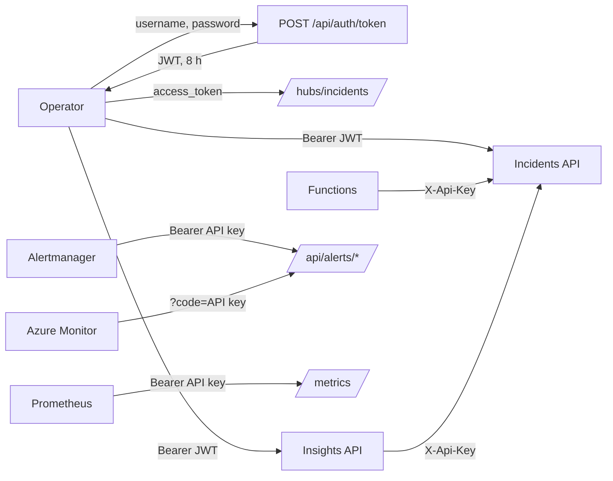

# Security

Nothing in Incident Ops is anonymous except health checks. People sign in to the console with one shared demo account and receive a signed access token; services authenticate with the API key. The decision and the alternatives are in [ADR 0011](../adr/0011-demo-authentication-with-signed-jwt-and-service-api-keys.md); the wire format is fixed by the [contract](https://github.com/marcelo-roman/incident-ops/blob/main/contracts/contracts.md#authentication).

## Callers and credentials

| Caller | Credential | Reaches |
| --- | --- | --- |
| Console (browser) | `Authorization: Bearer <JWT>` from `POST /api/auth/token`; the hub reads it from `access_token` | Incidents API `/api/*` except service endpoints, `/hubs/incidents`, Insights `/api/*` |
| Swagger UI, Insights `/docs` | the same JWT through **Authorize** | the same endpoints |
| Escalation functions | `X-Api-Key` | incident and on-call reads, `POST /api/incidents/{id}/escalate` |
| Insights service | `X-Api-Key` | `GET /api/incidents/export` |
| Alertmanager (local) | `Authorization: Bearer <API key>` | `POST /api/alerts/alertmanager` |
| Azure Monitor action group | `?code=<API key>` | `POST /api/alerts/azure-monitor` |
| Prometheus (local) | `Authorization: Bearer <API key>` from a credentials file | `GET /metrics` |
| Availability test, Container Apps probes, deploy smoke tests | none | `/health/live`, `/health/ready`, Insights `/health` |

## Endpoint matrix

| Endpoint | Anonymous | JWT | API key |
| --- | --- | --- | --- |
| `/health/live`, `/health/ready`, `POST /api/auth/token`, `/swagger` | yes | | |
| `/api/services`, `/api/incidents` reads and writes (except escalate), `/api/oncall/current`, `/api/metrics/summary`, `/hubs/incidents` | | yes | `X-Api-Key` |
| `POST /api/incidents/{id}/escalate`, `/api/chaos/*` | | | `X-Api-Key` |
| `POST /api/alerts/alertmanager`, `POST /api/alerts/azure-monitor` | | | `X-Api-Key`, `Authorization: Bearer`, `?code=` |
| `/metrics` | | | `X-Api-Key`, `Authorization: Bearer` |
| Insights `/health`, `/docs`, `/openapi.json` | yes | | |
| Insights `/api/*` | | yes | |

On mixed endpoints `Authorization: Bearer` always means a JWT, so the API key never travels in that header outside alert ingestion and `/metrics`. A JWT sent to a service endpoint is rejected with `401`.

## Access tokens

| Property | Value |
| --- | --- |
| Format | JWT, HS256 |
| Signing key | `Auth__SigningKey` in the API, `AUTH_SIGNING_KEY` in Insights; at least 32 bytes, startup fails otherwise |
| Issuer, audience | `incident-ops-api`, `incident-ops` |
| Claims | `sub` and `name` (the username), `iat`, `nbf`, `exp`, `jti` |
| Lifetime | 8 hours (`Auth__TokenLifetime`); 30 seconds of clock skew |
| Revocation | none; rotating the signing key invalidates every token |

The console keeps the token in memory and in `sessionStorage` until `expiresAt`, sends it on every API and Insights request, and on any `401` clears the session and returns to the login page with the original path preserved.

## Login protection

- One account: `Auth__DemoUsername` and `Auth__DemoPassword`. The password is a secret in GitHub and in Container Apps and is shared on request; it is never committed.
- Username and password are compared in constant time (SHA-256 digests compared with `CryptographicOperations.FixedTimeEquals`), both always evaluated.
- Every failure answers the same `401` problem details, `Invalid username or password.`
- `POST /api/auth/token` has its own fixed window per client IP: 5 attempts a minute, then `429`.
- With no password configured every login is rejected.

## Secrets

| Secret | Source | Consumers |
| --- | --- | --- |
| API key | GitHub secret `ESCALATION_API_KEY` | API (`Security__EscalationApiKey`), Insights (`INCIDENTS_API_KEY`), Function app (`IncidentsApi__ApiKey`), Action Group webhook `code` |
| Token signing key | GitHub secret `AUTH_SIGNING_KEY` | API (`Auth__SigningKey`), Insights (`AUTH_SIGNING_KEY`) |
| Demo password | GitHub secret `DEMO_PASSWORD` | API (`Auth__DemoPassword`) |

The demo username comes from the repository variable `DEMO_USERNAME` (default `demo`). Bicep receives the secrets as `@secure()` parameters and stores them as Container Apps secrets referenced by `secretRef`. Locally, [`.env.example`](https://github.com/marcelo-roman/incident-ops/blob/main/.env.example) carries local-only values.

## Limits

- One shared account means no per-person audit: timeline actors are typed by the operator, not taken from the token.
- Tokens cannot be revoked individually before they expire.
- The token lives in `sessionStorage`, readable by scripts on the console origin; the console has no third-party scripts and React escapes rendered content.
- A deployment with real users replaces the token endpoint with Microsoft Entra ID; the alternatives are compared in [ADR 0011](../adr/0011-demo-authentication-with-signed-jwt-and-service-api-keys.md).
