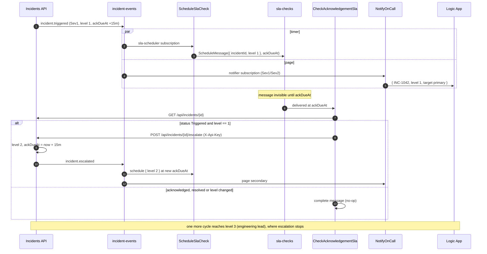
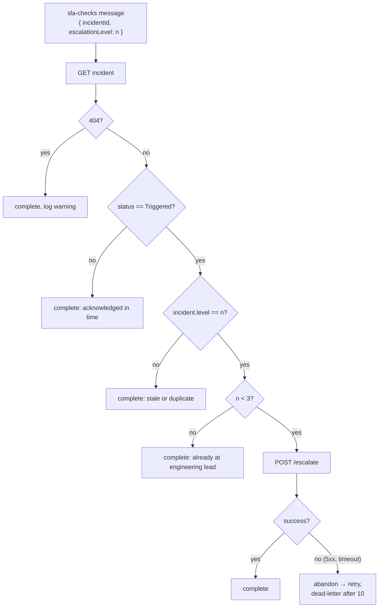
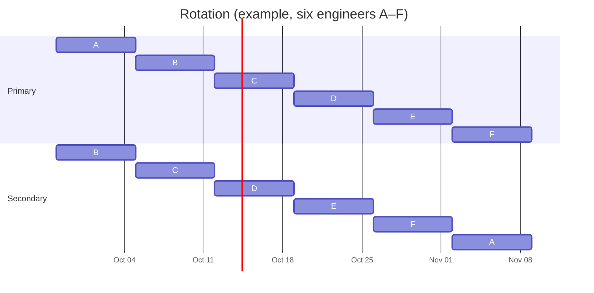
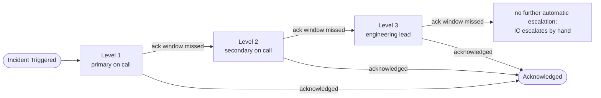

# SLA timers and escalation

An unacknowledged incident climbs one escalation level per missed acknowledgement window, up to level 3. No component polls: the timer is a Service Bus scheduled message. Rationale: [ADR 0002](../adr/0002-service-bus-scheduled-messages-for-sla-timers.md).

## Deadlines

- On creation: `ackDueAt = createdAt + ack window`, `resolveDueAt = createdAt + resolve window`.
- On each escalation: `ackDueAt = now + ack window`; `resolveDueAt` does not move.
- Windows: Sev1 15 min / 4 h, Sev2 30 min / 8 h, Sev3 4 h / 3 days, Sev4 24 h / 10 days ([severity and SLA](../operations/severity-and-sla.md)).

## Timer loop

## Idempotency guard

Messages can be delivered twice, late, or race with a human acknowledgement. The check compares the message's level with the incident's current level and does nothing on mismatch.

No message is ever cancelled. Acknowledging an incident simply turns its pending check into a no-op, which removes a whole class of race conditions.

## On-call rotation

Six engineers, weekly shifts starting Monday 10:30 America/New_York. Each engineer is secondary the week before being primary, so they take the pager with context on what is in flight.

`GET /api/oncall/current` returns `{ weekStart, primary, secondary, lead }` for the current week.

## Escalation levels

| Severity | Level 1 → 2 after | Level 2 → 3 after | Lead paged at the latest |
| --- | --- | --- | --- |
| Sev1 | 15 min | 15 min | 30 min after trigger |
| Sev2 | 30 min | 30 min | 1 h |
| Sev3 | 4 h | 4 h | 8 h (not paged; queue) |
| Sev4 | 24 h | 24 h | 48 h (not paged; queue) |

Paging only happens for Sev1 and Sev2 (`notifier` subscription filter). Sev3 and Sev4 escalate in the record, which moves the assignee's queue, without waking anyone. Human escalation paths beyond level 3: [incident response](../operations/incident-response.md#escalation-paths).
