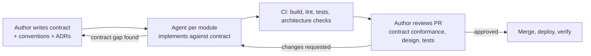

# AI-assisted development

How the team uses AI coding assistants and agents. The goal is more throughput on well-specified work without lowering the bar on correctness, security or ownership.

## Principles

1. **The author owns the change.** Whoever opens the PR answers for every line, generated or not.
2. **Specification before generation.** An agent gets a contract, acceptance criteria and conventions, not an open-ended wish.
3. **Tests and CI decide, not confidence.** Generated code passes the same [quality gates](quality-gates.md) as hand-written code.
4. **Nothing secret goes to a model.** No credentials, customer data, or production logs with personal data.

## Where it pays off

| Task | Why it works |
|---|---|
| Implementing endpoints, handlers and DTOs against a written contract | Spec is precise; output is easy to verify |
| Test scaffolding from acceptance criteria | Fast to generate, fast to review for meaning |
| Migrations between library versions | Mechanical, well documented, verified by build and tests |
| Bicep modules for standard resources | Documented schemas; `what-if` verifies |
| KQL queries and dashboards from a description | Easy to run and check against real data |
| First drafts of runbooks and READMEs from code | Author edits for accuracy |
| Explaining unfamiliar code during incident triage | Read-only, speeds orientation |

## What is not delegated

| Decision | Reason |
|---|---|
| Architecture and ADR decisions | Trade-offs depend on context the model does not have: team, budget, roadmap |
| Contract design ([contracts.md](https://github.com/marcelo-roman/incident-ops/blob/main/contracts/contracts.md)) | It is the boundary everything else is checked against |
| SLA policy, severity definitions, escalation semantics | Business commitments |
| Security-sensitive code without line-by-line review (auth, crypto, input parsing of untrusted data) | Plausible but wrong is worst here |
| Final say on a postmortem's root cause | Requires accountability and context |
| Merging | A human approves and merges |

## Guardrails

- Agents run with access to the repository only; no production credentials, no cloud write permissions.
- `.env.example` with placeholders is the only configuration an agent sees.
- Agents do not commit, push or merge; they leave changes in the working tree or a draft PR for review.
- Agents do not edit the contract or pipeline definitions; a needed change is raised to the author.
- New dependencies proposed by an agent are justified in the PR and pass the dependency audit.
- Sessions are scoped to one module and one work item at a time, so diffs stay reviewable.

## Workflow: contract-first with parallel agents

1. The author writes or updates the contract and acceptance criteria.
2. One agent session per module implements against it, in parallel.
3. CI runs on each change; failures go back to the agent with the log.
4. The author reviews each PR with the [code review guidelines](code-review-guidelines.md), focusing on contract conformance, domain placement and test meaning.
5. Contract gaps discovered during implementation go back to step 1, never patched locally in one module.

## Prompting practices

- Give the agent the contract section, the conventions and the acceptance criteria verbatim; link files rather than paraphrase.
- Ask for tests first for domain logic; review the tests before the implementation.
- State what not to touch (other modules, pipelines, the contract).
- Ask for the verification it ran (build, lint, test output) and check it against CI.
- Keep a module-level instructions file (conventions, commands to build/test) so every session starts from the same rules.

## Review

Extra checks on AI-assisted diffs, on top of the normal checklist:

- APIs, packages and configuration keys exist in the versions we use.
- Tests assert requirements, not the code's current behavior; at least one test fails if the feature is removed.
- No unrequested scope: extra endpoints, options, abstractions or files.
- Error handling is real (not swallowed, not generic catch-all logging).
- Names and structure follow conventions; no explanatory comments compensating for unclear code.

## AI inside the product

Insights drafts RCAs with Azure OpenAI (`POST /api/rca/draft`):

- Input is the incident record and its timeline only.
- Output is structured (summary, timeline, contributing factors, action items) and labeled as a draft in the console.
- The postmortem owner edits and approves; drafts are not stored as final documents.
- Calls go to an Azure OpenAI deployment in the same tenant (data not used for model training), authenticated with managed identity.
- Failures return `503` with problem details; the rest of Insights keeps working.

## Measuring the effect

Compared per quarter, not per person: PR cycle time, change failure rate, escaped defects, and review rework (PRs needing more than two rounds). If change failure rate rises while throughput rises, the guardrails tighten.
