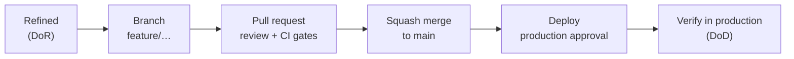

# Engineering standards

How work enters a sprint, what done means, how code is reviewed, merged, gated and released. The same rules apply to every module; per-workflow specifics are in [quality gates](quality-gates.md).

| Standard | Rule of thumb |
| --- | --- |
| [Definition of Ready](definition-of-ready.md) | no story enters a sprint without testable acceptance criteria, an estimate and named dependencies |
| [Definition of Done](definition-of-done.md) | merged, deployed, observable, documented, accepted |
| [Branching and git workflow](branching-and-git-workflow.md) | trunk-based, branches under 2 days, squash merge, `feature/` `hotfix/` `chore/` |
| [Code review guidelines](code-review-guidelines.md) | first review in 4 business hours, under 400 lines, comment prefixes |
| [Quality gates](quality-gates.md) | build, lint, tests, coverage floor, scans on every PR in GitHub Actions |
| [Testing strategy](testing-strategy.md) | pyramid per module, architecture tests, coverage floors |
| [Release readiness checklist](release-readiness-checklist.md) | backward-compatible migrations, rollback verified, `production` approval |
| [ADO hygiene](ado-hygiene.md) | work item hierarchy, tags, capacity, say/do ratio |

