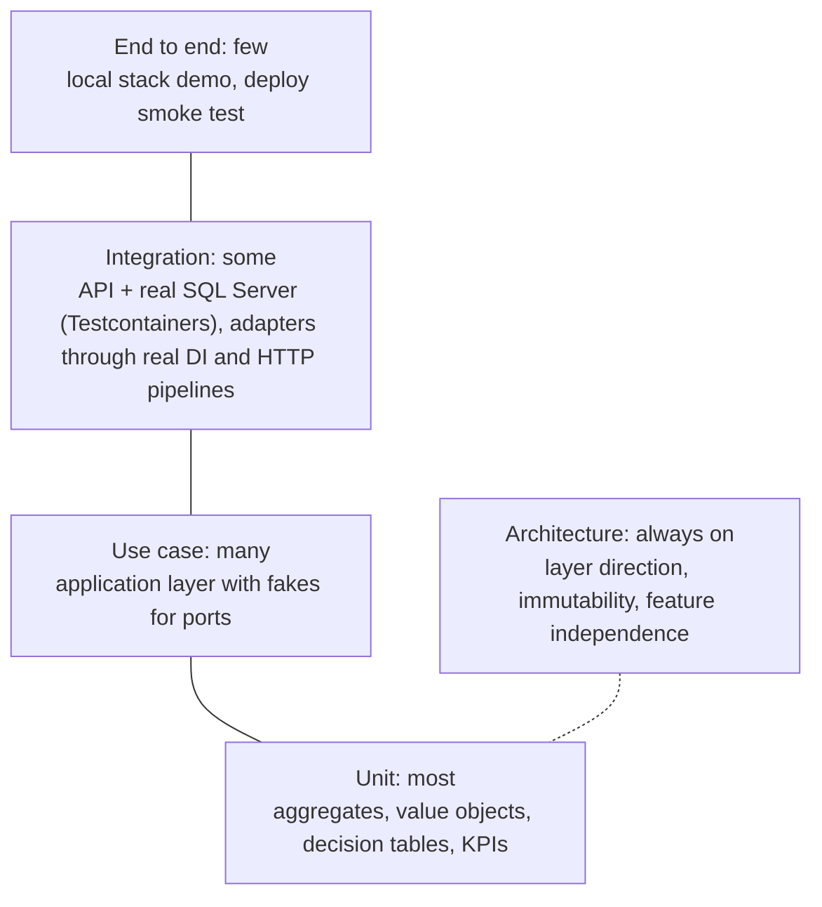

# Testing strategy

What is tested at which level in each module, what CI enforces, and why the shape is a pyramid: most of the confidence comes from fast tests on the domain, a smaller number of tests go through real infrastructure, and a few check the system end to end.

## Pyramid

| Level | Speed | Runs | Proves |
| --- | --- | --- | --- |
| Unit | ms | every PR that touches the module | business rules are correct, including edge cases |
| Use case | ms | same | orchestration: right ports called, right events raised, right errors |
| Integration | seconds | same | mapping, SQL, migrations, HTTP contract, serialization against real dependencies |
| Architecture | ms | same | dependency direction and boundaries hold |
| Contract fixtures | ms | same | real payloads parse and map: Alertmanager and Azure Monitor webhooks in `services/api/tests/IncidentOps.Api.Tests/Fixtures`, CloudEvent samples in the Escalation anti-corruption tests, the committed incident sample and response snapshots in Insights |
| End to end | minutes | after deploy (smoke test), on demand locally (`scripts/demo.sh`) | the system works as wired |

## Test counts

| Module | Tests | Coverage today | Gate |
| --- | --- | --- | --- |
| `services/api` | 204 (Domain 109, Application 37, Api integration 35, Architecture 23) | 95.8% line, 83.2% branch | 80% merged line coverage (ReportGenerator in `api.yml`) |
| `services/functions` | 186 (one project: Domain, Application, AntiCorruption, Adapters, Host, Architecture) | 94.8% line, 90.1% branch | 80% line and branch (`coverlet.msbuild`, fails the build) |
| `services/insights` | 178 | 99% line with branch coverage | 85% (`fail_under` in `pyproject.toml`) |
| `apps/web` | 161 | above every threshold | 70% global; 95% lines on `src/features/*/domain/**`; 90% on `src/shared/{format,config,http}/**` (`vite.config.ts`) |

## Per module

### Incident Management (`services/api`)

| Level | Project | Tools | Covers |
| --- | --- | --- | --- |
| Unit | `tests/IncidentOps.Domain.Tests` | xUnit | value object invariants, aggregate behaviors and the events they raise, state machine, `SlaClock` state and compliance, escalation cap at level 3, rotation across week boundaries and daylight saving time, alert rules |
| Use case | `tests/IncidentOps.Application.Tests` | xUnit, in-memory fakes of the ports wired through the real DI registration | every use case and query, domain event translation, outbox message handling and retries, metrics report |
| Integration | `tests/IncidentOps.Api.Tests` | `WebApplicationFactory`, Testcontainers SQL Server 2022 | lifecycle over HTTP, problem details, API key, alert ingestion with real payloads, outbox retries, seeded history, SignalR broadcast, rate limiting, chaos, Prometheus output, CloudEvent format |
| Architecture | `tests/IncidentOps.Architecture.Tests` | NetArchTest, reflection | layer dependencies, aggregates and owned entities, immutable value objects and events, no public setters, repositories only for roots, sealed single-method handlers ([code structure](../architecture/code-structure.md#incident-management-servicesapi)) |

### Escalation (`services/functions`)

| Suite | Covers |
| --- | --- |
| `Domain` | value object invariants; `AcknowledgementWatch.Open`, `Schedule`, `Evaluate` and `PagingDecision.Decide` as decision tables |
| `Application` | each use case against hand-written port fakes, time through `FakeTimeProvider`, log fields through `FakeLogger` |
| `AntiCorruption` | CloudEvent and SLA check translation, upstream status mapping, rejection of payloads that break the contract or the model |
| `Adapters` | typed HttpClients through the real DI and resilience pipeline with a recording handler (routes, `X-Api-Key`, `404`/`409` mapping, no retry on `POST`); Service Bus message shape; Logic App payload; telemetry redaction |
| `Host` | settlement (complete, abandon and rethrow, dead-letter) and each trigger end to end from a `ServiceBusReceivedMessage` |
| `Architecture` | dependency rule, upstream DTOs confined to the anti-corruption layer, domain immutability ([code structure](../architecture/code-structure.md#escalation-servicesfunctions)) |

### Operational Analytics (`services/insights`)

| Folder | Covers | How |
| --- | --- | --- |
| `tests/domain` | value objects, `IncidentRecord`, `IncidentHistory`, `KpiCalculator`, `RecurringIssueDetector`, `VolumeAnomalyDetector`, `RcaDraftComposer`, `KtloReportComposer` | small hand-built incident sets with known answers |
| `tests/application` | use cases | in-memory incident source, canned and failing drafters, fixed clock |
| `tests/infrastructure` | anti-corruption layer, API client and retries, CSV source, cache, settings, Azure OpenAI drafter, logging, telemetry | `httpx.MockTransport`; the real `AzureOpenAI` client over a mocked transport |
| `tests/interface` | HTTP API, CLI, report rendering, snapshots | `TestClient`, `CliRunner` against the committed sample; snapshots fail on any changed number or field |
| import-linter | layers, plain domain, independent features ([code structure](../architecture/code-structure.md#operational-analytics-servicesinsights)) | `uv run lint-imports` |

### Operations Console (`apps/web`)

| Level | Location | Tools | Covers |
| --- | --- | --- | --- |
| Unit | `src/features/*/domain`, `src/features/realtime/connection`, `src/shared/**` | Vitest | SLA clocks and edge cases (exactly 25% remaining, escalated windows), transitions, schemas, formatting, runtime config, reconnect backoff, connection supervisor |
| Component | `src/features/*/{pages,components,hooks,api}`, `src/app` | Vitest, Testing Library, MSW | dashboard, filters, incident actions (validation, success, `409`), declaration, insights, on-call, RCA drafts, realtime cache wiring, app shell |
| Boundaries | lint | `eslint-plugin-boundaries` | feature isolation ([code structure](../architecture/code-structure.md#operations-console-appsweb)) |
| End to end | `e2e/smoke.spec.ts` | Playwright against the mock dev server | declare and acknowledge in a browser; run on demand, not in CI |

### Infrastructure and platform

| Workflow | Checks |
| --- | --- |
| `infra.yml` | `az bicep build`, `build-params` and `lint` (every rule at error), Logic App JSON, ShellCheck on `infra/scripts`, Azure DevOps YAML parses, `validate` and `what-if` with OIDC |
| `platform.yml` | `promtool test rules` (each alert fires and stays quiet where it should), `promtool check config`, `amtool check-config`, `docker compose config` (default and `functions` profile), Service Bus emulator JSON, Markdown link check over every `.md`, ShellCheck, actionlint |
| `docs.yml` | `mkdocs build --strict` |

## Coverage

Coverage is a floor that stops erosion, not a goal. Generated code, migrations, composition roots and `Program.cs` are excluded. A test that only executes code without asserting behavior does not count in review.

## Writing tests

- Name tests after behavior: `Acknowledge_after_resolve_is_rejected_with_conflict`, `test_mttr_excludes_open_incidents`.
- One behavior per test; arrange with builders, not long setup blocks.
- Time is injected (`IClock`, `TimeProvider`, fixed `as_of`), never read from the system clock in rules.
- Bug fixes start with a failing test that reproduces the bug.
- Flaky tests are fixed or quarantined within one business day, with a work item; a quarantined test is not a passing test.

Gates per workflow, after merge and between GitHub Actions and Azure DevOps: [quality gates](quality-gates.md).
