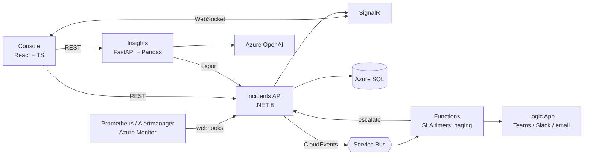

# Incident Ops

Incident management and KTLO operations platform: incidents against severity-based SLAs, alerts turned into deduplicated incidents, escalation through an on-call rotation without polling, real-time console, and KTLO analytics with AI-drafted root cause analyses.

This site documents how it is built and how it is operated. The interface contract every module implements is [contracts.md](https://github.com/marcelo-roman/incident-ops/blob/main/contracts/contracts.md).

## Live

| What | URL |
| --- | --- |
| Operations console | <https://incidents.marceloroman.com.br> |
| Incidents API (Swagger) | <https://incidents-api.marceloroman.com.br/swagger> |
| Insights API (OpenAPI) | <https://incidents-insights.marceloroman.com.br/docs> |
| Source and local stack | <https://github.com/marcelo-roman/incident-ops> |

## System at a glance

## Sections

| Section | Start with |
| --- | --- |
| Architecture | [overview and C4 diagrams](architecture/index.md), [SLA timers and escalation](architecture/sla-escalation.md), [deployment and delivery](architecture/deployment.md) |
| Operations | [support model](operations/support-model.md), [alerting](operations/alerting.md), [incident response](operations/incident-response.md), [runbooks](operations/runbooks/index.md) |
| Engineering | [quality gates](engineering/quality-gates.md), [definition of done](engineering/definition-of-done.md) |
| Leadership | [stakeholder updates](leadership/stakeholder-updates.md), [KTLO vs roadmap](leadership/ktlo-vs-roadmap.md) |
| Decisions | [architecture decision records](adr/index.md) |

## Modules

All modules live in one repository, [marcelo-roman/incident-ops](https://github.com/marcelo-roman/incident-ops). Each bounded context is one module ([context map](architecture/context-map.md)).

| Module | Bounded context | Role |
| --- | --- | --- |
| [`services/api`](https://github.com/marcelo-roman/incident-ops/tree/main/services/api) | Incident Management | system of record, SLA clock, alert ingestion, real-time hub |
| [`services/functions`](https://github.com/marcelo-roman/incident-ops/tree/main/services/functions) | Escalation | SLA timers, escalation, notifications |
| [`services/insights`](https://github.com/marcelo-roman/incident-ops/tree/main/services/insights) | Operational Analytics | KTLO analytics and RCA drafts |
| [`apps/web`](https://github.com/marcelo-roman/incident-ops/tree/main/apps/web) | Operations Console | operations console |
| [`infra`](https://github.com/marcelo-roman/incident-ops/tree/main/infra) | | Bicep, Azure DevOps samples, delivery scripts |
| [`docs`](https://github.com/marcelo-roman/incident-ops/tree/main/docs) | | this site |
| [`contracts`](https://github.com/marcelo-roman/incident-ops/tree/main/contracts) | | the contract every module implements |
| [`local`](https://github.com/marcelo-roman/incident-ops/tree/main/local) | | local stack configuration: Prometheus, Alertmanager, Service Bus emulator |
| [`.github/workflows`](https://github.com/marcelo-roman/incident-ops/tree/main/.github/workflows) | | one path-filtered workflow per module and a reusable container app deploy |
