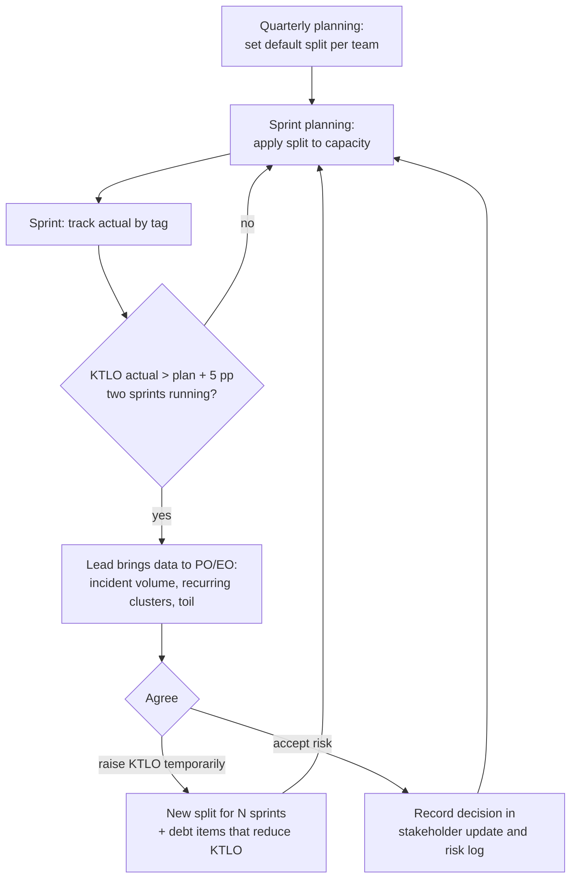

# KTLO vs roadmap

How capacity is split between keeping the lights on, roadmap features and technical debt, how the split is set, and how it is renegotiated when reality disagrees.

## Definitions

| Bucket | Includes | Tag |
| --- | --- | --- |
| Features | roadmap work agreed with Product | none |
| KTLO | incident follow-ups, bugs in production, dependency and runtime upgrades, certificate and secret rotation, alert tuning, support requests, compliance tasks | `ktlo` |
| Tech debt | deliberate improvement with a stated payoff: refactors, test gaps, architecture changes, automation of toil | `tech-debt` |
| Toil (subset of KTLO) | manual, repetitive, automatable work with no lasting value | `toil` |

## Allocation model

Default split per sprint, applied to planned capacity ([capacity planning](../engineering/ado-hygiene.md#capacity-planning)):

| Bucket | Default | Floor | Ceiling |
| --- | --- | --- | --- |
| Features | 60% | 40% | 75% |
| KTLO | 25% | 15% | 45% |
| Tech debt | 15% | 10% | 25% |

The split is a budget, not a target. KTLO consumption is reactive; the plan reserves it so it does not silently eat feature work.

## Signals that move the split

| Signal | Source | Moves |
| --- | --- | --- |
| SLA compliance below target for 2 months | [KTLO metrics](../operations/ktlo-metrics.md) | KTLO ↑ for the affected service |
| Recurring cluster ≥ 5 incidents in 90 days | Insights `/api/recurring` | tech debt ↑ (fix the class, not the instance) |
| Toil > 20% two sprints running | Boards tag `toil` | tech debt ↑ (automation) |
| Error budget exhausted | [SLO](../operations/slo.md#error-budget-policy) | features ↓ until recovered |
| Postmortem actions past due > 15% | [retrospective actions](retrospective-actions.md) | KTLO ↑ |
| Major roadmap deadline with contractual weight | Product | features ↑ to ceiling, debt to floor, time-boxed with a payback sprint |

## Negotiating with Product Owners and Engineering Owners

The conversation is about trade-offs with numbers, not about engineering wanting more time.

1. **Bring the cost of not doing it.** "Recurring dead-letter incidents cost 14 engineer-hours and 2 late escalations in the last 6 weeks" is a business case; "the code is messy" is not.
2. **Offer options, not a demand.** Three options with impact on the roadmap date, for example:

    | Option | Feature date impact | Expected effect |
    | --- | --- | --- |
    | A. Stay at 25% KTLO | none | incident load stays at ~8 Sev2+/month |
    | B. 35% KTLO for 2 sprints, then back to 25% | Feature X +1 week | recurring cluster closed; projected −3 Sev2/month |
    | C. Dedicated sprint on reliability | Feature X +2 weeks | B plus alert noise cleanup |

3. **Time-box any change.** Temporary splits end on a named sprint and are reviewed with the same metrics.
4. **Make the payoff measurable.** Each debt item states the metric it should move (MTTR, incident volume, toil hours) and is checked a month later.
5. **Record the decision.** Accepted risks go to the [risk log](risk-and-dependency-log.md) with the decision owner; the weekly [stakeholder update](stakeholder-updates.md) states the split actually delivered.
6. **Escalate only after options.** Disagreement goes to the Head of Engineering and Head of Product together, with the options table, not as a complaint.

## Reporting

Every sprint review shows planned vs actual split and the top three KTLO consumers by service. Quarterly, the trend of KTLO share and incident volume per service goes into planning: a service whose KTLO share keeps growing is a candidate for a modernization feature on the roadmap rather than more KTLO budget.
