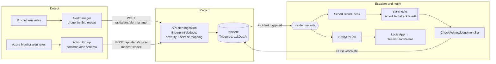
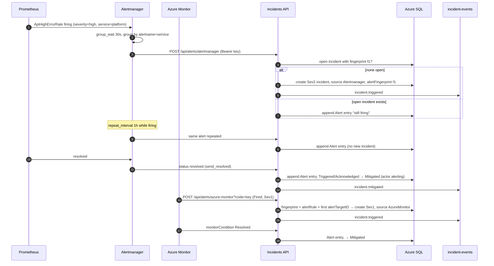

# Alerting

How a symptom in production becomes a page to the right person: alert rules, routing, deduplication, incident creation, SLA clock, escalation and notification, end to end.

## End to end



1. A rule fires in Prometheus or Azure Monitor.
2. Alertmanager or the Action Group posts a webhook to the API.
3. The API fingerprints the alert. No open incident for the fingerprint → new incident, `source` set, severity and service mapped. Open incident → `Alert` timeline entry only.
4. The new incident starts its SLA clock and emits `incident.triggered`.
5. Functions schedule the acknowledgement check and page the on-call primary for Sev1/Sev2.
6. Unacknowledged at `ackDueAt` → escalation to secondary, then engineering lead ([SLA timers and escalation](../architecture/sla-escalation.md)).
7. The alert resolves → `Alert` timeline entry; an incident still `Triggered` or `Acknowledged` moves to `Mitigated` with actor `alerting`. Resolving with a root cause stays a human action.

## Alert → incident



### Deduplication

| Source | Fingerprint | Effect of repeats |
|---|---|---|
| Alertmanager | the alert's `fingerprint` (hash of its label set) | one incident per label set; repeats append `Alert` entries |
| Azure Monitor | `essentials.alertRule` + first `essentials.alertTargetIDs` entry | one incident per rule and resource |

Dedupe applies only to **open** incidents. After an incident is resolved, the same alert firing again opens a new incident, which is what the recurring-issue analysis in Insights counts.

### Severity mapping

| Alertmanager `severity` label | Azure Monitor `essentials.severity` | Incident | Pages |
|---|---|---|---|
| `critical` | `Sev0`, `Sev1` | `Sev1` | yes |
| `high`, `error` | `Sev2` | `Sev2` | yes |
| `warning` | `Sev3` | `Sev3` | no |
| `info`, missing | `Sev4` | `Sev4` | no |

Service comes from the `service` label (Alertmanager) or `customProperties.service` (Azure Monitor). Unknown or missing service falls back to `platform`.

### Authentication

The API key is accepted as `X-Api-Key`, `Authorization: Bearer <key>` (Alertmanager `http_config.authorization`) or `?code=<key>` (Azure Monitor webhooks cannot set headers). The key is the `ESCALATION_API_KEY` deployment secret, stored as a Container Apps secret and a Function app setting; rotation updates those, the Action Group webhook URL and the Alertmanager credentials file together.

## Prometheus rules

Evaluated every 15 s against the API's `/metrics`. The rules file and its unit tests live in [`local/prometheus/`](https://github.com/marcelo-roman/incident-ops/tree/main/local/prometheus), checked by `promtool` in the `platform` workflow.

| Alert | Expression (summary) | For | Severity | Incident |
|---|---|---|---|---|
| `ApiDown` | `up{job="incident-ops-api"} == 0` | 1m | `critical` | Sev1 |
| `ApiHighErrorRate` | 5xx ÷ all requests > 5% over 5m, with at least 0.2 req/s | 2m | `high` | Sev2 |
| `ApiHighLatencyP95` | p95 of `http_server_request_duration_seconds` > 1 s over 5m | 5m | `warning` | Sev3 |
| `SlaBreachesOpen` | `incidentops_sla_breached_open > 0` | 5m | `warning` | none; routed to the engineering lead |

```yaml
- alert: ApiHighErrorRate
  expr: |
    (
      sum(rate(http_server_request_duration_seconds_count{job="incident-ops-api", http_response_status_code=~"5..", http_route!~"/metrics|/health.*"}[5m]))
      /
      sum(rate(http_server_request_duration_seconds_count{job="incident-ops-api", http_route!~"/metrics|/health.*"}[5m]))
    ) > 0.05
    and
    sum(rate(http_server_request_duration_seconds_count{job="incident-ops-api", http_route!~"/metrics|/health.*"}[5m])) > 0.2
  for: 2m
  labels:
    severity: high
    service: platform
  annotations:
    summary: incident-ops-api error rate above 5%
    description: "{{ $value | humanizePercentage }} of API requests returned 5xx over the last 5 minutes."
    runbook_url: https://incidents-docs.marceloroman.com.br/operations/runbooks/api-high-error-rate/
```

Every rule carries `severity`, `service`, `summary`, `description` and `runbook_url`. `summary` becomes the incident title and `description` its description.

`SlaBreachesOpen` also carries `category: process`. It describes the incident process, not a system: it fires when open incidents sit past an SLA deadline, which means escalation or ownership is failing. Turning it into one more incident would page the same rotation that is already missing deadlines, so Alertmanager routes it to the engineering lead instead.

## Alertmanager routing

```yaml
route:
  receiver: incident-ops-api
  group_by: [alertname, service]
  group_wait: 30s
  group_interval: 5m
  repeat_interval: 1h
  routes:
    - matchers: [category="process"]
      receiver: engineering-lead
      repeat_interval: 4h

inhibit_rules:
  - source_matchers: [alertname="ApiDown"]
    target_matchers: [alertname=~"ApiHighErrorRate|ApiHighLatencyP95|SlaBreachesOpen"]
    equal: [service]

receivers:
  - name: incident-ops-api
    webhook_configs:
      - url: http://api:8080/api/alerts/alertmanager
        send_resolved: true
        http_config:
          authorization:
            type: Bearer
            credentials_file: /alertmanager/api-key

  - name: engineering-lead
    webhook_configs:
      - url: http://notification-sink:8080/engineering-lead
        send_resolved: true
```

Locally the `engineering-lead` receiver posts to the `notification-sink` echo service; in a real deployment it targets the lead's channel.

| Setting | Value | Why |
|---|---|---|
| `group_by` | `alertname`, `service` | one notification per problem per service, not per instance |
| `group_wait` | 30 s | lets related alerts arrive together on first fire |
| `group_interval` | 5 min | batches new alerts into an existing group |
| `repeat_interval` | 1 h | still-firing alerts re-notify hourly; the API turns that into a timeline entry, not a new incident |
| inhibition | `ApiDown` suppresses the other API alerts | when the API is down, error rate, latency and SLA metrics are noise |
| `send_resolved` | true | drives auto-mitigation |
| `category="process"` route | `engineering-lead`, repeat 4 h | process alerts go to the person who owns the process, not into the incident queue |

## Azure Monitor

Defined in Bicep in [`infra/bicep/modules/alerting.bicep`](https://github.com/marcelo-roman/incident-ops/blob/main/infra/bicep/modules/alerting.bicep). All rules route to one Action Group whose webhook targets `/api/alerts/azure-monitor?code=<key>` with the common alert schema enabled.

| Rule | Signal | Condition | Severity | `customProperties.service` |
|---|---|---|---|---|
| API availability | standard availability test on `/health/ready` | 2 of 3 locations failing for 5 min | `Sev1` | `platform` |
| API failed requests | Application Insights `requests/failed` | > 5% for 5 min, ≥ 50 requests | `Sev2` | `platform` |
| API server response time | `requests/duration` p95 | > 1 s for 10 min | `Sev3` | `platform` |
| Dead-lettered messages | Service Bus `DeadletteredMessages` | > 0 on any entity | `Sev2` | `platform` |
| Function failures | Function App failed executions | > 5 in 15 min | `Sev2` | `platform` |

## When the API is the thing that is down

The API cannot record an incident about its own outage. Two independent paths cover it:

- **Azure**: the Action Group also has email and SMS receivers for the on-call distribution list, so the availability alert reaches people even when the webhook fails.
- **Prometheus**: Alertmanager retries the webhook with backoff; in a production Alertmanager, `ApiDown` additionally routes (`continue: true`) to a pager receiver outside the API. The local stack keeps only the API receiver.

## Alert hygiene

| Rule | Check |
|---|---|
| Actionable only | every alert implies a human action now; if the action is "wait and see", it is a dashboard, not an alert |
| Runbook linked | `runbook_url` (Prometheus) or the rule description (Azure Monitor) points to a page in [runbooks](runbooks/index.md); no runbook, no merge |
| Symptoms over causes | page on user-facing symptoms (errors, latency, availability, SLA); cause-level signals (CPU, memory) go to dashboards |
| Severity by impact | severity label follows the [severity definitions](severity-and-sla.md#severity-definitions), not the rule author's worry level |
| Owned | every rule has a `service` and that service has an `ownerTeam` |
| Tested | Prometheus rules have `promtool test rules` cases; Azure rules are fired once in a test before merge |

Noise review in the weekly ops review ([KTLO metrics](ktlo-metrics.md#review-cadence)):

Alert-created incidents in the last 7 days that were never acknowledged and were mitigated by the alert resolving, grouped by title: candidates for tuning.

```bash
curl -s "https://incidents-api.marceloroman.com.br/api/incidents/export?from=$(date -u -d '-7 days' +%F)&to=$(date -u +%F)" \
  | jq '[.[] | select(.source != "Manual" and .acknowledgedAt == null and .mitigatedAt != null)]
        | group_by(.title) | map({title: .[0].title, count: length}) | sort_by(-.count)'
```

| Signal | Threshold | Action |
|---|---|---|
| Alert-created incidents never acknowledged, auto-mitigated | > 3 per rule per week | tune threshold or `for`, or demote severity |
| Alert-created incidents closed as noise | > 10% of alert incidents | review rule with owner |
| Rules with no firing in 90 days | any | confirm still meaningful; test it fires |
| Pages outside business hours | > 2 per week | [on-call health](support-model.md#on-call-health) review |

Tuning work is tagged `toil` or `ktlo` and comes out of the KTLO allocation.
