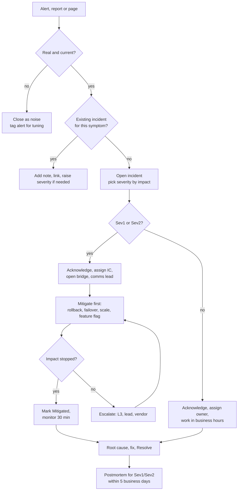

# Incident response

How an incident is run from detection to closure.

## Roles

Roles are filled for every Sev1 and Sev2. For Sev3/Sev4 the assignee holds all three.

| Role | Default | Responsibilities | Does not |
| --- | --- | --- | --- |
| Incident commander (IC) | L2 primary until handed off; engineering lead for Sev1 longer than 1 h | owns severity, decisions, priorities, role assignments, when to escalate, when to declare mitigated | debug hands-on |
| Comms lead | L1 lead or secondary on call | stakeholder updates on cadence, status page, single point of contact for questions | make technical decisions |
| Scribe | any engineer not debugging | timeline in the incident (`POST /notes`): actions, findings, decisions with timestamps | filter what goes in |
| Subject matter experts | owning team (L3) | investigate and mitigate as directed by the IC | change severity or communicate externally |

Handing off IC is explicit: "I am handing IC to Ana, Ana confirm" in the bridge and a note on the timeline.

## Triage flow



Mitigation before diagnosis: restore service with the cheapest reversible action, then find the cause.

## First 15 minutes

For a Sev1 or Sev2, the person acknowledging:

1. Acknowledge in the console (`POST /acknowledge`) — stops the escalation timer.
2. Confirm severity against [severity definitions](severity-and-sla.md#severity-definitions).
3. Open the bridge (Teams meeting linked in the incident note).
4. Assign IC (self by default), comms lead and scribe.
5. Post the initial update ([template](#initial-update)).
6. Check what changed: deploys in the last 24 h (GitHub deployments on `production`), config changes, Azure Service Health, dependency status.
7. Pick the matching runbook: [runbooks](runbooks/index.md).

## Escalation paths

| Trigger | Escalate to | How |
| --- | --- | --- |
| Not acknowledged within ack window | next on-call level (automatic) | `CheckAcknowledgementSla` → `POST /escalate` |
| Sev1 not mitigated in 60 min, Sev2 in 2 h | engineering lead + owning team lead | IC pages directly |
| Needs code change or deep component knowledge | owning team (L3) | page the team's on-call or lead |
| Azure platform issue suspected | Azure support, severity A for Sev1 | support request; record case number in notes |
| Data loss, data exposure or security | security on call + engineering lead, immediately | page; Sev1 regardless of scope |
| Customer contractual impact | account/product owner | comms lead |
| Sev1 lasting > 2 h | head of engineering | IC |

Escalating early is never a mistake in review. Escalating late is the common one.

## Stakeholder communication

| Severity | Audience | Channel | First update | Cadence | Resolution |
| --- | --- | --- | --- | --- | --- |
| `Sev1` | engineering leadership, product owners, support, account owners | incident channel + email list + status page | 15 min after declaration | every 30 min, even if nothing changed | within 1 h of resolution; postmortem link in 5 business days |
| `Sev2` | product owners of affected service, support | incident channel + email | 30 min | every 60 min | within 2 h |
| `Sev3` | owning team, support | incident channel | 4 h | daily | on resolution |
| `Sev4` | owning team | the work item | — | — | on resolution |

Rules: say what is known, what is not, and when the next update is. No speculation about cause before it is confirmed. Times in UTC with EST in parentheses.

## Templates

### Initial update

```text
[INC-{number}] {Sev} — {title}
Status: Investigating
Impact: {who is affected and how; % of requests or users if known}
Started: {time UTC} ({time EST})
Services: {serviceId}
IC: {name} | Comms: {name}
What we are doing: {current action}
Next update: {time UTC} or sooner if status changes
```

### Progress update

```text
[INC-{number}] {Sev} — {title}
Status: Investigating | Identified | Mitigating | Monitoring
Impact: {current impact; changed since last update?}
Since last update: {findings and actions, 2–4 bullets}
Next steps: {actions and owners}
Next update: {time UTC}
```

### Mitigated

```text
[INC-{number}] {Sev} — Mitigated
Impact ended: {time UTC}; duration {h:mm}
Mitigation: {what restored service}
Residual risk: {anything still degraded or temporary}
Next: root cause and permanent fix; postmortem by {date}
```

### Resolved

```text
[INC-{number}] {Sev} — Resolved
Root cause (summary): {one or two sentences}
Customer impact: {scope, duration}
Follow-up: postmortem {link} on {date}
```

### Executive summary (Sev1, within 24 h)

```text
What happened: {one paragraph, plain language}
Impact: {customers, transactions, revenue if known, SLA breached?}
Duration: detection {t}, mitigation {t}, resolution {t}
Cause: {confirmed / under investigation}
What we are doing to prevent recurrence: {top 3 actions with dates}
```

## Closing an incident

- `Mitigated` when user impact has stopped and has stayed stopped for 30 minutes.
- `Resolved` with `rootCause` filled: one or two sentences naming the cause, not the symptom.
- Sev1/Sev2: postmortem scheduled before resolving; owner assigned on the incident ([template](postmortem-template.md)).
- Temporary mitigations still in place become work items tagged `incident-followup` before resolving.

## Anti-patterns

- Debugging in a direct message instead of the bridge and the timeline.
- IC debugging hands-on and losing track of the whole picture.
- Holding updates until there is good news.
- Lowering severity to make the SLA look better.
- Resolving without root cause because the symptom went away.
