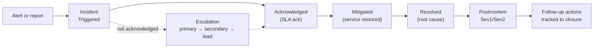

# Operations

How production is supported: who responds, how fast, how incidents are run, how alerts become incidents, and what is measured.

| Page | Covers |
| --- | --- |
| [Support model](support-model.md) | L1/L2/L3, hours 10:30–18:30 ET, on-call 1 week in 6, handoffs, on-call health |
| [Severity and SLA](severity-and-sla.md) | severity definitions with examples, ack/resolve targets, `slaState` |
| [Alerting](alerting.md) | Prometheus rules, Alertmanager routing, Azure Monitor, dedupe, severity mapping, alert hygiene |
| [Incident response](incident-response.md) | roles, triage flow, escalation paths, stakeholder comms cadence and templates |
| [Postmortem template](postmortem-template.md) | blameless format; [example Sev1](postmortems/2026-09-17-payments-gateway-timeouts.md) |
| [Runbooks](runbooks/index.md) | API error rate, dead letters, escalation not firing, with KQL |
| [KTLO metrics](ktlo-metrics.md) | MTTA, MTTR, SLA compliance, recurring rate, toil, KTLO split, and how Insights computes them |
| [SLOs](slo.md) | SLIs, objectives, burn-rate alerts, error budget policy |

