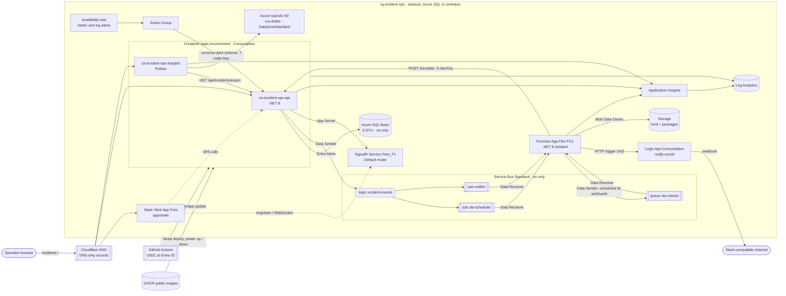

# Infrastructure

Infrastructure as code and delivery for Incident Ops: Bicep for every Azure resource in `rg-incident-ops`, the scripts for one-time setup and DNS, and Azure DevOps pipelines kept as samples. The GitHub Actions workflows that validate, preview and deploy it, and the reusable workflow that ships container app revisions with smoke test and rollback, live in [`.github/workflows/`](../.github/workflows).

## Contents

1. [Architecture](#architecture)
2. [Resources and estimated cost](#resources-and-estimated-cost)
3. [Power states](#power-states)
4. [Folder layout](#folder-layout)
5. [Naming and tags](#naming-and-tags)
6. [Runtime configuration](#runtime-configuration)
7. [Security model](#security-model)
8. [Delivery with GitHub Actions](#delivery-with-github-actions)
9. [Azure DevOps samples](#azure-devops-samples)
10. [First deployment](#first-deployment)
11. [Custom domains and DNS](#custom-domains-and-dns)
12. [Alerting](#alerting)
13. [Cost controls](#cost-controls)
14. [Teardown](#teardown)
15. [Local validation](#local-validation)
16. [Design decisions](#design-decisions)
17. [License](#license)

## Architecture



Event flow, as defined in the shared contract:

1. The API persists an incident in Azure SQL, pushes `IncidentChanged` through SignalR and publishes a CloudEvent to `incident-events` with application properties `eventType` and `severity`.
2. `sla-scheduler` (`eventType IN ('incident.triggered','incident.escalated')`) feeds `ScheduleSlaCheck`, which schedules a message on `sla-checks` at `ackDueAt`.
3. `CheckAcknowledgementSla` receives it; if the incident is still `Triggered` at the same level it calls `POST /api/incidents/{id}/escalate` and the cycle repeats up to level 3.
4. `notifier` (same filter `AND severity IN ('Sev1','Sev2')`) feeds `NotifyOnCall`, which posts to the Logic App HTTP trigger; the workflow forwards a message to the configured webhook.
5. Azure Monitor alerts reach the same API through the Action Group webhook and become incidents.

## Resources and estimated cost

The environment has two power states (see [Power states](#power-states)). The last column says whether a resource exists in both or only while the environment is on.

| Resource | Name | SKU / plan | Present |
|---|---|---|---|
| Log Analytics workspace | `log-incident-ops` | PerGB2018, 30 days, 0.25 GB/day cap | always |
| Application Insights | `appi-incident-ops` | workspace-based | always |
| Container Apps environment | `cae-incident-ops` | Consumption workload profile | always |
| Container app | `ca-incident-ops-api` | 0.25 vCPU / 0.5 GiB; 1–2 replicas on, 0–2 off | always |
| Container app | `ca-incident-ops-insights` | 0.5 vCPU / 1 GiB, 0–2 replicas | always |
| Managed certificates | 2 | free | always |
| Azure SQL logical server | `sql-incident-ops-<suffix>` | Entra-only auth | always |
| Azure SQL database | `sqldb-incident-ops` | Basic, 5 DTU, 2 GB | on only |
| SignalR Service | `sigr-incident-ops-<suffix>` | Free_F1 (20 connections, 20k messages/day) | always |
| Service Bus namespace | `sbns-incident-ops-<suffix>` | Standard (topics need Standard) | on only |
| Function App plan | `asp-incident-ops-functions` | Flex Consumption FC1, 2048 MB instances | always |
| Function App | `func-incident-ops` | .NET 8 isolated | always |
| Storage account | `stincidentops<suffix>` | Standard_LRS, shared key disabled | always |
| Logic App | `logic-incident-ops-notify` | Consumption | always |
| Azure OpenAI | `oai-incident-ops-<suffix>` | S0, `gpt-5.4-mini` DataZoneStandard, 10k TPM | always |
| Static Web App | `stapp-incident-ops` | Free | always |
| Availability test | `webtest-incident-ops-api-live` | standard test, 1 location every 15 min | always; runs only when on |
| Metric alerts | 3 rules, plus the dead-letter rule while on | per monitored time series | always; evaluated only when on |
| Log alert | 1 rule | 15-minute frequency | always; evaluated only when on |
| Action Group | `ag-incident-ops` | webhook + optional email | always |
| Budget | `budget-incident-ops` | 30 USD monthly | always |

Figures below are estimates in USD from `eastus2` list prices, for evaluation traffic. They are not quotes; the budget alert is the guardrail.

### On

| Item | Basis | Per day | Per week |
|---|---|---|---|
| Service Bus Standard | 0.0135 per hour base charge | ~0.32 | ~2.27 |
| Azure SQL Basic | 4.90 per month | ~0.16 | ~1.13 |
| API container app, 1 replica of 0.25 vCPU / 0.5 GiB | a week fits in the Container Apps monthly free grant (180,000 vCPU-seconds, 360,000 GiB-seconds) | ~0 | ~0 |
| Log Analytics | first 5 GB per month free per billing account, then ~2.30 per GB; ingestion capped at 0.25 GB per day | ~0 | ~0 |
| Availability test | 1 location every 15 minutes | ~0.05 | ~0.35 |
| Metric alerts | ~0.10 per rule per month, 4 rules | ~0.01 | ~0.09 |
| Log alert | ~0.50 per month | ~0.02 | ~0.12 |
| Insights container app, Functions, Logic App, Azure OpenAI, storage | pay per use | cents | cents |
| SignalR, Static Web App, Container Apps environment, SQL logical server, Action Group, budget | free | 0 | 0 |
| **Total** | | **~0.6** | **~4** |

Log Analytics stays at ~0 while a month's ingestion fits in the free 5 GB; past it, the daily cap bounds the charge at ~0.58 per day.

### Off

| Item | Basis | Per month |
|---|---|---|
| Storage account | function host state and deployment package | <0.10 |
| Log Analytics | residual platform logs, 30-day retention, within the free 5 GB | ~0 |
| Availability test, alert rules | deployed disabled; the dead-letter rule is deleted with the namespace | 0 |
| API and insights container apps | scaled to zero | 0 |
| Function App, Logic App, Azure OpenAI | idle, pay per use | 0 |
| SQL logical server without a database, free SKUs | no compute | 0 |
| **Total** | | **under 1** |

## Power states

`environmentState` (`on` or `off`) is a parameter of `main.bicep`; `main.bicepparam` reads it from `ENVIRONMENT_STATE` and defaults to `on`.

| | On | Off |
|---|---|---|
| Service Bus namespace, topic, subscriptions, queue | deployed, with the Service Bus role assignments | not in the template; deleted by `power.sh down` |
| Azure SQL database | Basic, 5 DTU, 2 GB | not in the template; deleted by `power.sh down` |
| API container app | `minReplicas` 1, so requests never wait for a cold start | `minReplicas` 0 |
| Availability test, metric and log alerts | enabled | deployed disabled; the dead-letter alert is deleted by `power.sh down` |

Incremental deployments never delete resources, so the script removes what `off` leaves out of the template. Settings that point at Service Bus (`ServiceBus__FullyQualifiedNamespace`, `ServiceBusConnection__fullyQualifiedNamespace`) are built from the namespace name, so both states deploy whether or not the namespace exists.

### Data

The database is deleted on every `down` and created empty on every `up`. The API runs with `Database__ApplyMigrations=true` and `Database__Seed=true`, so its first start applies the migrations and seeds the services, the rotation and six months of history. The history comes from a fixed random seed relative to the seeding date, so every `up` produces the same shape of data. Incidents created during an evaluation do not survive `down`.

Contained database users live in the database, so the API identity is granted again after each `up`. [`scripts/sql-grant-api-identity.sh`](scripts/sql-grant-api-identity.sh) does it as the caller, who must be a member of `sg-incident-ops-sql-admins`: it reads the client id of the API's system-assigned identity from Azure Resource Manager (`<app id>/providers/Microsoft.ManagedIdentity/identities/default`), creates the user with `CREATE USER ... WITH SID = <client id>, TYPE = E` (no Microsoft Graph lookup, so a service principal can run it without directory roles), adds `db_datareader`, `db_datawriter` and `db_ddladmin`, and retries while the new database and group membership settle. It opens a temporary firewall rule for the caller's public IP and removes it on exit.

### `scripts/power.sh`

Idempotent; requires the Azure CLI, `curl` and, for `up`, [go-sqlcmd](https://github.com/microsoft/go-sqlcmd).

| Command | Steps |
|---|---|
| `up` | deploy with `environmentState=on` using `main.bicepparam` and the running images; grant the API identity on the new database; restart the latest API revision; wait for `/health/ready` on the custom API host when it is bound (`SniEnabled`), otherwise on the container app FQDN; print the console, API, Swagger, insights and docs URLs |
| `down` | deploy with `environmentState=off`; delete the dead-letter alert, the Service Bus namespace and the SQL database when present; print the status |
| `status` | print the state (`on`, `off`, or `partial` when only one of the namespace and the database exists), the namespace, the database and its SKU, and the API minimum replicas |

`up` and `down` take the same inputs as the infra workflow: `ESCALATION_API_KEY`, `SQL_ADMIN_GROUP_NAME`, `SQL_ADMIN_GROUP_OBJECT_ID`, `BUDGET_EMAIL` and `CUSTOM_DOMAIN_BINDING` are required, `ALERT_EMAIL` and `NOTIFICATION_WEBHOOK_URL` are optional, and `API_IMAGE` / `INSIGHTS_IMAGE` default to the images running now. To run it from a workstation, sign in with an account in `sg-incident-ops-sql-admins` and export the same values the repository variables and secrets hold:

```bash
export ESCALATION_API_KEY=<same value as the GitHub secret>
export SQL_ADMIN_GROUP_NAME=sg-incident-ops-sql-admins SQL_ADMIN_GROUP_OBJECT_ID=<group object id>
export BUDGET_EMAIL=<email> CUSTOM_DOMAIN_BINDING=<None|Disabled|SniEnabled>
infra/scripts/power.sh status
infra/scripts/power.sh up
```

### `power.yml`

[`.github/workflows/power.yml`](../.github/workflows/power.yml) runs `power.sh`:

| Trigger | Action | Environment |
|---|---|---|
| `workflow_dispatch` with input `action` (`up` or `down`) | the chosen action | `production`, with its required reviewer |
| `schedule`, every day at 05:00 UTC | `down` | `power`, which accepts deployments from protected branches and has no reviewer, so the nightly run does not wait for an approval |

The job runs only when `github.ref` is `refs/heads/main` and `DEPLOY_ENABLED` is `true`, logs in with OIDC, installs go-sqlcmd for `up`, prints the status afterwards and writes both to the job summary. It shares the concurrency group `azure-rg-incident-ops` with the infra `deploy` job, so two deployments never overlap.

`KEEP_ON_UNTIL` is an optional repository variable with a UTC date (`yyyy-mm-dd`). While today (UTC) is on or before that date, the scheduled `down` is skipped and the summary says so; manual runs ignore it. To keep the environment on for a week of evaluations:

```bash
gh variable set KEEP_ON_UNTIL --repo marcelo-roman/incident-ops --body 2026-10-09
```

Delete the variable, or let the date pass, to return to the nightly `down`. A value that is not `yyyy-mm-dd` is ignored with a warning.

### Interaction with the other workflows

- `infra.yml` does not change the state: `scripts/environment-state.sh` reports `on` when the Service Bus namespace exists and `off` otherwise, and `plan` and `deploy` pass that value as `ENVIRONMENT_STATE`. A merge to `main` neither wakes nor stops the environment.
- `api.yml` calls `deploy-container-app.yml` with `requires-environment-on: true`. While the environment is off the new image is set on the app, the readiness wait and smoke test are skipped, and the next `up` starts that image and waits for it to be ready.
- The console checks `GET /health/ready` on load and every few minutes. A network error, a timeout or a 502, 503 or 504 replaces the page with a notice that the demo environment is paused and started on request; it checks again every 30 seconds and opens the console once the API answers.

## Folder layout

```
infra/
  bicep/
    main.bicep                    resource group scope, wires every module
    main.bicepparam               parameters; deploy-time values come from environment variables
    naming.bicep                  exported naming function, entity names and shared types
    modules/
      monitoring.bicep            Log Analytics + workspace-based Application Insights
      sql.bicep                   Entra-only logical server + Basic database (on only)
      signalr.bicep               Free_F1, Default service mode, local auth disabled
      servicebus.bicep            topic, filtered subscriptions, queue, dead-lettering (on only)
      containerapps-environment.bicep
      containerapp.bicep          one app: identity, ingress, probes, scale, secrets, custom domain
      functions.bicep             Flex Consumption plan, identity-based storage, app settings
      logicapp.bicep              Consumption workflow loaded from workflows/notify-oncall.json
      openai.bicep                account + model deployment
      staticwebapp.bicep          Free SKU + optional custom domain
      roleassignments.bicep       RBAC for the workload identities on SignalR, storage and Azure OpenAI
      servicebus-roleassignments.bicep  entity-scoped Service Bus RBAC (on only)
      alerting.bicep              availability test, alert rules, action group; idle when off
      budget.bicep                monthly consumption budget
    workflows/notify-oncall.json  Logic App workflow definition
  bicepconfig.json                linter rules, all at error level
  azure-devops/                   Azure DevOps samples: one pipeline per deployable
    api.yml, functions.yml, insights.yml, web.yml, infra.yml
    templates/                    bicep-validate, bicep-what-if, deploy-container-app
  scripts/
    github-oidc-bootstrap.sh      one-time Entra app, federated credentials, scoped roles
    cloudflare-dns.sh             idempotent CNAME/TXT upsert from deployment outputs
    resolve-image.sh              keeps the running image when infrastructure redeploys
    sql-grant-api-identity.sh     creates the API database user from its managed identity
    power.sh                      up, down and status of the power state
    environment-state.sh          prints on or off from the presence of the Service Bus namespace
    keep-on.sh                    decides whether KEEP_ON_UNTIL skips the scheduled power down
    ado-bootstrap.md              Azure DevOps one-time setup
.github/workflows/
  infra.yml                       Bicep build + lint, ShellCheck, ADO YAML parse, validate + what-if, deploy
  power.yml                       power up or down on demand, power down every day at 05:00 UTC
  deploy-container-app.yml        reusable: update revision, smoke test, rollback
```

## Naming and tags

Names follow the Cloud Adoption Framework abbreviations (`log`, `appi`, `cae`, `ca`, `sql`, `sqldb`, `sigr`, `sbns`, `asp`, `func`, `st`, `logic`, `oai`, `stapp`). `naming.bicep` exports one function, `resourceNames(workload, suffix, sqlSuffix)`; globally unique names carry a six-character suffix from `uniqueString(resourceGroup().id)`, so names are stable across redeploys. The SQL server suffix also takes `sqlLocation`, because a server name stays reserved in its original region and moving the server to another region needs a new name. Names fixed by the shared contract (`ca-incident-ops-api`, `ca-incident-ops-insights`, `func-incident-ops`, Service Bus entities) are not suffixed.

Every resource carries `project`, `owner`, `costCenter`, `environment` and `managedBy` tags.

## Runtime configuration

The template injects configuration as environment variables; the application modules read these names, fixed by the [contract](../contracts/contracts.md#runtime-configuration).

| Consumer | Variable | Value |
|---|---|---|
| API | `ConnectionStrings__IncidentOps` | `Server=tcp:<server>,1433;Database=sqldb-incident-ops;Authentication=Active Directory Managed Identity;Encrypt=True;...` |
| API | `Database__ApplyMigrations`, `Database__Seed` | `true`, `true`: migrate and seed the empty database created by each power up |
| API | `ServiceBus__FullyQualifiedNamespace`, `ServiceBus__TopicName` | `<namespace>.servicebus.windows.net`, built from the namespace name; `incident-events` |
| API | `Azure__SignalR__ConnectionString` | `Endpoint=https://<signalr>;AuthType=azure.msi;Version=1.0;` |
| API | `Security__EscalationApiKey` | secret reference `escalation-api-key` |
| API | `Cors__AllowedOrigins__0`, `Cors__AllowedOrigins__1` | custom web origin, Static Web App default origin |
| API, insights | `APPLICATIONINSIGHTS_CONNECTION_STRING`, `OTEL_SERVICE_NAME` | shared component, `incident-ops-api` / `incident-ops-insights` |
| Insights | `INCIDENTS_API_BASE_URL` | API base URL |
| Insights | `AZURE_OPENAI_ENDPOINT`, `AZURE_OPENAI_DEPLOYMENT` | account endpoint, `rca-drafts` |
| Insights | `CORS_ALLOWED_ORIGINS` | comma-separated web origins |
| Functions | `AzureWebJobsStorage__accountName` | identity-based host storage |
| Functions | `ServiceBusConnection__fullyQualifiedNamespace` | identity-based trigger connection, built from the namespace name |
| Functions | `IncidentEventsTopic`, `SlaSchedulerSubscription`, `NotifierSubscription`, `SlaChecksQueue` | entity names for `%binding%` expressions |
| Functions | `IncidentsApi__BaseUrl`, `IncidentsApi__ApiKey` | API base URL, escalation key |
| Functions | `Notifications__LogicAppUrl` | Logic App trigger callback URL (`listCallbackUrl`) |
| Functions | `Web__BaseUrl` | console base URL for incident links |

API base URLs switch from the `*.azurecontainerapps.io` host to the custom host when `customDomainBinding` is `SniEnabled`.

## Security model

### Workload identities

Each compute resource has a system-assigned managed identity. Role assignments are scoped to the narrowest resource the identity touches, not to the namespace or resource group.

| Identity | Role | Scope | Why |
|---|---|---|---|
| `ca-incident-ops-api` | Azure Service Bus Data Sender | topic `incident-events` | publish domain events |
| `ca-incident-ops-api` | SignalR App Server | SignalR Service | serve the hub with Entra auth |
| `ca-incident-ops-api` | `db_datareader`, `db_datawriter`, `db_ddladmin` (database roles) | `sqldb-incident-ops` | data access and EF Core migrations at startup |
| `func-incident-ops` | Azure Service Bus Data Receiver | subscriptions `sla-scheduler`, `notifier`; queue `sla-checks` | triggers |
| `func-incident-ops` | Azure Service Bus Data Sender | queue `sla-checks` | schedule SLA checks |
| `func-incident-ops` | Storage Blob Data Owner | function storage account | host leases and Flex deployment package |
| `ca-incident-ops-insights` | Cognitive Services OpenAI User | Azure OpenAI account | chat completions only |

Local authentication is disabled where the service allows it: Service Bus (`disableLocalAuth`), SignalR (`disableLocalAuth`), Azure OpenAI (`disableLocalAuth`), storage (`allowSharedKeyAccess: false`) and Azure SQL (`azureADOnlyAuthentication`). No connection string with a key exists in the template.

### Remaining shared secrets

| Secret | Where it lives | Reason |
|---|---|---|
| `ESCALATION_API_KEY` | GitHub secret → Container Apps secret, Function app setting, Action Group webhook `code` | the contract authenticates machine callers of `/escalate` and `/api/alerts/*` with an API key; Azure Monitor webhooks cannot send headers |
| `NOTIFICATION_WEBHOOK_URL` | GitHub secret → Logic App `securestring` parameter | third-party webhook |
| Logic App callback URL | Function app setting, resolved at deploy time with `listCallbackUrl()` | Consumption HTTP triggers authenticate with SAS |
| `SWA_DEPLOYMENT_TOKEN` | GitHub repository secret | Static Web Apps deploy action |

Key Vault references are the next step for the Function app settings; they were left out to keep the resource count and the cost line at zero for a single-key setup.

### Deployment principal

`scripts/github-oidc-bootstrap.sh` creates `sp-incident-ops-github` with federated credentials only (no client secret):

| Credential | Subject | Used by |
|---|---|---|
| `incident-ops-production` | `repo:marcelo-roman/incident-ops:environment:production` | every deploy job (`api.yml`, `functions.yml`, `insights.yml`, `infra.yml`, the reusable `deploy-container-app.yml`) and manual `power.yml` runs |
| `incident-ops-main` | `repo:marcelo-roman/incident-ops:ref:refs/heads/main` | `infra.yml` what-if on `main` before the approval gate |
| `incident-ops-power` | `repo:marcelo-roman/incident-ops:environment:power` | the scheduled `power.yml` run |

One repository holds every module, so three subjects cover all workflows. There is deliberately no `pull_request` subject: a pull request, even one that edits a workflow, cannot obtain an Azure token. `GITHUB_OWNER` and `GITHUB_REPOSITORY_NAME` override the defaults.

Roles, both scoped to `rg-incident-ops`:

- `Contributor`.
- `Role Based Access Control Administrator` with an ABAC condition: it can only create or delete assignments of the five workload roles above, and only for principals of type `ServicePrincipal`. The pipeline cannot grant itself `Owner` or hand roles to users.

The bootstrap also adds the principal to `sg-incident-ops-sql-admins`, so `power.sh up` can create the API's database user on each new database (see [Data](#data)). Membership makes it an administrator of every database on the server; the server holds only `sqldb-incident-ops`.

The pull request credential shares the principal; protect `main`, require reviews and keep fork pull requests without secrets (the GitHub default). A stricter variant is a second principal with a custom role limited to `deployments/validate/action` and `deployments/whatIf/action` plus `*/read`.

### Network

All endpoints are public with TLS 1.2 minimum. Azure SQL allows Azure services (`0.0.0.0` rule) because Consumption Container Apps without a VNet have no fixed egress IP. Private endpoints and a VNet-integrated environment are the production hardening path; they add roughly 7–8 USD per private endpoint per month and were left out of a 30 USD budget. `sql-grant-api-identity.sh` adds a firewall rule for its caller's public IP while it runs and deletes it on exit.

## Delivery with GitHub Actions

GitHub Actions is the live delivery path. Authentication uses `azure/login@v2` with OpenID Connect and the repository variables `AZURE_CLIENT_ID`, `AZURE_TENANT_ID`, `AZURE_SUBSCRIPTION_ID`. Every workflow except `power.yml` is path-filtered, so a change under `infra/` runs only `infra.yml` (plus `platform.yml` for Markdown links when a `.md` file changes).

### Workflows

| Workflow | Trigger | Steps |
|---|---|---|
| [`infra.yml`](../.github/workflows/infra.yml) → `bicep`, `scripts` | pull requests to `main` and pushes to `main` that change `infra/**` or the workflow | `az bicep build`, then `az bicep build-params` and `az bicep lint` of the parameters for both power states (all rules at error), Logic App JSON check, ShellCheck on `scripts/*.sh`, Azure Pipelines YAML parse for `azure-devops/` |
| `infra.yml` → `plan` | pushes to `main` only, after `bicep`, when `DEPLOY_ENABLED` is `true` | OIDC login, build and lint, detect the current power state, resolve running images, `az deployment group validate`, `az deployment group what-if` written to the job summary and uploaded as the `what-if` artifact |
| `infra.yml` → `deploy` | pushes to `main` only, when `DEPLOY_ENABLED` is `true` | waits for the `production` environment approval, detects the current power state, `az deployment group create` with that state, Cloudflare DNS upsert when `CLOUDFLARE_API_TOKEN` is set, outputs in the job summary |
| [`power.yml`](../.github/workflows/power.yml) | `workflow_dispatch` (`up` or `down`) and a daily `schedule` (`down`) on `main`, when `DEPLOY_ENABLED` is `true` | see [Power states](#power-states) |
| [`deploy-container-app.yml`](../.github/workflows/deploy-container-app.yml) | `workflow_call` from `api.yml` and `insights.yml` | see below |
| [`platform.yml`](../.github/workflows/platform.yml) → `workflows` | changes under `.github/**` | actionlint over every workflow |

Steps run with `defaults.run.working-directory: infra`. Every Azure job (infra plan and deploy, `power.yml`, and the deploy jobs of `api.yml`, `functions.yml`, `insights.yml` and `web.yml`) also requires the repository variable `DEPLOY_ENABLED=true`, so until the first deployment exists those jobs report as skipped rather than failed. The `production`, `power` and `github-pages` environments accept deployments from `main` only. The reviewer sees the what-if summary of the same run before approving the `deploy` job.

### Gates

- `production` environment with a required reviewer and deployment branch policy "protected branches only"; the deploy job also checks `github.ref == 'refs/heads/main'`.
- `power` environment, used only by the scheduled power down, with deployment branch policy "protected branches only" and no reviewer.
- Ruleset on `main`: pull request required, review from code owners ([`.github/CODEOWNERS`](../.github/CODEOWNERS)), and the `infra` checks (`Bicep build and lint`, `ShellCheck and Azure DevOps samples`, `Validate and what-if`) green on pull requests that change `infra/**`.
- `bicepconfig.json` raises every core linter rule to `error`, including `use-recent-api-versions`, `outputs-should-not-contain-secrets`, `secure-secrets-in-params` and `what-if-short-circuiting`, so a warning fails the build.

### Container app releases and rollback

`deploy-container-app.yml` is a local reusable workflow. `api.yml` and `insights.yml` call it after they push an image to GHCR:

```yaml
jobs:
  deploy:
    needs: image
    if: github.event_name == 'push' && github.ref == 'refs/heads/main'
    permissions:
      contents: read
      id-token: write
    uses: ./.github/workflows/deploy-container-app.yml
    with:
      container-app-name: ca-incident-ops-api
      resource-group: rg-incident-ops
      image: ghcr.io/marcelo-roman/incident-ops-api:${{ github.sha }}
      health-url: https://incidents-api.marceloroman.com.br/health/ready
      requires-environment-on: true
    secrets: inherit
```

The caller grants `id-token: write`. The reusable workflow runs in the `production` environment, so the environment's approval rule and the `environment:production` federated credential apply.

1. With `requires-environment-on: true`, checks whether the Service Bus namespace exists; when it does not, steps 4 and 5 are skipped.
2. Records `latestReadyRevisionName` and its image.
3. `az containerapp update --image` with revision suffix `gh<run id>-<attempt>`, so every run creates a revision even when a tag is reused.
4. Polls until the new revision is `latestReadyRevisionName`; fails fast if its provisioning state is `Failed`.
5. Polls `health-url` until it answers 2xx.
6. On any failure, `az containerapp revision copy --from-revision <previous>` restores the previous revision's template (image, environment, probes) as a new active revision; in single revision mode it takes all traffic.
7. Writes a job summary with previous and new revisions and the outcome of each step.

Infrastructure redeploys do not undo application releases: `scripts/resolve-image.sh` reads the image currently running and passes it to Bicep, falling back to `:latest` only before the first release.

## Azure DevOps samples

[`azure-devops/`](azure-devops) holds one pipeline per deployable (`api.yml`, `functions.yml`, `insights.yml`, `web.yml`, `infra.yml`) and the step templates in `azure-devops/templates/`. They are samples: delivery runs on GitHub Actions, and the pipelines are not wired to any Azure DevOps project. Each one uses `trigger.paths.include` and `pr.paths.include` for its module folder, checks out the repository once with `checkout: self`, sets `workingDirectory` to its module and references templates by relative path. [`scripts/ado-bootstrap.md`](scripts/ado-bootstrap.md) lists the one-time setup: project, service connection `sc-incident-ops` with workload identity federation, registry connection `ghcr-marcelo-roman`, variable group `vg-incident-ops` and environment `incident-ops-prod` with approval and branch control checks.

| Stage of `infra.yml` | Condition | Steps |
|---|---|---|
| Validate | always | `templates/bicep-validate.yml`: build, lint, build-params, `az deployment group validate` |
| WhatIf | after Validate | `templates/bicep-what-if.yml`: what-if published as artifact and run summary |
| Deploy | `main`, not a pull request | deployment job on `incident-ops-prod`; approvals and branch control are configured on the environment in Azure DevOps |

`templates/deploy-container-app.yml` mirrors the GitHub reusable workflow (parameters `containerAppName`, `image`, `resourceGroup`, `azureSubscription`, `healthUrl`) and is used by `api.yml` and `insights.yml`.

## First deployment

Nothing here runs automatically; these are the manual steps, in order.

1. Sign in with an account that can create app registrations and assign roles, then run the bootstrap. It is idempotent, so an existing setup gets the new credential and group membership by running it again.

   ```bash
   AZURE_SUBSCRIPTION_ID=<subscription id> infra/scripts/github-oidc-bootstrap.sh
   ```

   It creates `rg-incident-ops`, `sp-incident-ops-github`, the three federated credentials for `marcelo-roman/incident-ops`, the two scoped role assignments and the Entra group `sg-incident-ops-sql-admins` with you and `sp-incident-ops-github` as members, then prints the `gh` commands for repository variables, secrets and the `production` and `power` environments.
2. Run the printed `gh` commands. `ESCALATION_API_KEY` must be at least 32 characters. `KEEP_ON_UNTIL` is optional.
3. In the repository settings: a ruleset on `main` (pull request, review from code owners, block force pushes and deletion), GitHub Pages with source "GitHub Actions", and Actions permission to create the `github-pages` environment.
4. Publish at least one image of `incident-ops-api` and `incident-ops-insights` to GHCR and make both packages public (the first `main` run of `api.yml` and `insights.yml` pushes them; their deploy jobs fail until the container apps exist).
5. Run `infra.yml` on `main` (push or `workflow_dispatch`) and approve the `deploy` job. No Service Bus namespace exists yet, so this deployment is `off`: everything except Service Bus and the database.
6. Set the `SWA_DEPLOYMENT_TOKEN` repository secret with the command the bootstrap printed, then re-run `api.yml`, `insights.yml` and `web.yml` on `main`.
7. Run `power.yml` with `action: up` and approve it. It creates Service Bus and the database, grants the API identity, waits for `/health/ready` and prints the URLs in the job summary.
8. Follow [Custom domains and DNS](#custom-domains-and-dns). Each `CUSTOM_DOMAIN_BINDING` change is an `infra.yml` run, which keeps the current power state.

## Custom domains and DNS

DNS for `marceloroman.com.br` lives in Cloudflare. Records must be DNS-only (grey cloud): Container Apps managed certificates and Static Web Apps validate the CNAME directly.

| Host | Record | Target |
|---|---|---|
| `incidents.marceloroman.com.br` | CNAME | Static Web App default host name (validated by CNAME delegation) |
| `incidents-api.marceloroman.com.br` | CNAME | `ca-incident-ops-api` default FQDN |
| `asuid.incidents-api.marceloroman.com.br` | TXT | `containerAppsVerificationId` output |
| `incidents-insights.marceloroman.com.br` | CNAME | `ca-incident-ops-insights` default FQDN |
| `asuid.incidents-insights.marceloroman.com.br` | TXT | `containerAppsVerificationId` output |
| `incidents-docs.marceloroman.com.br` | CNAME | `marcelo-roman.github.io` (GitHub Pages of `marcelo-roman/incident-ops`) |

The template outputs these records as `dnsRecords`, and `scripts/cloudflare-dns.sh` creates or updates them idempotently (`unchanged`, `created`, `updated`), forcing `proxied: false`. The `deploy` job runs it when `CLOUDFLARE_API_TOKEN` is set; the token needs `Zone.DNS:Edit` on the zone. Manually:

```bash
az deployment group show --resource-group rg-incident-ops --name incident-ops \
  --query properties.outputs.dnsRecords.value > dns-records.json
CLOUDFLARE_API_TOKEN=<token> scripts/cloudflare-dns.sh dns-records.json
```

A managed certificate can only be issued after the host name is on the app, and the binding can only reference a certificate that exists, so binding takes three deployments driven by the `CUSTOM_DOMAIN_BINDING` repository variable:

| Value | Effect |
|---|---|
| `None` | no custom domains; DNS records are created from the outputs |
| `Disabled` | host names added to both apps without a certificate, managed certificates issued, Static Web App custom domain added |
| `SniEnabled` | certificates bound; API and insights base URLs switch to the custom hosts |

For GitHub Pages, set the custom domain `incidents-docs.marceloroman.com.br` in the repository's Pages settings after the CNAME exists, and update `site_url` in `docs/mkdocs.yml` to match.

## Alerting

`alerting.bicep` routes every rule to one Action Group whose webhook targets `<api>/api/alerts/azure-monitor?code=<ESCALATION_API_KEY>` with the common alert schema, so alerts become incidents through the API's alert ingestion. An optional email receiver is added when `ALERT_EMAIL` is set.

| Rule | Signal | Condition | Severity |
|---|---|---|---|
| `alert-incident-ops-api-availability` | standard availability test on `/health/live`, 1 location, every 15 min, one retry | the location failing | Sev1 |
| `alert-incident-ops-api-failed-requests` | `requests/failed` for role `incident-ops-api` | more than 5 in 5 min | Sev2 |
| `alert-incident-ops-api-response-time` | `requests/duration` average for role `incident-ops-api` | above 2000 ms over 15 min | Sev3 |
| `alert-<namespace>-dead-letters` | Service Bus `DeadletteredMessages`, split by entity; exists only while on | above 0 over 15 min | Sev2 |
| `alert-func-incident-ops-failures` | log query on `requests` for role `func-incident-ops` | any failed execution in 15 min, split by function | Sev3 |

While the environment is off, the availability test and the rules stay deployed with `enabled: false`, and `power.sh down` deletes the dead-letter rule together with the namespace it watches.

Every rule sends `customProperties.service = platform` (metric alerts through the action's `webHookProperties`, the log alert through `actions.customProperties`), which maps to the seeded `platform` service. Rules auto-resolve, and the resolved notification moves the incident to `Mitigated`.

Choices: the availability test probes `/health/live`, which answers without touching the database, so it reports whether the API is serving rather than the database's state, and one location every 15 minutes keeps it at about 0.05 USD a day; with one warm replica there is no cold start to absorb, and the test's retry re-runs a failed probe before it counts. Metric alerts cannot compute percentiles, so response time uses the average; a p95 rule needs a log alert on `requests | summarize percentile(duration, 95)`, at roughly 1.5 USD per month more.

## Cost controls

- Power states: Service Bus and the database exist only while the environment is on, and `power.yml` powers it down every day at 05:00 UTC unless `KEEP_ON_UNTIL` covers the day.
- Monthly budget of 30 USD on the resource group with notifications at 50% and 100% actual and 100% forecasted, to `BUDGET_EMAIL`.
- Azure SQL Basic has a fixed price per hour while it exists, independent of load.
- One warm API replica of 0.25 vCPU / 0.5 GiB while on; the insights app and the Function app scale to zero, and the free monthly grants cover evaluation traffic.
- Log Analytics daily cap of 0.25 GB and 30-day retention.
- SignalR and Static Web Apps on Free SKUs.
- Availability test kept to 1 location every 15 minutes, disabled while off.
- Azure OpenAI is pay-per-token with a 10k TPM ceiling.

## Teardown

```bash
az group delete --name rg-incident-ops --yes
az cognitiveservices account purge --location eastus2 --resource-group rg-incident-ops --name <oai-incident-ops-suffix>
az ad app delete --id "$(az ad app list --display-name sp-incident-ops-github --query '[0].appId' --output tsv)"
az ad group delete --group sg-incident-ops-sql-admins
```

Azure OpenAI accounts are soft-deleted for 48 hours; the purge frees the custom subdomain. Delete the Cloudflare records (filter by comment `incident-ops`) and the GitHub `production` and `power` environments afterwards.

## Local validation

Requires Azure CLI with Bicep (`az bicep install`), ShellCheck and actionlint. Run from `infra/`, except actionlint, which runs from the repository root:

```bash
az bicep build --file bicep/main.bicep --stdout > /dev/null
az bicep lint --file bicep/main.bicep
for state in on off; do
  ENVIRONMENT_STATE=$state ESCALATION_API_KEY=$(openssl rand -hex 32) az bicep build-params --file bicep/main.bicepparam --stdout > /dev/null
done
shellcheck --severity=style scripts/*.sh
(cd .. && actionlint)
```

## Design decisions

- **Azure SQL region.** `sqlLocation` (default `centralus`) places the SQL server apart from the other resources: Azure SQL provisioning is restricted per region and subscription, and `eastus2` refuses new servers for this subscription. `centralus` adds roughly 25 ms between the API and the database.
- **Resource group scope.** The contract fixes one resource group in one region, and the deployment principal is scoped to that group. A subscription-scope template would need subscription-level rights just to create the group; `scripts/github-oidc-bootstrap.sh` creates it once instead, and the budget is a resource-group budget. `az deployment group validate` and `what-if` then work with the same least-privilege principal.
- **Model.** The template defaults to `gpt-5.4-mini` `2026-03-17` under a model-neutral deployment name, `rca-drafts`, so the insights service never changes when the model does. The deployment type defaults to `DataZoneStandard`, which keeps processing within the US data zone and is where the subscription has `gpt-5.4-mini` quota in `eastus2`; `openAiDeploymentSku` selects `GlobalStandard` or `Standard` instead. `openAiModelName` and `openAiModelVersion` override the model, and `versionUpgradeOption: OnceCurrentVersionExpired` avoids silent upgrades. Models in the Deprecated lifecycle stage, such as `gpt-4o-mini` `2024-07-18`, cannot be deployed by subscriptions that never used them.
- **Role assignment names** derive from the scope, the role and the identity's resource name, not from the principal id, so what-if can predict them. Recreating an app gives it a new principal; delete its old assignment first.
- **Single revision mode with copy-based rollback.** Traffic splitting in multiple revision mode conflicts with Bicep redeploys, which reset traffic to the latest revision. Copying the previous revision keeps the running template and Bicep's resolved image in agreement.
- **Explicit `dependsOn`** where modules receive names instead of outputs: names known at compile time keep what-if precise (`what-if-short-circuiting`).
- **No diagnostic settings resources.** Container Apps and Functions already send logs to the workspace. The current `Microsoft.Insights/diagnosticSettings` API version is a 2021 preview, which the strict `use-recent-api-versions` rule rejects.
- **Delete rather than stop.** Service Bus has no stopped state and a Basic database has no pause, so `off` removes both. Basic rather than serverless: a serverless database resumes from auto-pause in about a minute and pauses for the rest of the month once the free allowance is used; Basic answers immediately whenever it exists and costs about 0.16 USD a day.
- **State detection.** The infra workflow infers the state from the Service Bus namespace, the most expensive resource that `off` removes, so no state is stored outside Azure.
- **Logic App webhook format.** The workflow posts `{ "text": ... }`, the Slack incoming-webhook format; Teams Workflows webhooks need an Adaptive Card body instead. Email needs an Office 365 API connection with interactive consent, so it is not part of the template.

## License

[MIT](../LICENSE)
