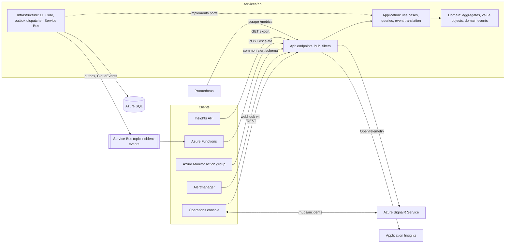
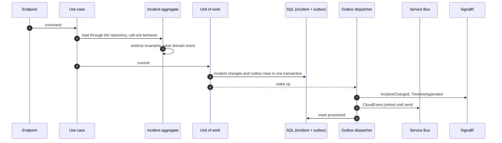
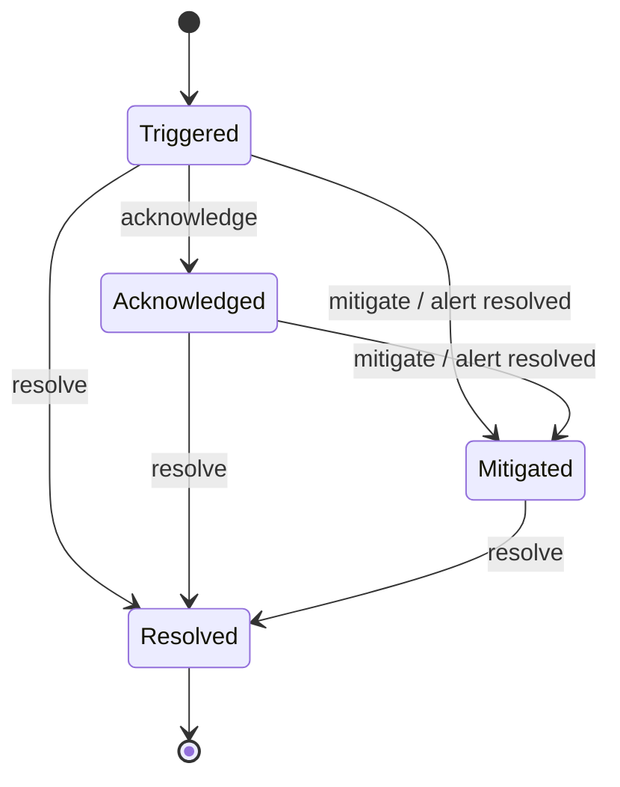
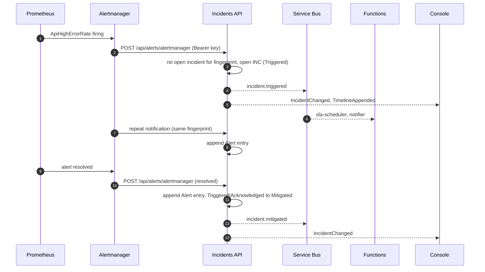

# Incidents API

The Incident Management bounded context of Incident Ops and the system of record for incidents: incident lifecycle, SLA clock, on-call escalation, alert ingestion and a real-time hub for the operations console. .NET 8, ASP.NET Core Minimal APIs, EF Core on Azure SQL, SignalR, Azure Service Bus and OpenTelemetry.

## Contents

1. [What it does](#what-it-does)
2. [Architecture](#architecture)
3. [Domain model](#domain-model)
4. [Design decisions](#design-decisions)
5. [Domain rules](#domain-rules)
6. [Alert ingestion](#alert-ingestion)
7. [HTTP API](#http-api)
8. [Real-time hub and events](#real-time-hub-and-events)
9. [Running locally](#running-locally)
10. [Configuration](#configuration)
11. [Observability](#observability)
12. [Testing](#testing)
13. [Deployment](#deployment)
14. [Known trade-offs](#known-trade-offs)
15. [License](#license)

## What it does

- Opens incidents manually or from Prometheus Alertmanager and Azure Monitor alerts, deduplicated by alert fingerprint.
- Runs each incident through `Triggered → Acknowledged → Mitigated → Resolved` and rejects any other transition with `409`.
- Computes acknowledge and resolve deadlines per severity, and the live SLA state (`OnTrack`, `AtRisk`, `Breached`, `Met`).
- Pages the primary on call from a weekly rotation and escalates to the secondary and then the engineering lead.
- Publishes CloudEvents to Service Bus so Azure Functions can schedule SLA checks and notify the on-call engineer.
- Pushes every change to the console over SignalR.
- Exposes KTLO metrics (open incidents, SLA compliance, MTTA, MTTR) and a flat export for the Insights service.
- Seeds seven services, the rotation and six months of deterministic incident history so analytics have data from the first run.

## Architecture



The solution follows a layered, ports-and-adapters structure. Dependencies point inward and are enforced by architecture tests.

| Project | Responsibility | Depends on |
|---|---|---|
| `IncidentOps.Domain` | Aggregates, entities, value objects, domain events, SLA clock, state machine, on-call rotation, alert rules, repository interfaces | nothing outside the base class library |
| `IncidentOps.Application` | One handler per use case, query handlers over read models, domain event translation, ports (`IUnitOfWork`, `IIncidentQueries`, `ICatalogQueries`, `IEventPublisher`, `IIncidentNotifier`, `IClock`), views returned to adapters | Domain |
| `IncidentOps.Infrastructure` | EF Core write model with value-object mappings and migrations, read-model context, repositories, unit of work, transactional outbox and dispatcher, Service Bus publisher, seeding | Application, Domain |
| `IncidentOps.Api` | Composition root, Minimal API endpoint groups, SignalR hub, problem details, API key filter, rate limiting, health checks, OpenTelemetry, demo traffic, chaos | Application, Infrastructure |

Application and Api are organized by feature (`Incidents`, `Alerts`, `Catalog`, `OnCall`, `Metrics`, `Chaos`). Each incident use case has its own folder with a command or query record and a single handler, for example `Incidents/Escalate/EscalateIncident.cs` and `EscalateIncidentHandler.cs`. Endpoints bind the request, call the handler and map the result; they hold no business rules.

A command flows in one direction:



## Domain model

| Aggregate | Root | Owns | Behavior |
|---|---|---|---|
| Incident | `Incident` (`IncidentId`) | `TimelineEntry` entities, `SlaClock` | `Trigger`, `TriggerFromAlert`, `Acknowledge`, `Escalate`, `Mitigate`, `Resolve`, `AddNote`, `RecordAlert`, `SlaStateAt`, `CompliesWithSla` |
| Service | `Service` (`ServiceId`) | | catalog entry; incidents reference it by `ServiceId` only |
| On-call rotation | `OnCallRotation` | `Engineer` entities | `ShiftAt(instant)` returns the primary, secondary and lead for that week |

Value objects carry their own invariants: `IncidentId`, `IncidentNumber` (`INC-n`), `IncidentTitle`, `Description`, `ServiceId` (lowercase slug), `Actor`, `Note`, `RootCause`, `EscalationLevel` (1 to 3, `Next()` stops at 3), `AlertFingerprint` and `SlaClock`. `SlaClock` holds the acknowledge window, the resolve deadline and `acknowledgementBreached`; it restarts on escalation, records the acknowledgement, computes the live SLA state and decides compliance. The incident delegates to it instead of a static service reading the aggregate from outside.

Each behavior raises one domain event bound to the timeline entry it appended: `IncidentTriggered`, `IncidentAcknowledged`, `IncidentEscalated`, `IncidentMitigated`, `IncidentResolved`, `IncidentNoteAdded`, `AlertRecorded`. The application translates them into integration events (CloudEvents) and real-time notifications.

## Design decisions

**Repositories live in the domain.** `IIncidentRepository`, `IServiceRepository` and `IOnCallRotationRepository` express persistence of aggregate roots in domain terms and exist only for roots. The application owns the remaining ports (`IUnitOfWork`, read-model queries, publishers, clock) because they describe use-case orchestration and delivery, not the model.

**Commands go through aggregates, queries read projections.** Use cases load an aggregate, call one behavior and commit through the unit of work. Queries (list, details, export, metrics) read `IncidentRecord` and `TimelineEntryRecord` from a separate no-tracking EF context mapped to the same tables, without materializing aggregates. SLA state on the read side is still computed by the domain `SlaClock`, so there is one implementation of the rules.

**Metrics are a read-model report.** `IncidentMetricsReport` aggregates many incidents for reporting and protects no invariant, so it belongs to the query side. Per-incident rules it relies on (SLA state, compliance) come from `SlaClock`.

**On-call is read through its aggregate.** The current shift is computed by the rotation's behavior, not stored, so `GET /api/oncall/current` asks the `OnCallRotation` aggregate.

**Transactional outbox.** The unit of work turns domain events into outbox rows in the same `SaveChanges` as the aggregate changes. A hosted dispatcher, woken on commit and polling as a fallback, notifies SignalR and publishes to Service Bus, then marks the row processed. Failures are retried with exponential backoff (capped) and dead-lettered after a maximum number of attempts. Delivery is at least once: the CloudEvent `id` and the Service Bus `MessageId` equal the outbox message id, so consumers deduplicate on it (and topic duplicate detection can be enabled). Order is preserved per dispatch batch but not guaranteed across retries, so consumers act on the incident state in the event (for example, the SLA check only escalates when the incident is still `Triggered` at the same level).

**Value objects in EF Core.** Single-value objects use value converters; `SlaClock` is an owned type mapped to columns of the `Incidents` table (`CreatedAt`, `AckWindowStartsAt`, `AckDueAt`, `ResolveDueAt`, `AcknowledgementBreached`). Entities have private setters and private parameterless constructors used only by EF Core.

## Domain rules

### SLA policy

| Severity | Acknowledge within | Resolve within |
|---|---|---|
| `Sev1` | 15 minutes | 4 hours |
| `Sev2` | 30 minutes | 8 hours |
| `Sev3` | 4 hours | 3 days |
| `Sev4` | 24 hours | 10 days |

`Sla:TimeScale` divides both windows (60 turns the Sev1 acknowledge window into 15 seconds) so the escalation loop can be exercised locally. The policy itself stays fixed; the scale is applied in the application layer.

### SLA state

| State | When |
|---|---|
| `Met` | resolved and compliant (see below) |
| `Breached` | resolved without complying, or an open deadline has passed (`ackDueAt` while `Triggered`, `resolveDueAt` while not resolved) |
| `AtRisk` | less than 25% of the active window remains (acknowledge window while `Triggered`, resolve window otherwise) |
| `OnTrack` | otherwise |

`acknowledgementBreached` is set when the incident escalates or when the acknowledgement arrives after `ackDueAt`, and is never reset. Because escalation moves `ackDueAt` to a new window, compliance never compares against the current `ackDueAt`: an incident complies when it was acknowledged, `acknowledgementBreached` is false and it was resolved by `resolveDueAt`. The 30-day percentage in `/api/metrics/summary` takes incidents created in the last 30 days that are either resolved or open but already unable to comply, because `acknowledgementBreached` is true or `slaState` is `Breached` (these count as non-compliant); open incidents that can still comply are not counted yet.

### State machine



### On-call and escalation

The rotation has six engineers. Each week starts Monday 10:30 `America/New_York` (daylight saving time included); the primary is one engineer and the secondary is next week's primary, so everyone is primary once every six weeks.

| Level | Target |
|---|---|
| 1 | primary on call |
| 2 | secondary on call |
| 3 | engineering lead |

An escalation is only valid while the incident is `Triggered`. It moves one level, reassigns to that level's target, sets `acknowledgementBreached` and opens a new acknowledge window (`ackDueAt = now + acknowledge window`). Escalation past level 3 returns `409`.

## Alert ingestion

| Rule | Alertmanager (webhook v4) | Azure Monitor (common alert schema) |
|---|---|---|
| Fingerprint | `fingerprint` | `essentials.alertRule` + `|` + first `essentials.alertTargetIDs` entry |
| Title | `annotations.summary`, else `labels.alertname` | `essentials.alertRule` |
| Description | `annotations.description` | `essentials.description` |
| Service | `labels.service` | `customProperties.service` |
| Firing / resolved | `status` = `firing` / `resolved` | `monitorCondition` = `Fired` / `Resolved` |

| Alertmanager `severity` | Azure Monitor `severity` | Incident |
|---|---|---|
| `critical` | `Sev0`, `Sev1` | `Sev1` |
| `high`, `error` | `Sev2` | `Sev2` |
| `warning` | `Sev3` | `Sev3` |
| `info`, missing | `Sev4` | `Sev4` |

- Firing with no open incident for the fingerprint opens an incident with `source` set to `Alertmanager` or `AzureMonitor`.
- Firing with an open incident appends an `Alert` timeline entry.
- Resolved appends an `Alert` entry and, when the incident is `Triggered` or `Acknowledged`, mitigates it with actor `alerting`. Resolving with a root cause stays a human action.
- An unknown or missing service falls back to `platform`.
- A filtered unique index on open incidents per fingerprint protects against two concurrent deliveries opening duplicates; the loser receives `409` and the retry appends.



## HTTP API

JSON in camelCase, enums as strings, timestamps ISO-8601 UTC, errors as RFC 7807 `application/problem+json`. Swagger UI is served at `/swagger`.

| Method | Path | Body | Result |
|---|---|---|---|
| GET | `/api/services` | | `Service[]` |
| GET | `/api/incidents?status=&severity=&serviceId=&open=&limit=` | | `Incident[]`, newest first, `limit` 1 to 500 (default 100) |
| GET | `/api/incidents/{id}` | | `Incident` with `timeline` |
| POST | `/api/incidents` | `{ title, description, serviceId, severity }` | `201 Incident` |
| POST | `/api/incidents/{id}/acknowledge` | `{ actor }` | `Incident` |
| POST | `/api/incidents/{id}/escalate` | `{ reason }` | `Incident`, requires the API key |
| POST | `/api/incidents/{id}/mitigate` | `{ actor, note }` | `Incident` |
| POST | `/api/incidents/{id}/resolve` | `{ actor, rootCause }` | `Incident` |
| POST | `/api/incidents/{id}/notes` | `{ actor, message }` | `TimelineEntry` |
| GET | `/api/incidents/export?from=&to=` | | flat `Incident[]` without timeline; defaults to the last 180 days, at most 400 |
| POST | `/api/alerts/alertmanager` | Alertmanager webhook v4 | `{ alerts: [{ fingerprint, action, incidentId, incidentNumber }] }`, requires the API key |
| POST | `/api/alerts/azure-monitor` | Azure Monitor common alert schema | same as above, requires the API key |
| GET | `/api/oncall/current` | | `{ weekStart, primary, secondary, lead }` |
| GET | `/api/metrics/summary` | | `{ openBySeverity, slaCompliance30d, mtta30dMinutes, mttr30dMinutes, breachedOpen }` |
| POST | `/api/chaos/faults` | `{ errorRate, latencyMs, durationSeconds }` | active fault; only mapped when `Chaos:Enabled=true`, requires the API key |
| DELETE | `/api/chaos/faults` | | `204`; clears the active fault |
| GET | `/health/live`, `/health/ready` | | liveness; readiness including the database |
| GET | `/metrics` | | Prometheus exposition |

`slaCompliance30d` is a percentage (0 to 100) with one decimal; `mtta30dMinutes` and `mttr30dMinutes` are averages in minutes.

The API key is accepted as `X-Api-Key: <key>`, `Authorization: Bearer <key>` or `?code=<key>` (Azure Monitor webhooks cannot send custom headers). Comparison is constant-time; with no key configured every protected call is rejected.

| Status | Meaning |
|---|---|
| `400` | validation problem with `errors` per field (unknown service, empty title, unsupported webhook version) |
| `401` | missing or wrong API key |
| `404` | incident not found |
| `409` | invalid transition, escalation not allowed, or concurrent update |
| `429` | write rate limit per client IP exceeded |

## Real-time hub and events

Hub path: `/hubs/incidents`. Server-to-client methods: `IncidentChanged(Incident)` and `TimelineAppended(TimelineEntry)`. It uses Azure SignalR Service when `Azure:SignalR:ConnectionString` is set and runs in-process otherwise.

State changes are published to the `incident-events` topic as structured CloudEvents 1.0 (`application/cloudevents+json`) with `type` one of `incident.triggered`, `incident.acknowledged`, `incident.escalated`, `incident.mitigated`, `incident.resolved`, `subject` set to the incident id and the incident as `data`. Each message carries the application properties `eventType` and `severity` for subscription filters, and `MessageId` equal to the CloudEvent `id`. Notes and alert entries notify the hub but do not publish integration events. Events and notifications leave through the transactional outbox described in [Design decisions](#design-decisions). Scheduling SLA checks on the `sla-checks` queue is the job of the [Escalation functions](../functions), not of this API. Shapes are fixed by the [contract](../../contracts/contracts.md).

## Running locally

Requirements: Docker and the .NET 8 SDK.

The full stack (API, Insights, console, Prometheus, Alertmanager, SQL Server, Service Bus emulator) runs from the [root compose file](../../docker-compose.yml):

```bash
cd ../..
cp .env.example .env
docker compose up --build
```

The API is then on <http://localhost:5080> (`API_PORT`). For work on this module alone, `docker-compose.yml` in this folder starts SQL Server 2022, the Azure Service Bus emulator (topic `incident-events` with subscriptions `sla-scheduler` and `notifier`, queue `sla-checks`, from `deploy/servicebus-emulator/Config.json`) and the API on <http://localhost:8080>:

```bash
docker compose up --build
```

The API applies migrations, seeds the database and publishes to the emulator through its connection string.

| Variable | Default | Effect |
|---|---|---|
| `API_PORT`, `SQL_PORT`, `SERVICEBUS_PORT`, `SERVICEBUS_HEALTH_PORT` | `8080`, `1433`, `5672`, `5300` | host ports |
| `SLA_TIME_SCALE` | `1` | divides SLA windows; `60` turns minutes into seconds |
| `DEMO_TRAFFIC_ENABLED` | `false` | triggers and advances incidents periodically |
| `ESCALATION_API_KEY` | `local-dev-key` | API key for escalate, alerts and chaos |
| `MSSQL_SA_PASSWORD` | `IncidentOps!Local1` | SQL Server password |

The module stack binds the same host ports as the root stack, so run one of them at a time (or override the ports).

Exercise the escalation loop in seconds:

```bash
SLA_TIME_SCALE=60 DEMO_TRAFFIC_ENABLED=true docker compose up --build
curl -X POST localhost:8080/api/incidents -H 'content-type: application/json' \
  -d '{"title":"Checkout errors","description":"5xx on payment","serviceId":"checkout","severity":"Sev1"}'
curl -X POST "localhost:8080/api/alerts/alertmanager?code=local-dev-key" -H 'content-type: application/json' \
  --data @tests/IncidentOps.Api.Tests/Fixtures/alertmanager-firing.json
```

To run the API from source against the compose dependencies:

```bash
docker compose up -d sqlserver servicebus
dotnet run --project src/IncidentOps.Api
```

The `Development` environment (`appsettings.Development.json`) points at `localhost`, applies migrations, seeds, enables chaos and listens on <http://localhost:5080>.

## Configuration

Every setting can be supplied as an environment variable using `__` as the section separator.

| Variable | Default | Description |
|---|---|---|
| `ConnectionStrings__IncidentOps` | required | SQL Server connection string; in Azure, `Authentication=Active Directory Managed Identity` |
| `Database__ApplyMigrations` | `false` | apply EF Core migrations at startup |
| `Database__Seed` | `false` | seed services, rotation and six months of history when the database is empty |
| `ServiceBus__FullyQualifiedNamespace` | empty | namespace host; uses `DefaultAzureCredential` (managed identity in Azure) |
| `ServiceBus__ConnectionString` | empty | connection string, used for the local emulator |
| `ServiceBus__TopicName` | `incident-events` | topic for incident events |
| `Azure__SignalR__ConnectionString` | empty | Azure SignalR Service; in-process SignalR when empty |
| `Security__EscalationApiKey` | empty | API key for escalate, alert ingestion and chaos |
| `Cors__AllowedOrigins__0..n` | `https://incidents.marceloroman.com.br`, `http://localhost:5173` | origins allowed to call the API and the hub |
| `Sla__TimeScale` | `1` | divides SLA windows for local testing |
| `RateLimiting__WritePermitLimit`, `RateLimiting__WindowSeconds` | `30`, `60` | fixed window per client IP for write endpoints |
| `DemoTraffic__Enabled`, `DemoTraffic__IntervalSeconds`, `DemoTraffic__TargetOpenIncidents` | `false`, `45`, `4` | background traffic for a live dashboard |
| `Chaos__Enabled` | `false` | maps the fault injection endpoints and middleware; local only |
| `Outbox__PollingIntervalMilliseconds`, `Outbox__BatchSize` | `1000`, `50` | fallback polling interval and batch size of the outbox dispatcher |
| `Outbox__MaxAttempts`, `Outbox__MaxRetryDelaySeconds` | `20`, `60` | attempts before a message is dead-lettered, and the backoff cap |
| `Observability__GaugeRefreshSeconds` | `30` | refresh interval of the incident gauges |
| `APPLICATIONINSIGHTS_CONNECTION_STRING` | empty | enables the Azure Monitor OpenTelemetry exporter |
| `OTEL_SERVICE_NAME` | `incident-ops-api` | service name on traces, metrics and logs |

When neither Service Bus setting is present the API logs events instead of publishing them, so it runs standalone.

## Observability

- Traces, metrics and logs through OpenTelemetry. With `APPLICATIONINSIGHTS_CONNECTION_STRING` set, `Azure.Monitor.OpenTelemetry.AspNetCore` exports requests, dependencies (SQL, Service Bus, HTTP), exceptions and logs to Application Insights.
- Structured JSON console logs carry `TraceId` and `SpanId` scopes for correlation.
- `/metrics` exposes Prometheus metrics:

| Metric | Type | Labels |
|---|---|---|
| `http_server_request_duration_seconds` | histogram | `http_route`, `http_request_method`, `http_response_status_code` |
| `incidentops_incident_events_total` | counter | `kind`, `severity`, `source` |
| `incidentops_incidents_open` | gauge | `severity` |
| `incidentops_sla_breached_open` | gauge | |
| `incidentops_sla_compliance_30d` | gauge | |

- `/health/live` reports the process; `/health/ready` also checks the database. The container image has a `HEALTHCHECK` on `/health/live`.
- With `Chaos__Enabled=true`, `POST /api/chaos/faults` makes requests under `/api/incidents`, `/api/services`, `/api/oncall` and `/api/metrics` fail at `errorRate` and wait `latencyMs` for `durationSeconds`. Health, metrics, alert ingestion and the chaos endpoints are never affected, so alerts keep flowing while the fault is active.

## Testing

```bash
dotnet test
```

| Project | Scope |
|---|---|
| `IncidentOps.Domain.Tests` | value object invariants, aggregate behaviors and the events they raise, state machine, SLA clock and compliance, escalation, rotation (week boundaries, daylight saving time), alert rules |
| `IncidentOps.Application.Tests` | every use case and query against in-memory fakes of the ports, wired through the real dependency injection registration; domain event translation, outbox message handling and retries; metrics report |
| `IncidentOps.Api.Tests` | `WebApplicationFactory` integration tests on SQL Server 2022 started by Testcontainers: lifecycle, problem details, escalation and API key, alert ingestion with real Alertmanager and Azure Monitor payloads (`tests/IncidentOps.Api.Tests/Fixtures`), outbox retries, seeded history, SignalR broadcast, rate limiting, chaos, Prometheus output, CloudEvent format |
| `IncidentOps.Architecture.Tests` | layer dependencies (domain without dependencies, application on domain and ports only, Api features on application only), aggregates and owned entities, immutable value objects and domain events, no public setters on entities, repositories only for aggregate roots, sealed single-method handlers |

The integration tests need Docker. Coverage is collected with coverlet and merged with ReportGenerator:

```bash
dotnet test --settings coverage.runsettings --collect "XPlat Code Coverage" --results-directory TestResults
dotnet tool restore
dotnet reportgenerator -reports:"TestResults/**/coverage.cobertura.xml" -targetdir:coverage -reporttypes:TextSummary
```

CI fails when merged line coverage drops below 80%. The current suite has 204 tests with 95% line and 82% branch coverage.

Code quality gates: nullable reference types, `TreatWarningsAsErrors`, `AnalysisLevel` `latest-recommended`, code style enforced in build, and `dotnet format --verify-no-changes`.

## Deployment

Delivery runs on GitHub Actions with OpenID Connect to Azure (no stored credentials). [`.github/workflows/api.yml`](../../.github/workflows/api.yml) runs when `services/api/**` or the workflow changes (and on pull requests that change `contracts/**`):

1. On every pull request and push: restore, format check, build, test with coverage and the coverage gate.
2. On push to `main`: build the image and push `ghcr.io/marcelo-roman/incident-ops-api:<sha>` and `:latest` with `GITHUB_TOKEN`.
3. On push to `main`: call the reusable workflow [`deploy-container-app.yml`](../../.github/workflows/deploy-container-app.yml) for `ca-incident-ops-api` in `rg-incident-ops`. It runs in the `production` environment, updates the revision, smoke tests `https://incidents-api.marceloroman.com.br/health/ready` and rolls back on failure.

[`infra/azure-devops/api.yml`](../../infra/azure-devops/api.yml) is the Azure DevOps equivalent, kept as a sample: it builds and tests this folder, pushes the image through the `ghcr-marcelo-roman` registry connection and deploys with the step template `infra/azure-devops/templates/deploy-container-app.yml` and the `sc-incident-ops` Azure service connection.

The container runs as the non-root `app` user on port 8080. Infrastructure (Container Apps, Azure SQL, Service Bus, SignalR, Application Insights and role assignments for the managed identity) is defined in [`infra/`](../../infra).

## Known trade-offs

- The outbox gives at-least-once delivery. Consumers must be idempotent (deduplicate on the CloudEvent `id`). Several API replicas would each run a dispatcher; claiming rows with a lease would avoid duplicate sends.
- Migrations run at startup when `Database__ApplyMigrations=true`. New migrations target the write context: `dotnet ef migrations add <Name> --context IncidentOpsDbContext -p src/IncidentOps.Infrastructure -s src/IncidentOps.Infrastructure -o Persistence/Migrations`. This suits a single replica; with more replicas, migrations belong in the pipeline (an EF Core migration bundle).
- Forwarded headers are trusted from any proxy because the API only receives traffic through the Container Apps ingress; rate limiting relies on `X-Forwarded-For`.
- Seeded history is generated from a fixed random seed relative to the seeding date, so the shape is stable while dates stay recent.

## License

[MIT](../../LICENSE)
