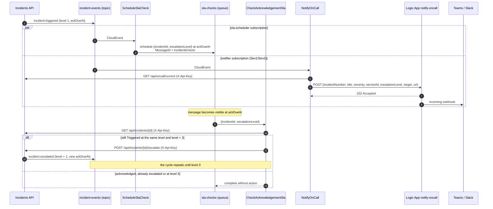

# Escalation functions

SLA watchdog and on-call notifications for Incident Ops, built on Azure Functions (.NET 8 isolated worker), Azure Service Bus and a Logic App.

## Contents

1. [What it is](#what-it-is)
2. [How the escalation loop works](#how-the-escalation-loop-works)
3. [Functions](#functions)
4. [Architecture](#architecture)
5. [Configuration](#configuration)
6. [Running locally](#running-locally)
7. [Testing](#testing)
8. [Failure handling](#failure-handling)
9. [Observability](#observability)
10. [Logic App workflow](#logic-app-workflow)
11. [Deployment](#deployment)
12. [License](#license)

## What it is

The [Incidents API](../api) is the system of record for incidents and publishes CloudEvents to the Service Bus topic `incident-events`. This module reacts to those events:

- it schedules an acknowledgement check for every incident that is waiting for someone to acknowledge it;
- when the check fires and the incident is still unacknowledged at the same level, it asks the API to escalate;
- every `incident.triggered` and `incident.escalated` event for `Sev1`/`Sev2` pages the person on call for the current escalation level through a Logic App.

The shared contract (domain, events, HTTP API, runtime configuration) lives in [`contracts/contracts.md`](../../contracts/contracts.md).

## How the escalation loop works



## Functions

| Function | Trigger | Use case | Does |
| --- | --- | --- | --- |
| `ScheduleSlaCheck` | topic `incident-events`, subscription `sla-scheduler` | `ScheduleAcknowledgementCheck` | Translates the CloudEvent, asks `AcknowledgementWatch.Open` whether a watch is needed (acknowledgement pending, level below 3) and schedules `{ incidentId, escalationLevel }` on `sla-checks` at the deadline, or immediately when it already passed. `MessageId` is the watch key `{incidentId}-{level}`, so duplicate detection drops a second schedule for the same level. |
| `CheckAcknowledgementSla` | queue `sla-checks` | `CheckAcknowledgementSla` | Resumes the watch from the message, reads the current incident state from the API and lets `AcknowledgementWatch.Evaluate` decide: `Escalate`, `AlreadyAcknowledged`, `Superseded` or `FinalLevelReached`. Only `Escalate` calls `POST /api/incidents/{id}/escalate` with reason `Acknowledgement SLA breached at level N`. |
| `NotifyOnCall` | topic `incident-events`, subscription `notifier` | `PageOnCall` | Reads the rotation from `GET /api/oncall/current` and lets `PagingDecision.Decide` choose: `Sev1`/`Sev2` awaiting acknowledgement page the primary, secondary or lead for the level. The page goes to the Logic App. |

Entity names come from app settings through `%binding%` expressions, so the same build runs against any namespace.

## Architecture

This module is the **Escalation** bounded context. It consumes the integration events and HTTP API of Incident Management ([`services/api`](../api)) through an anti-corruption layer; the upstream DTOs never reach the domain.

```text
src/
  IncidentOps.Escalation.Domain/          the model, no dependencies
    Incidents/        IncidentId, IncidentNumber, ServiceId, Severity, IncidentProfile, IncidentState
    Escalation/       EscalationLevel, AcknowledgementDeadline, EscalationReason, OnCallTarget, OnCallRotation
    Watches/          AcknowledgementWatch (aggregate), AcknowledgementWindowOpened, WatchOpening,
                      EscalationDecision, ScheduledCheck, WatchKey
    Paging/           PagingDecision, PageRequest
  IncidentOps.Escalation.Application/     use cases and ports
    UseCases/         ScheduleAcknowledgementCheck, CheckAcknowledgementSla, PageOnCall
    Ports/            IIncidentReader, IIncidentEscalator, IOnCallDirectory, ISlaCheckScheduler, IPager,
                      IIncidentEventTranslator, IAcknowledgementCheckTranslator
    Messaging/        InboundMessage, Translation, MalformedMessageException
  IncidentOps.Escalation.Infrastructure/  adapters
    AntiCorruption/   CloudEvent and SLA check translators, upstream DTOs, status mapping
    IncidentsApi/     typed HttpClients with the standard resilience handler
    ServiceBus/       scheduled sender (DefaultAzureCredential or emulator connection string)
    Paging/           Logic App pager and payload translation
  IncidentOps.Functions/                  Functions host
    Triggers/         one thin class per function: bind, map to InboundMessage, call the use case
    Messaging/        MessageSettlement (complete, abandon, dead-letter)
    Telemetry/        Application Insights wiring and URL redaction
    Composition/      dependency injection
tests/
  IncidentOps.Functions.Tests/            domain, use case, ACL, adapter, host and architecture tests
```

Model:

- Value objects enforce their invariants on creation and are immutable: `EscalationLevel` only exists between 1 and 3 and knows `IsFinal` and `Next()`; `Severity` knows whether it `PagesOnCall`; `AcknowledgementDeadline` knows when it has passed, when to check and how late a check is.
- `AcknowledgementWatch` is the aggregate, identified by incident and level. `Open` decides whether a window needs watching, `Schedule` produces the check, `Evaluate` compares the watch with the incident's current state and returns an `EscalationDecision`.
- `PagingDecision.Decide` holds which severities page and who is paged.
- Use cases translate input through a port, call one domain behavior and act on the outcome through ports; they hold no rules.
- The anti-corruption layer maps the upstream vocabulary (`Triggered`, `Acknowledged`, `Mitigated`, `Resolved`, event types) into the Escalation model and turns any contract or invariant violation into `MalformedMessageException`.

The dependency rule is enforced at compile time by project references and checked by `NetArchTest.Rules` and reflection tests: the domain depends on nothing; the application depends only on the domain and its own abstractions; use cases depend on domain, ports and messaging types only; triggers depend on the application, never on the domain or infrastructure; upstream DTOs stay inside the anti-corruption layer; domain types have only read-only state; concrete types are sealed.

## Configuration

Names follow the runtime configuration in the shared contract. In Azure they are app settings; locally they go in `src/IncidentOps.Functions/local.settings.json` (copy `local.settings.json.example`).

| Setting | Azure value | Local value |
| --- | --- | --- |
| `AzureWebJobsStorage__accountName` | host storage account, identity-based | `AzureWebJobsStorage=UseDevelopmentStorage=true` (Azurite) |
| `ServiceBusConnection__fullyQualifiedNamespace` | `<namespace>.servicebus.windows.net`, used by the triggers and by the sender with `DefaultAzureCredential` | not set |
| `ServiceBusConnection` | not set | emulator connection string |
| `ServiceBusConnection__clientId` | optional, user-assigned identity client id | not set |
| `IncidentEventsTopic` | `incident-events` | `incident-events` |
| `SlaSchedulerSubscription` | `sla-scheduler` | `sla-scheduler` |
| `NotifierSubscription` | `notifier` | `notifier` |
| `SlaChecksQueue` | `sla-checks` | `sla-checks` |
| `IncidentsApi__BaseUrl` | `https://incidents-api.marceloroman.com.br/` | `http://localhost:5080/` |
| `IncidentsApi__ApiKey` | API key sent as `X-Api-Key` on every call to the Incidents API; secure setting injected by the infrastructure; a Key Vault reference (`@Microsoft.KeyVault(SecretUri=...)`) works unchanged | `local-development-key` |
| `Notifications__LogicAppUrl` | Logic App trigger callback URL (contains a SAS signature) | any HTTP endpoint |
| `Web__BaseUrl` | `https://incidents.marceloroman.com.br/` | `http://localhost:8080/` |
| `APPLICATIONINSIGHTS_CONNECTION_STRING` | shared Application Insights component | optional |

Base URLs must end with `/`. Options are validated at startup, so a missing setting fails the host instead of the first message.

Azure RBAC for the Function App identity: `Azure Service Bus Data Receiver` on the topic subscriptions and the queue, `Azure Service Bus Data Sender` on `sla-checks`, and the storage roles required by identity-based `AzureWebJobsStorage`.

## Running locally

Requirements: .NET 8 SDK, Docker, Azure Functions Core Tools v4 (`npm i -g azure-functions-core-tools@4 --unsafe-perm true`).

1. Start Azurite, the Service Bus emulator, the API and the notification sink from the [root compose file](../../docker-compose.yml):

   ```bash
   cd ../..
   cp .env.example .env
   docker compose --profile functions up -d --build sqlserver servicebus azurite api notification-sink
   ```

   The emulator loads [`local/servicebus/Config.json`](../../local/servicebus/Config.json) with the topic, both filtered subscriptions and the `sla-checks` queue.

2. `Notifications__LogicAppUrl` can point at any HTTP endpoint that accepts a POST. The example settings use the compose `notification-sink` (an echo server on port 8099) that prints every page in its logs (`docker compose logs -f notification-sink`). To exercise the real workflow, deploy [`infra/bicep/workflows/notify-oncall.json`](../../infra/bicep/workflows/notify-oncall.json) and set the setting to its callback URL.

3. Configure and start the host from `services/functions`:

   ```bash
   cd services/functions
   cp src/IncidentOps.Functions/local.settings.json.example src/IncidentOps.Functions/local.settings.json
   cd src/IncidentOps.Functions
   func start
   ```

   The host lists `CheckAcknowledgementSla`, `NotifyOnCall` and `ScheduleSlaCheck` as `serviceBusTrigger` functions.

4. Create a `Sev1` incident through the API and leave it unacknowledged:

   ```bash
   curl -s -X POST http://localhost:5080/api/incidents \
     -H 'Content-Type: application/json' -H 'X-Api-Key: local-development-key' \
     -d '{"title":"Checkout returns 502","description":"Upstream timeout","serviceId":"checkout","severity":"Sev1"}'
   ```

   The echo server receives a page for the primary on call; after the acknowledgement window (15 minutes for `Sev1`) the incident escalates to level 2, the secondary is paged, and the same happens once more up to the lead at level 3.

## Testing

```bash
dotnet format --verify-no-changes
dotnet build
dotnet test -p:CollectCoverage=true
```

| Suite | Covers |
| --- | --- |
| `Domain` | value object invariants; `AcknowledgementWatch.Open`, `Schedule` and `Evaluate` and `PagingDecision.Decide` as decision tables |
| `Application` | each use case against hand-written port fakes, time through `FakeTimeProvider`, structured log fields through `FakeLogger` |
| `AntiCorruption` | CloudEvent and SLA check translation, upstream status mapping, rejection of envelopes and payloads that break the contract or the model |
| `Adapters` | typed HttpClients through the real DI registration and resilience pipeline with a recording `HttpMessageHandler` (routes, `X-Api-Key`, payloads, `404`/`409` mapping, no retry on `POST`); Service Bus message shape; Logic App payload; telemetry redaction; composition root |
| `Host` | settlement (complete, abandon and rethrow, dead-letter), inbound message mapping and each trigger end to end from a `ServiceBusReceivedMessage` |
| `Architecture` | dependency rule and domain immutability |

Coverage runs through `coverlet.msbuild`; the build fails below 80% line or branch coverage (generated code and `Program` excluded).

## Failure handling

Every trigger uses `AutoCompleteMessages = false` and settles explicitly through `MessageSettlement`:

| Outcome | Settlement | Effect |
| --- | --- | --- |
| Handler finished, acted or skipped | complete | message removed |
| Body breaks the upstream contract or a domain invariant (`MalformedMessageException` from the anti-corruption layer) | dead-letter with reason `InvalidMessage` and the parse error as description | no retries for a message that can never succeed |
| Any other exception (API down, timeout, 5xx) | abandon, then rethrow so the invocation is recorded as failed | Service Bus redelivers; after `maxDeliveryCount` deliveries (10 in the infrastructure) the broker moves it to the dead-letter queue with `MaxDeliveryCountExceeded` |

Idempotency:

- `ScheduleSlaCheck` uses `MessageId = {incidentId}-{level}`; with duplicate detection on `sla-checks` a redelivered event inside the detection window does not schedule a second check. Outside the window a second check is still harmless because of the next point.
- `CheckAcknowledgementSla` re-reads the incident on every delivery and `AcknowledgementWatch.Evaluate` escalates only while acknowledgement is pending at the watched level; a redelivery after a successful escalation evaluates to `Superseded`. A `409` from the API (lost race with an acknowledgement) completes the message.
- The watch deadline on the check side is the message's scheduled enqueue time, so the body stays the contract's `{ incidentId, escalationLevel }`.
- The standard resilience handler (`Microsoft.Extensions.Http.Resilience`) retries transient failures for `GET` only. Retries are disabled for `POST`, so a timed-out escalation is never replayed blindly; the Service Bus redelivery repeats the full read-then-decide cycle instead.
- `NotifyOnCall` is at-least-once: a failure after the Logic App accepted the payload can page twice. The Logic App answers `202` as soon as the payload passes schema validation and owns the webhook retries.

Host settings (`host.json`): `prefetchCount` 0 so locks are not taken on messages waiting in a local buffer, `maxConcurrentCalls` 16, `maxAutoLockRenewalDuration` 5 minutes, exponential client retries, function timeout 5 minutes.

The infrastructure alerts on dead-lettered messages; inspect them with Service Bus Explorer in the portal and resubmit after fixing the cause.

## Observability

- Application Insights through `Microsoft.Azure.Functions.Worker.ApplicationInsights`; the default rule that drops worker logs below `Warning` is removed so `Information` logs reach Application Insights.
- Logs use `LoggerMessage` source generation with structured fields (`IncidentId`, `EscalationLevel`, `CheckAt`, `Overdue`, `Target`, `EscalationAttempt`). Each message runs inside a scope with `MessageId`, `CorrelationId`, `DeliveryCount` and `EventType`.
- The Logic App URL carries a SAS signature: its HttpClient has no request logging, and a telemetry initializer strips signed query strings from dependency telemetry.

Example query for escalations in the last day:

```kusto
traces
| where timestamp > ago(1d)
| where message startswith "Acknowledgement SLA breached"
| project timestamp, IncidentId = customDimensions.IncidentId, Level = customDimensions.EscalationLevel, Overdue = customDimensions.Overdue, Attempt = customDimensions.EscalationAttempt
```

## Logic App workflow

The Consumption workflow definition lives with the infrastructure, in [`infra/bicep/workflows/notify-oncall.json`](../../infra/bicep/workflows/notify-oncall.json), and is deployed by the Bicep `logicapp` module:

- HTTP request trigger with a JSON schema for the notification payload and schema validation on;
- `202 Accepted` response immediately after validation;
- a condition on `severity`: `Sev1` is posted as a `PAGE`, other severities as a regular message;
- HTTP POST of `{ "text": ... }` to the `webhookUrl` parameter (`securestring`), a Slack-compatible incoming webhook, with an exponential retry policy; an empty `webhookUrl` skips the post.

## Deployment

GitHub Actions is the delivery system. [`.github/workflows/functions.yml`](../../.github/workflows/functions.yml) runs when `services/functions/**` or the workflow changes (and on pull requests that change `contracts/**`):

| Job | When | Steps |
| --- | --- | --- |
| `build` | pull requests and pushes | restore, `dotnet format --verify-no-changes`, build, tests with the coverage gate; on `main` also publishes the zip package as an artifact |
| `deploy` | pushes to `main`, environment `production` | `azure/login@v2` with OpenID Connect (`vars.AZURE_CLIENT_ID`, `vars.AZURE_TENANT_ID`, `vars.AZURE_SUBSCRIPTION_ID`), then `Azure/functions-action@v1` to `func-incident-ops` on Flex Consumption |

[`infra/azure-devops/functions.yml`](../../infra/azure-devops/functions.yml) is an equivalent Azure DevOps sample and is not wired to any project: stages Build → Deploy, `AzureFunctionApp@2` with service connection `sc-incident-ops`, `isFlexConsumption: true` and environment `incident-ops-prod`.

## License

[MIT](../../LICENSE)
